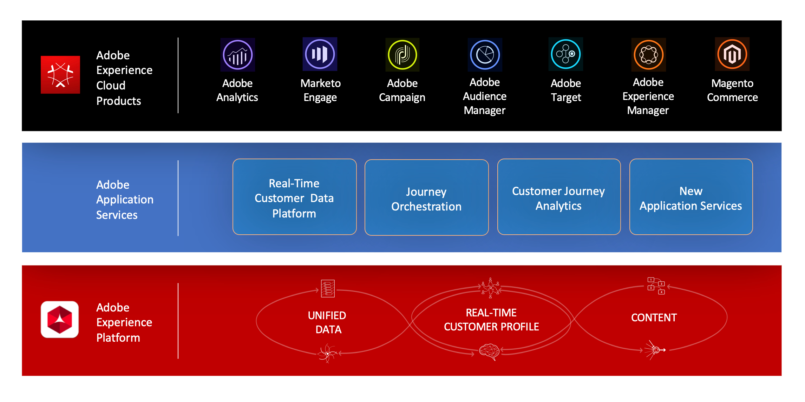

# Sobre[!DNL Journey Orchestration]{#concept_nd3_mqt_52b}

Crie casos de uso de orquestração em tempo real usando dados contextuais armazenados em eventos ou fontes de dados.

O [!DNL Journey Orchestration] é um serviço de aplicativos integrado à Adobe Experience Platform. 

O [!DNL Journey Orchestration] permite a orquestração em tempo real com dados contextuais de eventos, informações da Adobe Experience Platform ou dados de serviços de API de terceiros. Você pode configurar uma ação personalizada se estiver usando um sistema de terceiros para enviar mensagens. Se tiver o Adobe Campaign Standard, você poderá enviar emails, notificações por push e SMS usando os [recursos de Mensagens Transacionais](https://docs.adobe.com/content/help/pt-BR/campaign-standard/using/communication-channels/transactional-messaging/about-transactional-messaging.html) do Adobe Campaign Standard.

Na guia Configuração do evento, um **usuário técnico** configura os eventos esperados nas jornadas. Os dados de entrada dos eventos são padronizados de acordo com o Adobe Experience Data Model (XDM). Os eventos vêm das APIs de assimilação de streaming para eventos autenticados e não autenticados (como eventos do Adobe Mobile SDK).

Na guia de configuração da fonte de dados, um **usuário técnico** configura:

* Os diferentes campos expostos a partir da Adobe Experience Platform no designer da jornada para fins de construção de condições e personalização.
* As fontes de dados personalizadas adicionais que você utiliza no designer da jornada. As fontes de dados personalizadas são conexões entre o [!DNL Journey Orchestration] e sistemas ou serviços de terceiros por meio da API. Você pode conectar um sistema de terceiros, como um sistema de fidelidade. Os serviços de terceiros podem ser, por exemplo, uma API meteorológica.

Com o designer da jornada, um **usuário empresarial** pode arrastar e soltar facilmente um evento de entrada, adicionar condições e especificar a ação que será executada.

Assim você cria condições com base em:

* tempo
* dados provenientes do payload do evento
* informações provenientes de fontes de dados: fonte de dados do Perfil do cliente em tempo real ou fontes de dados personalizadas

Você pode usar a condição de divisão para enviar pessoas na jornada em direções diferentes.

Usando atividades de ação, você pode enviar uma mensagem por meio de um sistema de terceiros. Se você tiver o Adobe Campaign Standard, envie SMSs personalizados em tempo real, notificações por push ou emails.

Como o [!DNL Journey Orchestration] tem várias fases, você pode criar cenários avançados. Por exemplo, após um primeiro evento e uma ação, você pode arrastar outros eventos. Em seguida, você pode adicionar uma segunda ação, colocar uma atividade de espera para aguardar algum tempo, adicionar uma condição de divisão para encaminhar as pessoas a dois caminhos diferentes e enviar mensagens distintas.

>[!NOTE]
>
>Esta documentação é atualizada com frequência para refletir as alterações recentes no produto. Entretanto, algumas capturas de tela podem diferir ligeiramente da interface do produto.
