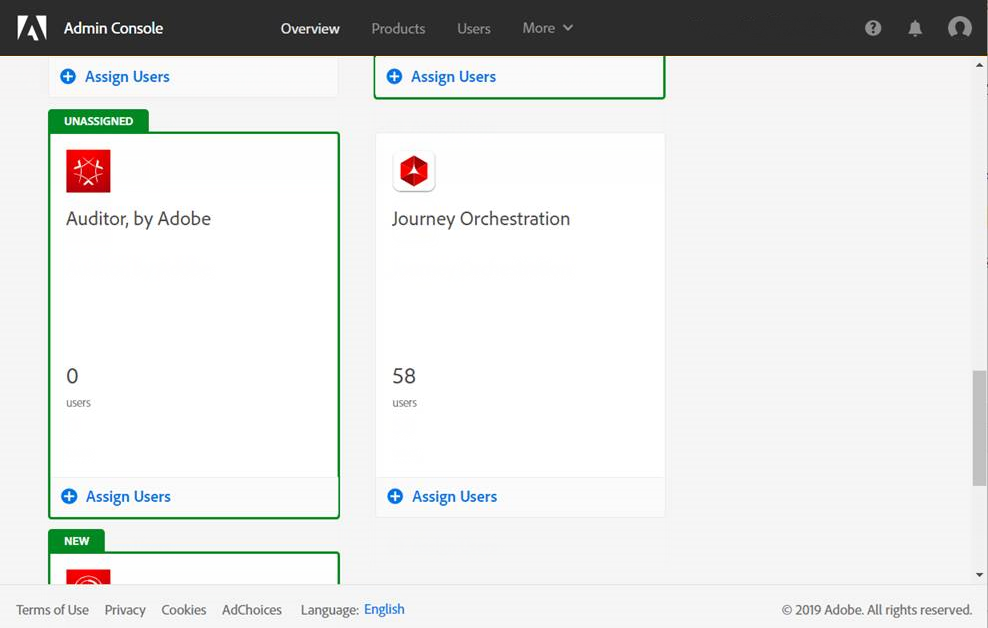

# Gerenciamento de acesso{#concept_rfj_wpt_52b}

## Sobre o gerenciamento de acesso {#about-access-management}

Os perfis de produto são atribuídos a um conjunto de usuários que compartilham os mesmos direitos em sua organização.

No Admin Console, é possível atribuir um dos seguintes perfis de produto predefinidos aos usuários:

* **[!UICONTROL Limited Access User]**: usuário com acesso somente leitura a viagens e relatórios. Este perfil de produto inclui os seguintes direitos:
   * Ler viagens
   * Ler relatórios

* **[!UICONTROL Administrators]**: usuário com acesso aos menus de administração com a possibilidade de gerenciar viagens, eventos e relatórios. Este perfil de produto inclui os seguintes direitos:
   * Gerenciar e executar viagens
   * Gerenciar eventos, fontes de dados e ações
   * Gerenciar relatórios
   >[!NOTE]
   >
   >**[!UICONTROL Administrators]**é o único perfil de produto que permite a criação, edição e publicação de mensagens transacionais (ou modelos de mensagens) no Adobe Campaign Standard. Esse perfil de produto é necessário se você usar o Adobe Campaign Standard para enviar mensagens em suas viagens.

* **[!UICONTROL Standard User]**: usuário com acesso básico, como gerenciamento de jornada. Este perfil de produto inclui os seguintes direitos:
   * Gerenciar e executar viagens
   * Gerenciar relatórios

Você pode encontrar [aqui](../assets/do-not-localize/acs_rights_journeys.pdf) a compatibilidade entre os direitos e as diferentes funcionalidades da Journey Orchestration.

## Atribuição de um perfil de produto {#assigning-product-profile}

Os perfis de produto são gerenciados no Admin Console. For more on this, refer to the [Admin Console documentation](https://helpx.adobe.com/enterprise/managing/user-guide.html).

Para atribuir um perfil de produto para um usuário acessar o Journey Orchestration:

1. No Admin Console, selecione **[!UICONTROL Journey orchestration]**.

   

1. Selecione o perfil de produto ao qual o novo usuário será vinculado.

   

1. Clique em **[!UICONTROL Add user]**.

   Você também pode adicionar seu novo usuário a um grupo de usuários para ajustar o conjunto compartilhado de permissões. Para obter mais informações, consulte esta [página](https://helpx.adobe.com/enterprise/using/user-groups.html).

   

1. Digite o endereço de email do novo usuário e clique em **[!UICONTROL Save]**.

   

O usuário deve receber um e-mail de redirecionamento para a instância do Journey Orchestration.