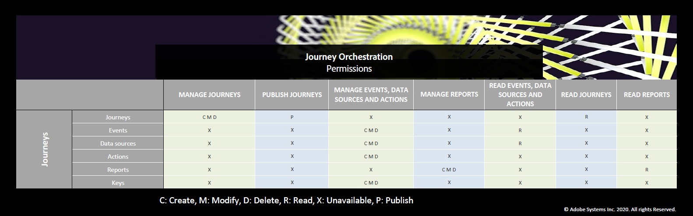

# Gerenciamento de acesso{#concept_rfj_wpt_52b}

## Sobre o gerenciamento de acesso {#about-access-management}

[!DNL Journey Orchestration] permite que você atribua um conjunto de permissões aos usuários para definir qual parte da interface eles podem acessar.

Eles podem ser gerenciados por administradores que têm acesso ao Admin Console. Para obter mais informações sobre o Admin Console, consulte esta [documentação](https://helpx.adobe.com/br/enterprise/managing/user-guide.html).

Para poder acessar [!DNL Journey Orchestration], o usuário deve ser:

* parte de um [!DNL Journey Orchestration] associado às **[!UICONTROL product profile]** [!DNL Journey Orchestration] permissões.
* parte de um [!DNL Adobe Experience Platform]**[!UICONTROL product profile]**. Não há permissão obrigatória para ter. O usuário deve ter a **[!UICONTROL profile management]** permissão para criar e editar segmentos da plataforma a partir da [!DNL Journey Orchestration] interface. Para obter mais informações, consulte esta [página](https://docs.adobe.com/content/help/en/experience-platform/access-control/home.html#adobe-admin-console).

No Admin Console, é possível atribuir um dos seguintes perfis de produto prontos para uso aos usuários:

* **[!UICONTROL Limited Access User]**: usuário com acesso somente leitura a viagens e relatórios. Este perfil de produto inclui as seguintes permissões:
   * Ler viagens
   * Ler relatórios

* **[!UICONTROL Administrators]**: usuário com acesso aos menus de administração com a possibilidade de gerenciar viagens, eventos e relatórios. Este perfil de produto inclui as seguintes permissões:
   * Gerenciar viagens
   * Publicar viagens
   * Gerenciar eventos, fontes de dados e ações
   * Gerenciar relatórios

   >[!NOTE]
   >
   >**[!UICONTROL Administrators]** é o único perfil de produto que permite a criação, edição e publicação de mensagens transacionais (ou modelos de mensagens) no Adobe Campaign Standard. Esse perfil de produto é necessário se você usar o Adobe Campaign Standard para enviar mensagens em suas viagens.

* **[!UICONTROL Standard User]**: usuário com acesso básico, como a gestão de jornada. Este perfil de produto inclui as seguintes permissões:
   * Gerenciar viagens
   * Publicar viagens
   * Gerenciar relatórios

Você também pode criar seus próprios perfis de produtos se os perfis prontos para uso não forem suficientes para gerenciar seus usuários.
Os usuários devem estar sempre vinculados a um perfil de produto, permitindo que você atribua a eles permissões de criação específicas, como:

* **[!UICONTROL Read journeys]**
* **[!UICONTROL Read reports]**
* **[!UICONTROL Manage events, data sources and actions]**
* **[!UICONTROL Read events, data sources and actions]**
* **[!UICONTROL Manage journeys]**
* **[!UICONTROL Publish journeys]**
* **[!UICONTROL Manage reports]**

Você pode encontrar abaixo a compatibilidade entre as permissões e [!DNL Journey Orchestration]as diferentes funcionalidades.

## Criação de um perfil de produto {#create-product-profile}

[!DNL Journey Orchestration] permite que você crie seus próprios perfis de produtos e atribua um conjunto de permissões e caixas de proteção aos usuários. Com perfis de produtos, você pode autorizar ou negar acesso a determinadas funcionalidades ou objetos na interface.

Para obter mais informações sobre como criar e gerenciar caixas de proteção, consulte a documentação [do](https://docs.adobe.com/content/help/en/experience-platform/sandbox/ui/user-guide.html)Adobe Experience Platform.

Para criar um perfil de produto e atribuir um conjunto de permissões e caixas de proteção:

1. No Admin Console, selecione **[!UICONTROL Journey Orchestration]**. From the **[!UICONTROL Product profile]** tab, click **[!UICONTROL New Profile]**.

   

1. Adicione um **[!UICONTROL Profile Name]** e **[!UICONTROL Description]** para o seu novo perfil de produto. Se você quiser que seu perfil **[!UICONTROL Display name]** seja diferente, desmarque **[!UICONTROL Same as Profile Name]** e digite seu **[!UICONTROL Display name]**.

1. Na **[!UICONTROL User Notifications]** categoria, escolha se os usuários serão notificados por email quando forem adicionados ou removidos deste perfil de produto.

1. Quando terminar, clique em **[!UICONTROL Done]**. Seu novo perfil de produto foi criado.

   

1. Selecione seu novo perfil de produto para obter as permissões de gerenciamento do start. Na **[!UICONTROL Users]** guia, adicione usuários ao seu perfil de produto. Para obter mais informações, consulte esta [página](../about/access-management.md#assigning-product-profile).

1. Execute as mesmas etapas descritas acima para adicionar **[!UICONTROL Admin]** ao seu perfil de produto.

1. Na **[!UICONTROL Permissions]** guia, selecione uma das duas categorias **[!UICONTROL Sandbox]** ou **[!UICONTROL Authoring]** para abrir a **[!UICONTROL Edit Permissions]** página e adicionar ou remover permissões para seu perfil de produto.

   

1. Na categoria de **[!UICONTROL Sandboxes]** permissões, escolha as caixas de proteção a serem atribuídas ao perfil do produto. Em **[!UICONTROL Available Permissions Items]**, clique no ícone de adição (+) para atribuir caixas de proteção ao seu perfil. For more information on sandboxes, refer to this [section](../about/access-management.md#sandboxes).

   

1. Se necessário, em **[!UICONTROL Included Permission Items]**, clique no ícone X ao lado de remover permissões para o perfil do produto.

   

1. Na categoria de **[!UICONTROL Authoring]** permissões, execute as mesmas etapas descritas acima para adicionar permissões ao perfil do produto.
    Para obter mais informações sobre permissões e compatibilidade entre permissões e [!DNL Journey Orchestration]as diferentes funcionalidades, consulte esta [seção](../about/access-management.md#about-access-management).

   

1. Quando terminar, clique em **[!UICONTROL Save]**.

Seu perfil de produto agora é criado e configurado. Os usuários vinculados a este perfil agora podem se conectar a [!DNL Journey Orchestration].

## Atribuição de um perfil de produto {#assigning-product-profile}

Os perfis de produtos são atribuídos a um conjunto de usuários que compartilham as mesmas permissões em sua organização.
A lista de cada perfil de produto pronto para uso com permissões atribuídas pode ser encontrada nesta seção.

Para atribuir um perfil de produto para um usuário acessar [!DNL Journey Orchestration]:

1. No Admin Console, selecione **[!UICONTROL Journey Orchestration]**.

   

1. Selecione o perfil do produto ao qual o novo usuário será vinculado.

   

1. Clique em **[!UICONTROL Add user]**.

   Você também pode adicionar seu novo usuário a um grupo de usuários para ajustar o conjunto compartilhado de permissões. Para obter mais informações, consulte esta [página](https://helpx.adobe.com/enterprise/using/user-groups.html).

   

1. Digite o endereço de email do novo usuário e clique em **[!UICONTROL Save]**.

   

Seu usuário deve receber um email de redirecionamento para sua [!DNL Journey Orchestration] instância.

## Uso de caixas de proteção {#sandboxes}

[!DNL Journey Orchestration] permite que você partilhe sua instância em ambientes virtuais separados chamados de caixas de proteção.
As caixas de proteção são atribuídas por meio de perfis de produto no Admin Console. Para obter mais informações sobre como atribuir caixas de proteção, consulte esta [seção](../about/access-management.md#create-product-profile).

[!DNL Journey Orchestration] reflete as caixas de proteção do Platform que foram criadas para uma determinada organização.
As caixas de proteção do Platform podem ser criadas ou redefinidas a partir da sua instância de Adobe Experience Platform. Consulte o guia [do usuário do](https://docs.adobe.com/content/help/en/experience-platform/sandbox/ui/user-guide.html) Sandbox para obter as etapas detalhadas.

Você pode encontrar o controle do alternador de sandbox na parte superior esquerda da tela. Para alternar de uma caixa de proteção para outra, clique na caixa de proteção ativa no momento no alternador e selecione outra caixa de proteção na lista suspensa.
