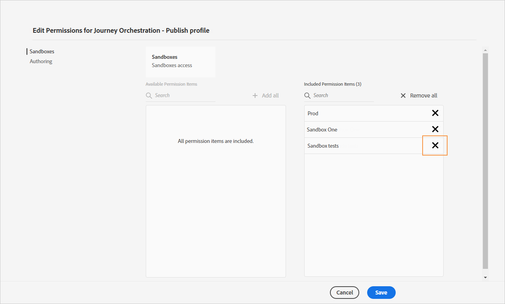
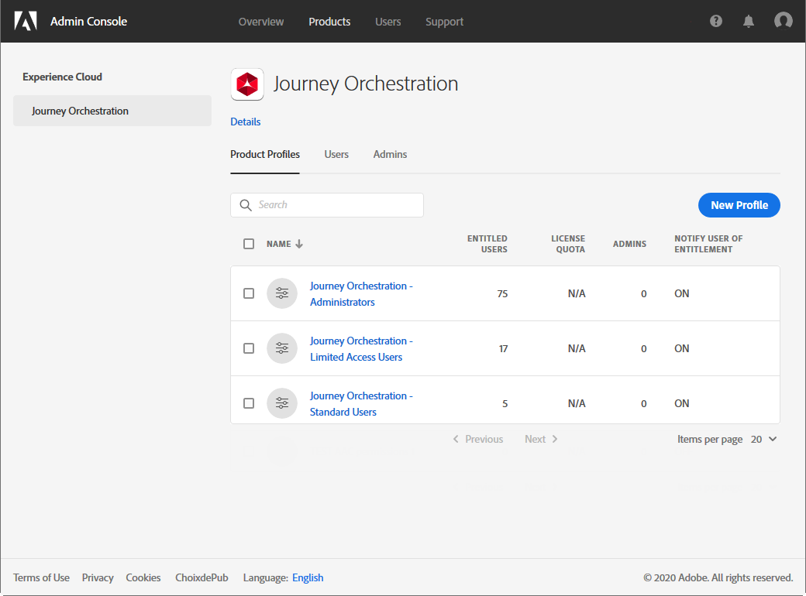

# Gerenciamento de acesso{#concept_rfj_wpt_52b}

## Sobre o gerenciamento de acesso {#about-access-management}

O [!DNL Journey Orchestration] permite atribuir um conjunto de permissões aos usuários para definir qual parte da interface pode ser acessada.

Eles podem ser gerenciados por administradores com acesso ao Admin Console. Para obter mais informações sobre o Admin Console, consulte esta [documentação](https://helpx.adobe.com/br/enterprise/managing/user-guide.html).

Para acessar o [!DNL Journey Orchestration], o usuário deve ser:

* parte de um [!DNL Journey Orchestration] **[!UICONTROL product profile]** associado às permissões [!DNL Journey Orchestration].
* parte de um [!DNL Adobe Experience Platform] **[!UICONTROL product profile]**. Não há uma permissão obrigatória. O usuário deve ter a permissão **[!UICONTROL profile management]** para criar e editar segmentos da plataforma na interface do [!DNL Journey Orchestration]. Para obter mais informações, consulte esta [página](https://docs.adobe.com/content/help/pt-BR/experience-platform/access-control/home.html#adobe-admin-console).

No Admin Console, é possível atribuir um dos seguintes perfis de produto prontos para uso aos usuários:

* **[!UICONTROL Limited Access User]**: usuário com acesso somente leitura a jornadas e relatórios. Este perfil de produto conta com as seguintes permissões:
   * Ler jornadas
   * Ler relatórios

* **[!UICONTROL Administrators]**: usuário com acesso aos menus de administração com a possibilidade de gerenciar jornadas, eventos e relatórios. Este perfil de produto conta com as seguintes permissões:
   * Gerenciar jornadas
   * Publicar jornadas
   * Gerenciar eventos, fontes de dados e ações
   * Gerenciar relatórios

   >[!NOTE]
   >
   >**[!UICONTROL Administrators]** é o único perfil de produto que permite a criação, edição e publicação de mensagens transacionais (ou modelos de mensagens) no Adobe Campaign Standard. Esse perfil de produto é necessário se você usar o Adobe Campaign Standard para enviar mensagens em suas jornadas.

* **[!UICONTROL Standard User]**: usuário com acesso básico, como gestão de jornada. Este perfil de produto conta com as seguintes permissões:
   * Gerenciar jornadas
   * Publicar jornadas
   * Gerenciar relatórios
   * Ler eventos, fontes de dados e ações

Você também pode criar seus próprios perfis de produtos se os perfis prontos para uso não forem suficientes para gerenciar os usuários.
Os usuários devem estar sempre vinculados a um perfil de produto, permitindo que você atribua a eles permissões de criação específicas, como:

* **[!UICONTROL Read journeys]**
* **[!UICONTROL Read reports]**
* **[!UICONTROL Manage events, data sources and actions]**
* **[!UICONTROL Read events, data sources and actions]**
* **[!UICONTROL Manage journeys]**
* **[!UICONTROL Publish journeys]**
* **[!UICONTROL Manage reports]**

Você pode encontrar abaixo a compatibilidade entre as permissões e diferentes funcionalidades do [!DNL Journey Orchestration].

## Criação de um perfil de produto {#create-product-profile}

O [!DNL Journey Orchestration] permite criar seus próprios perfis de produtos e atribuir um conjunto de permissões e sandboxes aos usuários. Com perfis de produtos, você pode autorizar ou negar acesso a determinadas funcionalidades ou objetos na interface.

Para obter mais informações sobre como criar e gerenciar sandboxes, consulte a [documentação da Adobe Experience Platform](https://docs.adobe.com/content/help/pt-BR/experience-platform/sandbox/ui/user-guide.html).

Para criar um perfil de produto e atribuir um conjunto de permissões e sandboxes:

1. No Admin Console, selecione **[!UICONTROL Journey Orchestration]**. Na guia **[!UICONTROL Product profile]**, clique em **[!UICONTROL New Profile]**.

   

1. Adicione um **[!UICONTROL Profile Name]** e **[!UICONTROL Description]** para o novo perfil de produto. Se você quiser que seu perfil **[!UICONTROL Display name]** seja diferente, desmarque **[!UICONTROL Same as Profile Name]** e digite seu **[!UICONTROL Display name]**.

1. Na categoria **[!UICONTROL User Notifications]**, escolha se os usuários serão notificados por email quando forem adicionados ou removidos do perfil de produto.

1. Quando terminar, clique em **[!UICONTROL Done]**. O novo perfil de produto foi criado.

   

1. Selecione o novo perfil de produto para iniciar o gerenciamento de permissões. Na guia **[!UICONTROL Users]**, adicione usuários ao perfil de produto. Para obter mais informações, consulte esta [página](../about/access-management.md#assigning-product-profile).

1. Siga as mesmas etapas descritas acima para adicionar **[!UICONTROL Admin]** ao perfil de produto.

1. Na guia **[!UICONTROL Permissions]**, selecione uma das duas categorias **[!UICONTROL Sandbox]** ou **[!UICONTROL Authoring]** para abrir a página **[!UICONTROL Edit Permissions]** e adicionar ou remover permissões do perfil de produto.

   

1. Na categoria de permissões **[!UICONTROL Sandboxes]**, escolha as sandboxes que serão atribuídas ao perfil do produto. Em **[!UICONTROL Available Permissions Items]**, clique no ícone de adição (+) para atribuir sandboxes ao perfil. Para obter mais informações sobre sandboxes, consulte esta [seção](../about/access-management.md#sandboxes).

   

1. Se necessário, no **[!UICONTROL Included Permission Items]**, clique no ícone X ao lado de remover permissões do perfil do produto.

   

1. Na categoria de permissões **[!UICONTROL Authoring]**, siga as mesmas etapas descritas acima para adicionar permissões ao perfil do produto.
    Para obter mais informações sobre permissões e compatibilidade entre permissões e as diferentes funcionalidades do [!DNL Journey Orchestration], consulte esta [seção](../about/access-management.md#about-access-management).

   

1. Quando terminar, clique em **[!UICONTROL Save]**.

O perfil de produto foi criado e está configurado. Os usuários vinculados a este perfil podem agora se conectar ao [!DNL Journey Orchestration].

## Atribuição de um perfil de produto {#assigning-product-profile}

Os perfis de produtos são atribuídos a um conjunto de usuários que compartilham as mesmas permissões em sua organização.
Você encontra a lista de cada perfil de produto pronto para uso com permissões atribuídas nesta seção.

Para atribuir um perfil de produto a um usuário acesse [!DNL Journey Orchestration]:

1. No Admin Console, selecione **[!UICONTROL Journey Orchestration]**.

   

1. Selecione o perfil do produto ao qual o novo usuário será vinculado.

   

1. Clique em **[!UICONTROL Add user]**.

   Você também pode adicionar seu novo usuário a um grupo de usuários para ajustar o conjunto compartilhado de permissões. Para obter mais informações, consulte esta [página](https://helpx.adobe.com/br/enterprise/using/user-groups.html).

   

1. Digite o email do novo usuário e clique em **[!UICONTROL Save]**.

   

Seu usuário deve receber um email de redirecionamento para sua instância [!DNL Journey Orchestration].

## Uso de sandboxes {#sandboxes}

O [!DNL Journey Orchestration] permite particionar sua instância em ambientes virtuais separados chamados de sandboxes.
As sandboxes são atribuídas por meio de perfis de produto no Admin Console. Para obter mais informações sobre como atribuir sandboxes, consulte esta [seção](../about/access-management.md#create-product-profile).

O [!DNL Journey Orchestration] reflete as sandboxes da Adobe Experience Platform que foram criadas para uma determinada organização.
As sandboxes da Adobe Experience Platform podem ser criadas ou redefinidas pela instância da Adobe Experience Platform. Consulte o [guia de usuário de sandbox](https://docs.adobe.com/content/help/en/experience-platform/sandbox/ui/user-guide.html) para ver as etapas detalhadas.

Você pode encontrar o controle do alternador de sandbox na parte superior esquerda da tela. Para alternar a sandbox, clique na sandbox atualmente ativa no alternador e selecione outra sandbox na lista suspensa.
