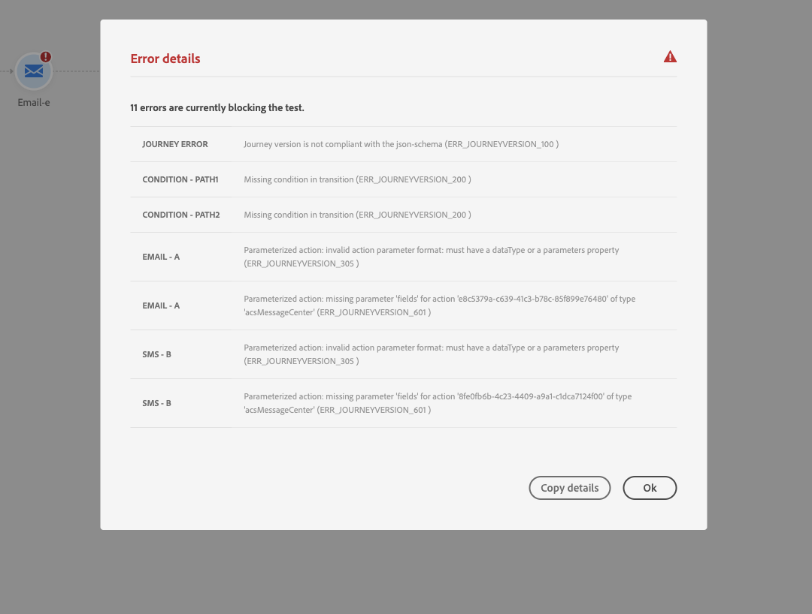

# Solução de problemas{#concept_nlv_bcv_2fb}

Nesta seção, você descobrirá como solucionar problemas de viagens antes de testar ou publicar. Todos os controlos a seguir enumerados podem ser efetuados quando a viagem estiver em modo de ensaio ou quando a viagem estiver em vida. A recomendação é que todas as verificações a seguir sejam feitas no modo de teste e, em seguida, prossigam para a publicação. Consulte [](../building-journeys/testing-the-journey.md).

## Verificação de erros antes de testar{#section_h3q_kqk_fhb}

Antes de testar e publicar sua jornada, verifique se todas as atividades estão configuradas corretamente. Não é possível executar testes ou publicações se os erros ainda forem detectados pelo sistema.

Os erros são exibidos com um símbolo de aviso exibido nas próprias atividades na tela. Coloque o cursor no ponto de exclamação para exibir a mensagem de erro. Se você clicar na atividade, verá a linha com erro, com um aviso. Por exemplo, se um campo obrigatório estiver vazio, um erro será exibido.


Por exemplo, na tela de desenho, quando duas atividades são desconectadas, um aviso é exibido.


Ao lado da **[!UICONTROL Test]** alternância e do **[!UICONTROL Publish]** botão, um sinal de aviso pode ser exibido. Este sinal de aviso mostra erros detectados pelo sistema e impede a ativação do modo de teste ou a publicação da jornada. Na maioria das vezes, os erros detectados pelo sistema estão vinculados aos erros visíveis nas atividades, mas às vezes estão vinculados a outros problemas. Nesse caso, você pode exibi-los e tentar identificar o problema usando a descrição do erro. Se não conseguir identificar o problema, você pode copiar os detalhes e enviá-los ao administrador ou para suporte. Observe que os erros que bloqueiam o teste e os erros que bloqueiam a publicação são semelhantes.

O sistema detecta dois tipos de problemas: erros e avisos. Os erros bloqueiam a publicação e a ativação de teste. Os avisos indicam possíveis problemas que não estão bloqueando a ativação de teste ou a publicação. Você verá uma descrição do problema e uma ID de log de problemas do tipo ERR_XXX_XXX. Isso ajudará o suporte técnico a identificar o problema.

Duas cores diferentes podem ser exibidas no sinal ao lado da **[!UICONTROL Test]** alternância e do **[!UICONTROL Publish]** botão. O sinal é exibido em vermelho em caso de erros. É exibido em laranja no caso de avisos.



Erros e avisos que são globais para a jornada aparecem primeiro na lista. Os erros e avisos relacionados a atividades específicas são listados depois, por ordem de atividade ou aparência na jornada da esquerda para a direita. O **[!UICONTROL Copy details]** botão copia informações técnicas sobre a jornada que a equipe de suporte pode usar para solucionar problemas.

## Verificando se os eventos foram enviados corretamente{#section_rqz_11t_dgb}

O ponto de partida de uma viagem é sempre um evento. Você pode realizar testes usando ferramentas como o Postman.

Você pode verificar se a chamada de API enviada por meio dessas ferramentas é enviada corretamente ou não. Se você receber um erro de volta, isso significa que sua chamada tem um problema. Verifique a carga novamente, o cabeçalho (e especialmente a ID da organização) e o URL de destino. Você pode perguntar ao administrador qual é o URL correto para ocorrência.

Eventos não são empurrados diretamente da origem para a Journey Orchestration. Na verdade, a Journey Orchestration depende das APIs de ingestão de streaming da plataforma Experience. Como resultado, no caso de problemas relacionados ao evento, consulte esta [página](https://docs.adobe.com/content/help/en/experience-platform/ingestion/streaming/troubleshooting.html) para obter a solução de problemas das APIs de ingestão de transmissão.

## Verificando se as pessoas entram na viagem{#section_x4v_zzs_dgb}

O relatórios da Journey Orchestration mede as entradas das pessoas numa viagem em tempo real.

Se você enviar o evento com sucesso, mas não vir nenhuma entrada na viagem, isso significa que algo corre mal entre o envio do evento e a recepção do evento na viagem.

Veja alguns itens e o administrador deve verificar:

* Tem certeza de que a jornada em que você espera que o evento de entrada esteja no modo de teste ou ao vivo?
* Você salvou seu evento antes de copiar a carga da pré-visualização de carga?
* Sua carga do evento contém uma ID do evento?
* Você atingiu o URL certo?
* Você seguiu a estrutura de carga das APIs de ingestão de fluxo usando a pré-visualização da estrutura de carga no painel de configuração do evento? Consulte [](../event/previewing-the-payload.md).
* Você usou os pares de chave/valor corretos no cabeçalho do seu evento?

   ```
   X-gw-ims-org-id - your ORGID
   Content-type - application/json
   ```

## Verificando como as pessoas navegam pela jornada{#section_l5y_yzs_dgb}

O relatórios de orquestração de jornada mede o progresso dos indivíduos dentro de uma jornada. É fácil identificar onde e por que uma pessoa foi parada.

Veja algumas coisas a serem verificadas:

* Isso se deve a uma condição que exclui a pessoa? Por exemplo, a condição é &quot;gênero = homem&quot; e a pessoa é uma mulher. Essa verificação pode ser realizada por um usuário comercial se a condição não for muito complexa.
* Isso ocorre porque uma chamada para uma fonte de dados não está respondendo? Quando a jornada está em teste, essas informações podem ser vistas nos registros do modo de teste. Quando a jornada é em tempo real, um administrador pode testar chamadas diretas para a fonte de dados e verificar a resposta recebida. Um administrador também pode duplicado a jornada e testá-la.

## Verificando se as mensagens foram enviadas com êxito{#section_qb1_yzs_dgb}

Se os indivíduos continuarem a percorrer o caminho certo na viagem, mas não receberem as mensagens que devem receber, pode verificar se:

* As mensagens transacionais levaram corretamente em conta a solicitação para enviar a mensagem. Um usuário comercial pode acessar o mensagen transacional que deve ser enviado e verificar se a hora da execução mais recente corresponde ao tempo de execução da sua jornada. Ele também pode verificar as chamadas/eventos de API mais recentes recebidos por mensagens transacionais.
* As mensagens transacionais enviaram a mensagem com êxito. Nos registros de envio do mensagen transacional, você pode ver o status de cada execução. Podem ver se é verde, vermelho e qual era o problema. Um usuário comercial pode acessar essa tela e enviar os registros a um administrador para mais investigações.

No caso de uma mensagem enviada através de uma ação personalizada, a única coisa que pode ser verificada durante o teste de viagem é o fato de a chamada do sistema da ação personalizada levar a um erro ou não. Se a chamada para o sistema externo associada à ação personalizada não levar a um erro, mas não a um envio de mensagem, algumas investigações devem ser feitas do lado do sistema externo.

