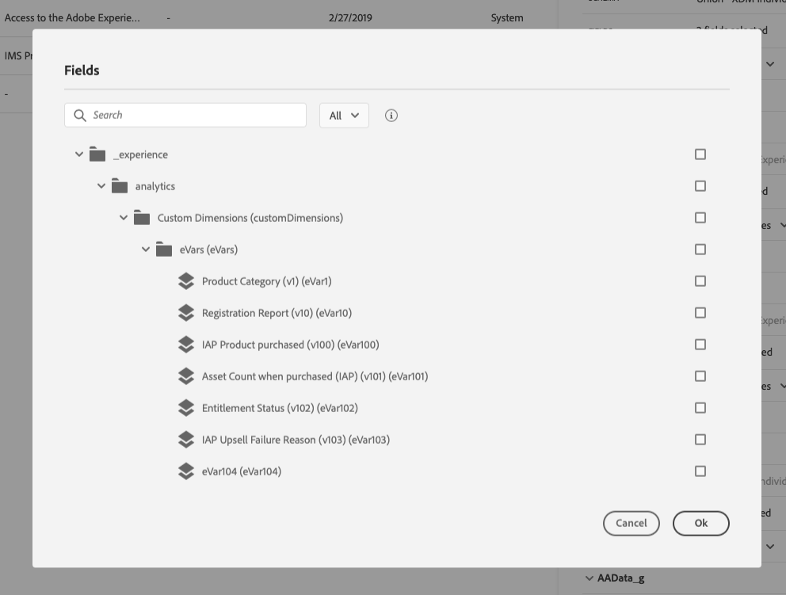

# Interface do usuário{#concept_rcq_lqt_52b}

>[!NOTE]
>
>Para tirar o melhor proveito do [!DNL Journey Orchestration], recomendamos a utilização do Chrome como navegador de Internet. A interface é exibida no idioma definido no IMS. Se o seu idioma IMS não for aceito pelo [!DNL Journey Orchestration], a interface será exibida em inglês.
>
>Esta documentação é atualizada com frequência para refletir as alterações recentes no produto. Entretanto, algumas capturas de tela podem diferir ligeiramente da interface do produto.

## Acesso ao [!DNL Journey Orchestration]{#accessing_journey_orchestration}

To access the [!DNL Journey Orchestration]&#39;s interface, click the **[!UICONTROL App Selector]** icon, in the top right, then click **[!UICONTROL Journey Orchestration]**.

Você também pode acessar o [!DNL Journey Orchestration] na página inicial da Experience Cloud, na seção **[!UICONTROL Quick access]**.

## Descobrir a interface{#section_jsq_zr1_ffb}

>[!CONTEXTUALHELP]
>id="jo_home"
>title="Sobre a lista da jornada"
>abstract="A lista de jornadas permite visualizar todas as suas jornadas de uma só vez, ver seu status e executar ações básicas. Você pode duplicar, interromper ou excluir suas jornadas. Dependendo da jornada, certas ações podem não estar disponíveis. Por exemplo, você não pode excluir ou reiniciar uma jornada encerrada. Você pode criar uma nova versão ou duplicá-la. Você também pode usar a barra de pesquisa para procurar uma jornada."
>additional-url="https://images-tv.adobe.com/mpcv3/38af62cb-9390-4bc0-a576-d336849adb97_1574809570.1920x1080at3000_h264.mp4" text="Assista ao vídeo de demonstração"

Os menus superiores permitem navegar por diferentes funcionalidades do [!DNL Journey Orchestration]: **[!UICONTROL Home]**(as jornadas),**[!UICONTROL Data Sources]**, **[!UICONTROL Events]**, **[!UICONTROL Actions]**.

Clique no ícone  no canto superior direito da tela para exibir a ajuda contextual. Ela está disponível em diferentes telas de lista [!DNL Journey Orchestration] (jornadas, eventos, ações e fontes de dados). A ajuda permite visualizar uma descrição rápida da funcionalidade atual e acessar artigos e vídeos relacionados.

## Pesquisa e filtragem{#section_lgm_hpz_pgb}

Em **[!UICONTROL Home]**,**[!UICONTROL Data Sources]**, **[!UICONTROL Events]** e **[!UICONTROL Actions]** listas, uma barra de pesquisa permite procurar um item.

O **[!UICONTROL Filters]** é acessível com um clique no ícone de filtro na parte superior esquerda da lista. O menu de filtros permite filtrar os elementos exibidos de acordo com diferentes critérios. Você pode optar por exibir apenas os elementos de um determinado tipo ou status, os que você criou ou os que foram modificados nos últimos 30 dias.

Nas listas **[!UICONTROL Data Sources]**, **[!UICONTROL Events]** e **[!UICONTROL Actions]**, use **[!UICONTROL Creation filters]** para filtrar a data de criação e o usuário. Por exemplo, você pode optar por exibir somente os eventos criados nos últimos 30 dias.

Na lista de jornada (abaixo **[!UICONTROL Home]**), além de **[!UICONTROL Creation filters]**, você também pode filtrar as jornadas exibidas de acordo com seu status e versão (**[!UICONTROL Status and version filters]**). Você também pode optar por exibir somente as jornadas que usam um evento, grupo de campos ou ação específica (**[!UICONTROL Activity filters]** e **[!UICONTROL Data filters]**). O **[!UICONTROL Publication filters]** permite selecionar uma data de publicação ou usuário. Você pode optar, por exemplo, por exibir somente as versões mais recentes de jornadas ao vivo que foram publicadas ontem. Consulte [esta página](../building-journeys/using-the-journey-designer.md).

>[!NOTE]
>
>Observe que as colunas exibidas podem ser personalizadas usando o botão de configuração na parte superior direita das listas. A personalização é salva para cada usuário.

As colunas **[!UICONTROL Last update]** e **[!UICONTROL Last update by]** exibem quando ocorreu a última atualização de suas jornadas e qual usuário a operou.

Nos painéis de configuração de evento, fonte de dados e ação, o campo **[!UICONTROL Used in]** exibe o número de jornadas que usam esse evento, grupo de campos ou ação em particular. Você pode clicar no botão **[!UICONTROL View journeys]** para exibir a lista de jornadas correspondentes.

Nas diferentes listas, é possível executar ações básicas em cada elemento. Por exemplo, você pode duplicar ou excluir um item.

## Navegação pelos campos da Adobe Experience Platform {#friendly-names-display}

Ao definir a [carga útil do evento](../event/defining-the-payload-fields.md), [carga útil do grupo de campo](../datasource/field-groups.md) e selecionar campos no [editor de expressões](../expression/expressionadvanced.md), o nome de exibição é exibido além do nome do campo. Essas informações são recuperadas a partir da definição do schema no modelo de dados de experiência.

Se descritores como &quot;xdm:alternateDisplayInfo&quot; forem fornecidos durante a configuração de schemas, os nomes de usuário simples substituirão os nomes de exibição. É especialmente útil ao trabalhar com &quot;eVars&quot; e campos genéricos. Você pode configurar descritores de nome simples por meio de uma chamada de API. Para obter mais informações, consulte o [guia do desenvolvedor do Registro de Schema](https://docs.adobe.com/content/help/pt-BR/experience-platform/xdm/api/getting-started.html).

Se um nome simples estiver disponível, o campo será exibido como `<friendly-name>(<name>)`. Se nenhum nome simples estiver disponível, o nome de exibição será exibido, por exemplo `<display-name>(<name>)`. Se nenhum deles estiver definido, somente o nome técnico do campo será exibido `<name>`.

>[!NOTE]
>
>Os nomes simples não são recuperados ao selecionar campos de uma união de schemas.

## Uso de atalhos diferentes{#section_ksq_zr1_ffb}

Estes são os diferentes atalhos disponíveis na interface do [!DNL Journey Orchestration].

_Na lista de jornadas, ações, fontes de dados ou eventos:_

* Pressione **c** para criar uma nova jornada, ação, fonte de dados ou evento.

_Ao configurar uma atividade em uma jornada:_

A tela é salva automaticamente. Você pode ver, na parte superior esquerda da tela, o status de salvamento.

* Pressione **escape** para fechar o painel de configuração e descartar as alterações feitas. É equivalente ao botão **[!UICONTROL Cancel]**.
* Pressione **Enter** ou clique fora do painel para fechar o painel de configuração. As alterações são salvas. É equivalente ao botão **[!UICONTROL Ok]**.
* Se você pressionar **Delete** ou **backspace**, será possível pressionar **Enter** para confirmar a exclusão.

_Em janelas pop-ups:_

* Pressione **escape** para fechar (equivalente ao botão **[!UICONTROL Cancel]**).
* Pressione **Enter** para salvar ou confirmar (equivalente ao botão **[!UICONTROL Ok]** ou **[!UICONTROL Save]**).

_No painel de configuração do evento, fonte de dados ou ação:_

* Pressione **escape** para fechar o painel de configuração sem salvar.
* Pressione **Enter** para salvar as modificações e fechar o painel de configuração.
* Pressione **tab** para saltar entre os diferentes campos que serão configurados.

_No editor de expressões simples_

* Duplo clique em um campo, à esquerda, para adicionar uma query (equivalente a arrastar e soltar).

_Ao navegar pelos campos XDM:_

* Marcar um &quot;nó&quot; selecionará todos os campos do nó.

_Em todas as áreas de texto:_

* Use a combinação de teclas **Ctrl/Command + A** para selecionar o texto. Na pré-visualização de carga, é selecionada a carga útil.

_Em uma tela com uma barra de pesquisa:_

* Use a combinação de teclas **Ctrl/Command + F** para selecionar a barra de pesquisa.

_Na tela de uma jornada:_

* Use a combinação de teclas **Ctrl/Command + A** para selecionar todas as atividades.
* Quando uma ou várias atividades forem selecionadas, pressione **Delete** ou **backspace** para excluí-las. Pressione **Enter** na janela pop-up para confirmar.
* Clique duas vezes em uma atividade da paleta esquerda para adicioná-la à primeira posição disponível (de cima para baixo).
