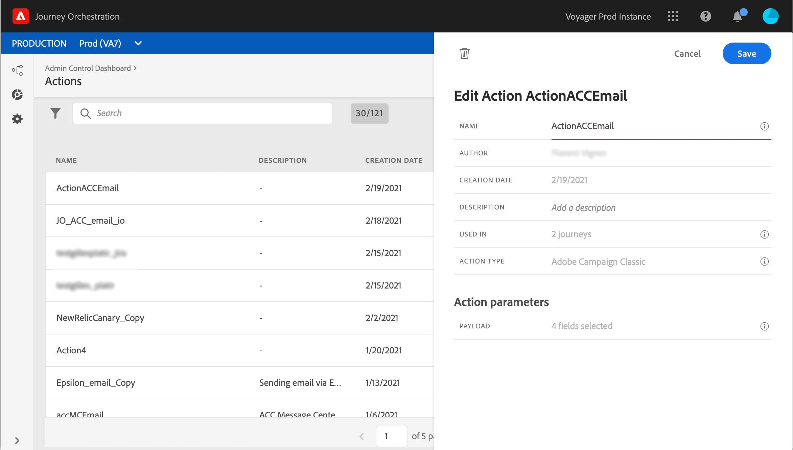

# Trabalhar com o Adobe Campaign v7/v8 {#integrating-with-adobe-campaign-classic}

Essa integração está disponível para o Adobe Campaign Classic v7, a partir da versão 21.1, e o Adobe Campaign v8. Ela permite enviar emails, notificações por push e SMS usando os recursos de mensagens transacionais do Adobe Campaign.

A conexão entre as instâncias do Journey Orchestration e do Campaign é configurada pela Adobe no momento do provisionamento.

Um caso de uso completo é apresentado nesta [seção](../usecase/campaign-classic-use-case.md).

Para cada ação configurada, uma atividade de ação está disponível na paleta do designer de jornada. Consulte esta [seção](../building-journeys/using-adobe-campaign-classic.md).

## Observações importantes

* Não há limitação de mensagens. Limitamos o número de mensagens que podem ser enviadas para 50.000/hora com base em nosso SLA do Campaign atual. Por esse motivo, a orquestração de Jornadas só deve ser usada em casos de uso unitário (eventos individuais, não segmentos).

* Você precisa configurar uma ação na tela por modelo que deseja usar. É necessário configurar uma ação no Journey Orchestration para cada modelo que você deseja usar do Adobe Campaign.

* Recomendamos que você use uma instância dedicada do Centro de mensagens hospedada para essa integração para evitar que você afete outras operações do Campaign que possam estar ocorrendo. O servidor de marketing pode ser hospedado ou no local. A build necessária é a versão 21.1 ou posterior.

* Não há validação para indicar que a carga ou mensagem da campanha está correta.

* Não é possível usar uma ação do Campaign com um evento de qualificação de segmento.

## Pré-requisitos

No Campaign, você precisa criar e publicar uma mensagem transacional e seu evento associado. Consulte a [documentação do Adobe Campaign](https://experienceleague.adobe.com/docs/campaign-classic/using/transactional-messaging/introduction/about-transactional-messaging.html#transactional-messaging).

Você pode criar sua carga JSON correspondente a cada mensagem seguindo o padrão abaixo. Você colará essa carga ao configurar a ação no Journey Orchestration (veja abaixo)

Exemplo:

```
{
    "channel": "email",
    "eventType": "welcome",
    "email": "example@adobe.com",
    "ctx": {
        "firstName": "John"
    }
}
```

* **canal**: o canal definido para o modelo transacional do Campaign
* **eventType**: o nome interno do evento do Campaign
* **ctx**: variável com base na personalização que você tem em sua mensagem.

## Configuração da ação

No Journey Orchestration, é necessário configurar uma ação por mensagem transacional. Siga estas etapas:

1. Criar uma nova ação. Consulte esta [seção](../action/action.md).
1. Insira um nome e uma descrição.
1. No campo **Tipo de ação**, selecione **Adobe Campaign Classic**.
1. Clique no campo **Carga** e cole um exemplo da carga JSON correspondente à mensagem do Campaign. Entre em contato com o Adobe para obter essa carga.
1. Ajuste os diferentes campos para serem estáticos ou variáveis, dependendo se deseja mapeá-los na tela de Jornada. Determinados campos, como parâmetros de canal para campos de endereço de email e personalização (ctx), provavelmente serão definidos como variáveis para mapeamento no contexto da jornada.
1. Clique em **Salvar**.




