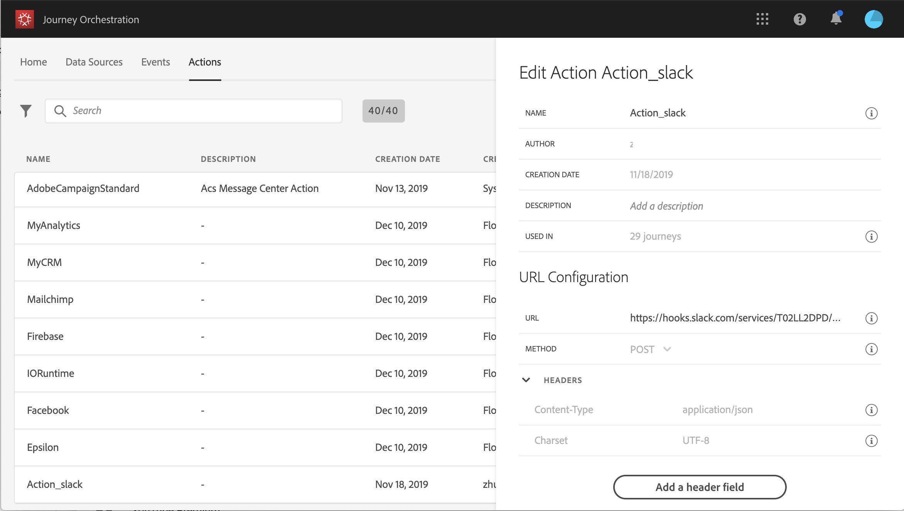

# Configurar o URL {#concept_gbg_1f1_2gb}

>[!CAUTION]
>
>**Está procurando pelo Adobe Journey Optimizer**? Clique [aqui](https://experienceleague.adobe.com/pt-br/docs/journey-optimizer/using/ajo-home){target="_blank"} para acessar a documentação do Journey Optimizer.
>
>
>_Essa documentação refere-se ao material herdado do Journey Orchestration, que foi substituído pelo Journey Optimizer. Entre em contato com a equipe de contas em caso de dúvidas sobre como acessar o Journey Orchestration ou o Journey Optimizer._

Ao configurar uma ação personalizada, você precisa definir os seguintes **[!UICONTROL URL Configuration]** parâmetros:

1. No campo **[!UICONTROL URL]**, especifique a URL do serviço externo:

   * Se o URL for estático, insira o URL neste campo.

   * Se o URL incluir um caminho dinâmico, insira apenas a parte estática do URL, ou seja, o esquema, o host, a porta e, opcionalmente, uma parte estática do caminho.

     Exemplo: `https://xxx.yyy.com/somethingstatic/`

     Você especificará o caminho dinâmico do URL ao adicionar a ação personalizada a uma jornada. [Saiba mais](../building-journeys/using-custom-actions.md).

   >[!NOTE]
   >
   >Por motivos de segurança, recomendamos que você use o esquema HTTPS para o URL. Não permitimos o uso de endereços Adobe que não sejam públicos e o uso de endereços IP.
   >
   >Somente as portas padrão são permitidas ao definir uma ação personalizada: 80 para http e 443 para https.

1. Selecione a chamada **[!UICONTROL Method]**: pode ser **[!UICONTROL POST]** ou **[!UICONTROL PUT]**.
1. Na seção **[!UICONTROL Headers]**, defina os cabeçalhos HTTP da mensagem de solicitação a ser enviada para o serviço externo:
   1. Para adicionar um campo de cabeçalho, clique em **[!UICONTROL Add a header field]**.
   1. Insira a chave do campo de cabeçalho.
   1. Para definir um valor dinâmico para o par de valor-chave, selecione **[!UICONTROL Variable]**. Caso contrário, selecione **[!UICONTROL Constant]**.

      Por exemplo, para um carimbo de data e hora, é possível definir um valor dinâmico.

   1. Se você selecionou **[!UICONTROL Constant]**, insira o valor constante.

      Se você selecionou **[!UICONTROL Variable]**, especificará essa variável ao adicionar a ação personalizada a uma jornada. [Saiba mais](../building-journeys/using-custom-actions.md).

      

   1. Para excluir um campo de cabeçalho, aponte para o campo de cabeçalho e clique no ícone **[!UICONTROL Delete]**.

   Os campos de cabeçalho **[!UICONTROL Content-Type]** e **[!UICONTROL Charset]** são definidos por padrão. Não é possível modificar ou excluir esses campos.

   Depois de ter adicionado a ação personalizada a uma jornada, ainda será possível adicionar campos de cabeçalho a ela se a jornada estiver em status de rascunho. Se não quiser que a jornada seja afetada pelas alterações de configuração, duplique a ação personalizada e adicione os campos de cabeçalho à nova ação personalizada.

   >[!NOTE]
   >
   >Os cabeçalhos são validados de acordo com as regras de análise de campo. [Saiba mais](https://tools.ietf.org/html/rfc7230#section-3.2.4).
