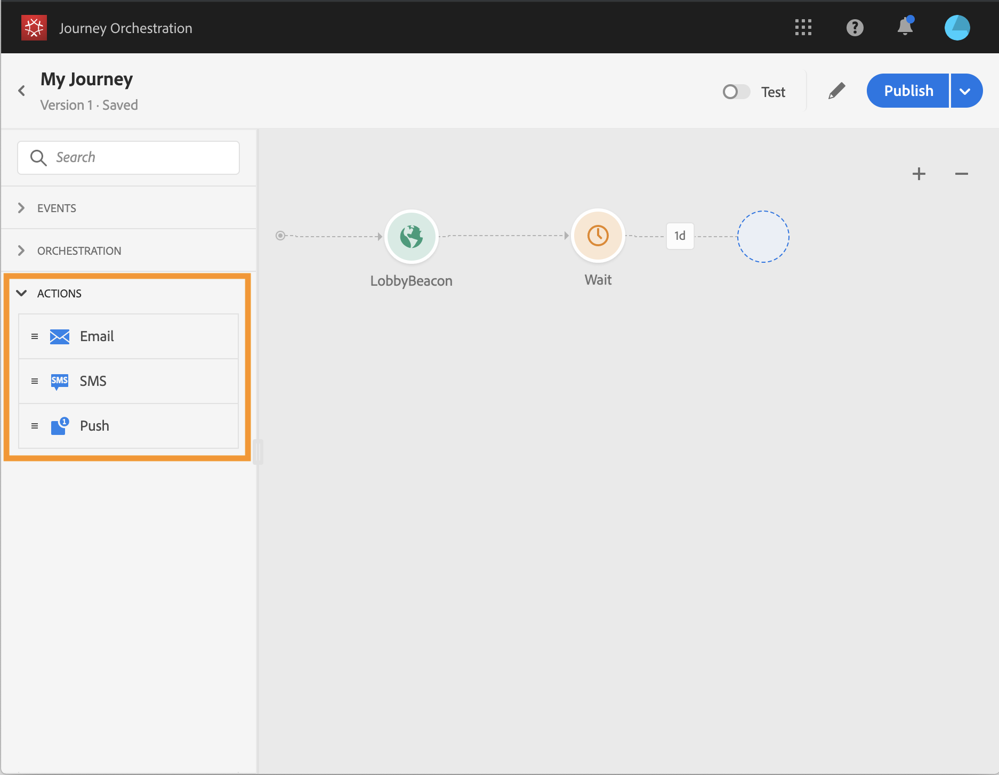

# Trabalhar com o Adobe Campaign Standard {#using_adobe_campaign_standard}

>[!CAUTION]
>
>**Está procurando pelo Adobe Journey Optimizer**? Clique [aqui](https://experienceleague.adobe.com/pt-br/docs/journey-optimizer/using/ajo-home){target="_blank"} para acessar a documentação do Journey Optimizer.
>
>
>_Essa documentação refere-se ao material herdado do Journey Orchestration, que foi substituído pelo Journey Optimizer. Entre em contato com a equipe de contas em caso de dúvidas sobre como acessar o Journey Orchestration ou o Journey Optimizer._

Você pode enviar emails, notificações por push e SMS usando os recursos de Mensagens transacionais do Adobe Campaign Standard.

O [!DNL Journey Orchestration] vem com uma ação pronta para uso que permite a conexão com o Adobe Campaign Standard.

A mensagem transacional do Campaign Standard e o evento associado devem ser publicados para serem usados no Journey Orchestration. Se o evento for publicado, mas a mensagem não for, ele não estará visível na interface do Journey Orchestration. Se a mensagem for publicada, mas o evento associado não, ela ficará visível na interface do Journey Orchestration, mas não poderá ser usada.

>[!NOTE]
>
>Uma regra de limitação de 4.000 chamadas a cada 5 minutos é definida automaticamente para ações do Adobe Campaign Standard, assim que a integração do Adobe Campaign Standard é configurada. Isso corresponde à escala oficial das Mensagens transacionais do Adobe Campaign Standard.
>
>Leia mais sobre os SLAs de mensagens transacionais em [Descrição do produto Adobe Campaign Standard](https://helpx.adobe.com/br/legal/product-descriptions/campaign-standard.html).

Estas são as etapas para configurá-la:

1. Na lista **[!UICONTROL Actions]**, clique na ação **[!UICONTROL AdobeCampaignStandard]** interna. O painel de configuração de ação é aberto no lado direito da tela.

   

1. Copie a URL da instância do Adobe Campaign Standard e cole no campo **[!UICONTROL URL]**.

1. Clique em **[!UICONTROL Test the instance URL]** para testar a validade da instância.

   >[!NOTE]
   >
   >Este teste verifica se:
   >
   >O host é &quot;.campaign.adobe.com&quot;, &quot;.campaign-sandbox.adobe.com&quot;, &quot;.campaign-demo.adobe.com&quot;, &quot;.ats.adobe.com&quot; ou &quot;.adls.adobe.com&quot;.
   >
   >O URL começa com https,
   >
   >A ORG associada a essa instância do Adobe Campaign Standard é a mesma ORG do Journey Orchestration.

Ao criar sua jornada, três ações estarão disponíveis na categoria **[!UICONTROL Action]**: **[!UICONTROL Email]**, **[!UICONTROL Push]**, **[!UICONTROL SMS]** (consulte [Usando ações do Adobe Campaign](../building-journeys/using-adobe-campaign-actions.md)). O **Evento de reações** também permitirá que você reaja a cliques de mensagem, aberturas, etc. (consulte [Eventos de reações](../building-journeys/reaction-events.md)).

Se você estiver usando um sistema de terceiros para enviar mensagens, será necessário adicionar e configurar uma ação personalizada. Consulte [Sobre a configuração de ação personalizada](../action/about-custom-action-configuration.md).
