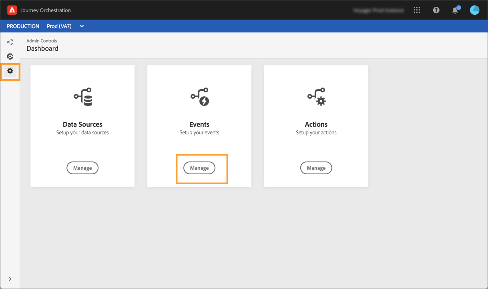

# Eventos com base em regras{#simplified-events}

Simplificamos a forma como você configura os eventos na experiência. Estamos introduzindo um novo método que não requer o uso de uma ID de evento. Agora é possível definir um evento com base em regras ao configurar seu evento no Journey Orchestration.

Esse novo tipo de evento não gera uma eventID. Usando o editor de expressões simples, agora você simplesmente define uma regra que será usada pelo sistema para identificar os eventos relevantes que acionarão suas viagens. Essa regra pode se basear em qualquer campo disponível na carga do evento, por exemplo, o local do perfil ou o número de itens adicionados ao carrinho do perfil.

Esse novo método é transparente para os usuários. A única alteração é um novo campo na tela de definição do evento.

>[!CAUTION]
>
>Uma regra de limite é definida para eventos baseados em regras. Limita o número de eventos qualificados que uma jornada pode processar a 400 mil por minuto. Entre em contato com seu ponto de contato do programa Alpha para obter mais informações.

## Como aproveitar os dados da Adobe Analytics{#analytics-data}

>[!NOTE]
>
>Esta seção se aplica somente aos clientes que precisam usar os dados da Adobe Analytics.

Você pode aproveitar todos os dados de evento comportamental da Adobe Analytics que já está capturando e fazendo streaming na plataforma para acionar viagens e automatizar experiências para seus clientes.

Para que isso funcione, é necessário ativar, no Adobe Experience Platform, o conjunto de relatórios que você deseja aproveitar:

1. No Adobe Experience Platform, selecione **[!UICONTROL Sources]** e depois **[!UICONTROL Add data]** na seção Adobe Analytics. A lista de conjuntos de relatórios Adobe Analytics disponíveis é exibida.

1. Selecione o conjunto de relatórios que deseja ativar, clique em **[!UICONTROL Next]** e em **[!UICONTROL Finish]**.

1. Compartilhe a ID de dados de origem com o ponto de contato do programa alfa.

Isso habilita o conector de origem do Analytics para esse conjunto de relatórios. Sempre que os dados entram, eles são transformados em um evento da Experiência e enviados para o Adobe Experience Platform.

Para obter mais informações sobre o conector de origem Adobe Analytics, consulte a [documentação](https://docs.adobe.com/help/en/experience-platform/sources/connectors/adobe-applications/analytics.html) e o [tutorial](https://docs.adobe.com/content/help/en/experience-platform/sources/ui-tutorials/create/adobe-applications/analytics.html).

## Configurar um evento baseado em regras{#configuring-rule-based}

1. No menu esquerdo, clique no **[!UICONTROL Admin]** ícone e, em seguida, clique em **[!UICONTROL Events]**. A lista dos eventos é exibida.

   

1. Clique em **[!UICONTROL Add]** para criar um novo evento. O painel de configuração do evento é aberto no lado direito da tela.

   

1. Digite o nome do seu evento. Você também pode adicionar uma descrição.

   

1. In the new **[!UICONTROL Event ID type]** field, select **[!UICONTROL Rule Based]**.

   

   >[!NOTE]
   >
   >O **[!UICONTROL System Generated]** tipo é o método existente que requer uma eventID. Consulte [esta seção](../event/about-events.md).

1. Defina o **[!UICONTROL Schema]** e a carga **[!UICONTROL Fields]**. Consulte [esta seção](../event/defining-the-payload-fields.md).

   

   >[!NOTE]
   >
   >Quando você seleciona o **[!UICONTROL System Generated type]**, somente os schemas com a combinação do tipo eventID estão disponíveis. Quando você seleciona o **[!UICONTROL Rule Based]** tipo, todos os schemas do Evento Experience estão disponíveis.

1. Clique dentro do **[!UICONTROL Event ID condition]** campo. Usando o editor de expressões simples, defina a condição que será usada pelo sistema para identificar os eventos que acionarão sua jornada.

   

   Em nosso exemplo, escrevemos uma condição baseada na cidade do perfil. Isso significa que, sempre que o sistema receber um evento que corresponda a essa condição (**[!UICONTROL City]** campo e **[!UICONTROL Paris]** valor), ele o transmitirá ao Journey Orchestration.

1. Defina o **[!UICONTROL Namespace]** e **[!UICONTROL Key]**. Consulte [Seleção da namespace](../event/selecting-the-namespace.md) e [Definição da chave](../event/defining-the-event-key.md)do evento.

   

As outras etapas para a configuração do evento e criação da jornada permanecem inalteradas.

O evento agora está configurado e pronto para ser lançado em uma jornada como qualquer outro evento. Toda vez que um evento que corresponde à regra é enviado ao sistema, ele é passado para a Journey Orchestration para acionar suas viagens.

## Modo de teste para eventos baseados em regras{#test-rule-based}

O modo de teste também está disponível para viagens que usam um evento baseado em regras.

Ao acionar um evento, a tela de configuração **do** Evento permite que você defina os parâmetros do evento a serem aprovados no teste. Você pode visualização a condição da ID do evento clicando no ícone da dica de ferramenta no canto superior direito. Uma dica de ferramenta também está disponível ao lado de cada campo que faz parte da avaliação da regra.

For more information on how to use the test mode, refer to .

