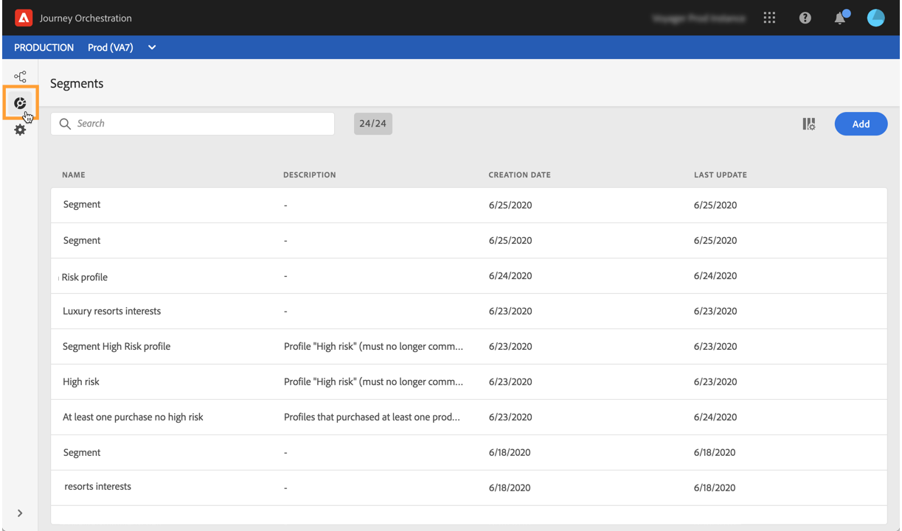

# Descobrindo a interface da versão Alpha {#discovering-alpha-interface}

## Sobre a interface de versão Alpha {#about-alpha-interface}

A navegação nos [!DNL Journey Orchestration] menus foi aprimorada para fornecer uma interface consistente com o Adobe Experience Platform. As alterações incluem:

* Os menus são movidos de cima para o lado esquerdo da interface,
* Agrupamento de funcionalidades administrativas em um único painel.

Os conceitos globais sobre como usar e navegar na interface (pesquisar e filtrar, navegar pelos campos do Adobe Experience Platform, atalhos) são apresentados [nesta seção](../about/user-interface.md).

## Acessar [!DNL Journey Orchestration] funcionalidades {#accessing-journey-orchestration-functionalities}

A barra de menus localizada no lado esquerdo dá acesso às diferentes funcionalidades. Clique em um ícone para acessar o menu correspondente. Você pode clicar na seta na parte inferior esquerda para expandir ou recolher a barra de menus.

Quando você acessa [!DNL Journey Orchestration], o **[!UICONTROL Journeys]** menu é exibido, permitindo que você acesse as viagens existentes ou crie novas. See [Using the journey designer](../building-journeys/using-the-journey-designer.md).

O **[!UICONTROL Segments]** menu permite acessar e criar segmentos do Adobe Experience Platform. Consulte [Sobre segmentos](../segment/about-segments.md)Adobe Experience Platform.

O **[!UICONTROL Admin]** menu está disponível para todos os usuários com direitos de Administrador (consulte Gerenciamento [de](../about/access-management.md)acesso). Ele fornece um painel que permite configurar fontes [de](../datasource/about-data-sources.md)dados, [eventos](../event/about-events.md) e [ações](../action/action.md).

