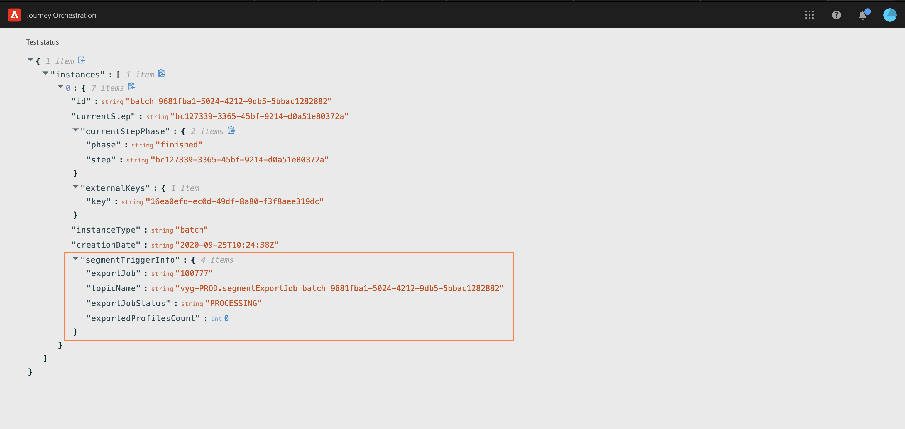

# Atividade Ler segmento {#segment-trigger-activity}

## Sobre a atividade Ler segmento {#about-segment-trigger-actvitiy}

>[!NOTE]
>
>Se uma atividade de ação predefinida da Adobe Campaign Standard estiver presente na tela no momento da publicação ou no modo de teste no tempo de ativação, a jornada será limitada a 13 entradas por segundo. Caso contrário, a viagem será limitada a 1000 eventos por segundo.

A atividade Ler segmento permite fazer com que todos os indivíduos que pertencem a um segmento do Adobe Experience Platform entrem em uma jornada. A entrada em uma jornada pode ser efetuada uma vez ou regularmente.

Digamos que você tenha um segmento de cliente Gold no Adobe Experience Platform. Com a atividade de segmentos de leitura, é possível fazer com que todos os indivíduos pertencentes ao segmento de clientes Gold entrem em uma jornada e façam com que eles fluam em jornadas individualizadas que aproveitarão todas as funcionalidades de viagem: condições, temporizadores, eventos, ações.

## Configuring the activity {#configuring-segment-trigger-activity}

>[!NOTE]
>
>Devido às latências de exportação de segmento, não é possível acionar uma jornada baseada em segmento em um período de tempo mais curto que uma hora.

1. Desdobre a **[!UICONTROL Orchestration]** categoria e solte uma **[!UICONTROL Read Segment]** atividade na tela.

   A atividade deve ser posicionada como o primeiro passo de uma viagem.

1. Adicione um item **[!UICONTROL Label]** à atividade (opcional).

1. No **[!UICONTROL Segment]** campo, escolha o segmento Adobe Experience Platform que entrará na jornada e clique em **[!UICONTROL Save]**.

   >[!NOTE]
   >
   >Observe que você pode personalizar as colunas exibidas na lista e classificá-las.

   

   Depois que o segmento é adicionado, o **[!UICONTROL Copy]** botão permite copiar seu nome e ID:

   `{"name":"Gold customers,”id":"8597c5dc-70e3-4b05-8fb9-7e938f5c07a3"}`

   

1. No **[!UICONTROL Namespace]** campo, escolha a namespace a ser usada para identificar os indivíduos. For more on namespaces, refer to [this section](../event/selecting-the-namespace.md).

   >[!NOTE]
   >
   >Os indivíduos que pertencem a um segmento que não tem a identidade (namespace) selecionada entre suas diferentes identidades não podem entrar na jornada.

1. A **[!UICONTROL Read Segment]** atividade permite especificar a hora em que o segmento entrará na jornada. Para fazer isso, clique no **[!UICONTROL Edit journey schedule]** link para acessar as propriedades da jornada e configure o **[!UICONTROL Scheduler type]** campo.

   

   Por padrão, os segmentos entram na jornada **[!UICONTROL As soon as possible]**, o que significa 1 hora após a publicação da jornada. Se desejar que o segmento insira a jornada em uma data/hora específica ou de forma recorrente, selecione o valor desejado na lista.

   >[!NOTE]
   >
   >Observe que a **[!UICONTROL Schedule]** seção só está disponível quando uma **[!UICONTROL Read Segment]** atividade é solta na tela.

   

## Testar e publicar a viagem {#testing-publishing}

A **[!UICONTROL Read Segment]** atividade permite testar a jornada em um perfil unitário ou em 100 perfis de teste aleatório selecionados entre os perfis qualificados para o segmento.

Para fazer isso, ative o modo de teste e selecione a opção desejada no painel esquerdo.

Você pode configurar e executar o modo de teste como de costume. Na [presente seção](../building-journeys/testing-the-journey.md)são apresentados passos detalhados sobre como testar uma viagem.

Quando o teste estiver em execução, o **[!UICONTROL Show logs]** botão permite que você veja os resultados de teste de acordo com a opção de teste selecionada:

* **[!UICONTROL Single profile at a time]**: os registros de teste exibem as mesmas informações que ao usar o modo de teste unitário. Para obter mais informações, consulte [esta seção](../building-journeys/testing-the-journey.md#viewing_logs)

* **[!UICONTROL Up to 100 profiles at once]**: os registros de teste permitem rastrear a progressão da exportação do segmento da Adobe Experience Platform, bem como o progresso individual de todas as pessoas que entraram na jornada.

   Observe que testar a jornada usando até 100 perfis ao mesmo tempo não permite rastrear o progresso dos indivíduos na jornada usando o fluxo visual.

   

Depois que os testes forem bem-sucedidos, você poderá publicar sua jornada (consulte [Publicação da jornada](../building-journeys/publishing-the-journey.md)). Os indivíduos que pertencem ao segmento entram na viagem na data/hora especificada na seção relativa às propriedades da viagem **[!UICONTROL Scheduler]** .

>[!NOTE]
>
>Ao fazer uma nova versão de uma jornada baseada em segmentos que não é recorrente (começando o mais rápido possível ou &quot;uma vez&quot;), todos os indivíduos que entraram na jornada anteriormente não voltarão a entrar na nova versão quando você a publicar. Se você quiser permitir que eles entrem novamente, você deve duplicado a jornada.
