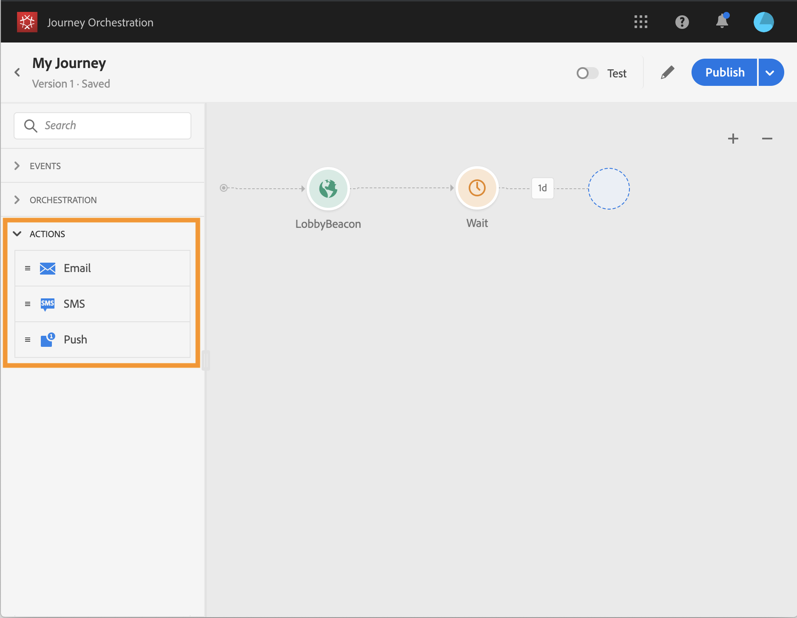

# Sobre atividades de ação {#concept_hbj_hrt_52b}

>[!CAUTION]
>
>**Procurando Adobe Journey Optimizer**? Clique [aqui](https://experienceleague.adobe.com/pt-br/docs/journey-optimizer/using/ajo-home){target="_blank"} para obter a documentação do Journey Optimizer.
>
>
>_Esta documentação se refere ao material herdado do Journey Orchestration que foi substituído pelo Journey Optimizer. Entre em contato com a equipe de conta em caso de dúvidas sobre o acesso ao Journey Orchestration ou Journey Optimizer._

Na paleta, no lado esquerdo da tela, abaixo de **[!UICONTROL Events]** e **[!UICONTROL Orchestration]**, você encontrará a categoria **[!UICONTROL Actions]**.

Essas atividades representam os diferentes canais de comunicação disponíveis. É possível combiná-los para criar um cenário entre canais.

Se você tiver o Adobe Campaign Standard, as seguintes atividades de ação predefinidas estarão disponíveis: **[!UICONTROL Email]**, **[!UICONTROL Push]** e **[!UICONTROL SMS]**. Consulte [esta página](../building-journeys/using-adobe-campaign-actions.md).

Se você tiver configurado ações personalizadas, elas também aparecerão aqui (consulte [esta página](../building-journeys/using-custom-actions.md)).

Ao soltar uma atividade de ação na tela, você pode definir um **[!UICONTROL Label]**. Isso permite adicionar um sufixo ao nome da ação que aparecerá em sua atividade na tela. Isso é útil se você usar a mesma ação várias vezes na jornada e quiser identificá-las mais facilmente. Os relatórios também serão mais fáceis de ler. Você também pode adicionar um **[!UICONTROL Description]** opcional.

A jornada de uma pessoa para quando ocorre um erro em uma ação ou condição. O único modo de fazê-la continuar é marcando a caixa **[!UICONTROL Add an alternative path in case of a timeout or an error]**. Consulte [esta seção](../building-journeys/using-the-journey-designer.md#paths).
