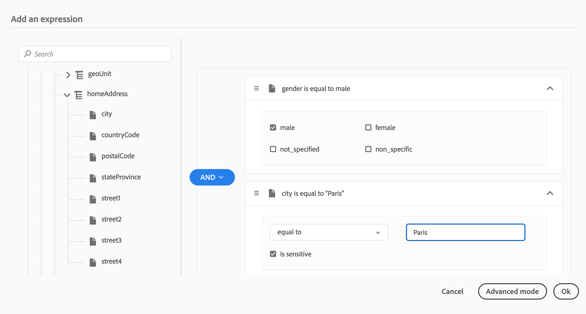
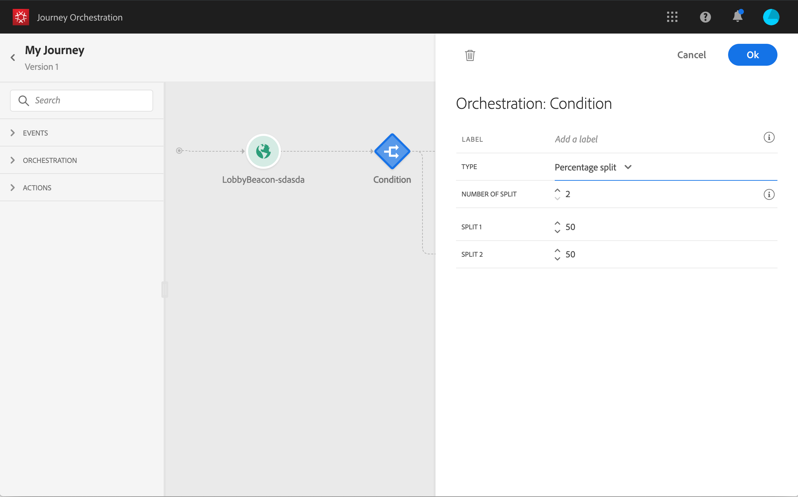

# Atividade de condição{#section_e2n_pft_dgb}

Há quatro tipos de condições disponíveis:

* [Condição da fonte de dados](#data_source_condition)
* [Condição de tempo](#time_condition)
* [Divisão de porcentagem](#percentage_split)
* [Condição de data](#date_condition)

## Sobre a atividade de Condição {#about_condition}

Ao usar várias condições em uma jornada, você pode definir rótulos para cada uma delas para identificá-las mais facilmente.

Clique em **[!UICONTROL Add a path]** se quiser definir várias condições. Para cada condição, um novo caminho é adicionado na tela após a atividade.

Observe que o design das jornadas tem impactos funcionais. Quando vários caminhos são definidos após uma condição, somente o primeiro caminho qualificado é executado. Isso significa que é possível variar a priorização de caminhos colocando-os um acima ou abaixo do outro.

Por exemplo, vamos pegar o exemplo de uma condição de primeiro caminho &quot;A pessoa é um VIP&quot; e uma condição de segundo caminho &quot;A pessoa é um homem&quot;. Se uma pessoa que atende às duas condições (um homem que é VIP) passar por essa etapa, o primeiro caminho será escolhido mesmo que ele também seja elegível para o segundo, porque o primeiro caminho é &quot;acima&quot;. Para alterar essa prioridade, mova suas atividades em outra ordem vertical.

Você pode criar outro caminho para públicos-alvo que não se qualifiquem para as condições definidas marcando **[!UICONTROL Show path for other cases than the one(s) above]**. Observe que essa opção não está disponível em condições de divisão. Consulte [Divisão de porcentagem](#percentage_split).

O modo simples permite executar consultas simples com base em uma combinação de campos. Todos os campos disponíveis são exibidos no lado esquerdo da tela. Arraste e solte campos na zona principal. Para combinar os elementos diferentes, faça o interbloqueio entre eles para criar grupos e/ou níveis de grupo diferentes. Você pode selecionar um operador lógico para combinar elementos no mesmo nível:

* AND: uma interseção de dois critérios. Somente os elementos correspondentes a todos os critérios são considerados.
* OR: uma união de dois critérios. Os elementos correspondentes a pelo menos um dos critérios são considerados.

Se você estiver usando o [Serviço de segmentação do Adobe Experience Platform](https://experienceleague.adobe.com/docs/experience-platform/segmentation/home.html?lang=pt-BR) para criar segmentos, você pode aproveitá-los nas condições de jornada. Consulte [Uso de segmentos em condições](../segment/using-a-segment.md).

>[!NOTE]
>
>Não é possível executar consultas em séries de tempo (por exemplo, uma lista de compras, cliques anteriores em mensagens) com o editor simples. Para isso, será necessário usar o editor avançado. Consulte [esta página](../expression/expressionadvanced.md).

A jornada de uma pessoa para quando ocorre um erro em uma ação ou condição. O único modo de fazê-la continuar é marcando a caixa **[!UICONTROL Add an alternative path in case of a timeout or an error]**. Consulte [esta seção](../building-journeys/using-the-journey-designer.md#paths).

No editor simples, você também encontrará a categoria Propriedades da Jornada, abaixo das categorias de evento e fonte de dados. Essa categoria contém campos técnicos relacionados à jornada para um determinado perfil. Essas são as informações recuperadas pelo sistema a partir das jornadas ativas, como a ID da jornada ou os erros específicos encontrados. Para obter mais informações, consulte [esta página](../expression/journey-properties.md)

## Condição da fonte de dados {#data_source_condition}

Isso permite definir uma condição com base nos campos das fontes de dados ou nos eventos posicionados anteriormente na jornada. Para saber como usar o editor de expressão, consulte [esta página](../expression/expressionadvanced.md). Usando o editor de expressão avançado, você pode configurar condições mais avançadas que manipulem coleções ou usem fontes de dados que exijam a transmissão de parâmetros. Consulte [esta página](../datasource/external-data-sources.md).

## Condição de tempo{#time_condition}

Isso permite executar ações diferentes de acordo com a hora do dia e/ou o dia da semana. Por exemplo, você pode decidir enviar mensagens SMS durante o dia e emails à noite durante os dias da semana.

>[!NOTE]
>
>O fuso horário não é mais específico para uma condição e agora é definido no nível da jornada nas propriedades da jornada. Consulte [esta página](../building-journeys/timezone-management.md).

## Divisão de porcentagem {#percentage_split}

Essa opção permite dividir aleatoriamente o público para definir uma ação diferente para cada grupo. Defina o número de divisões e a repartição para cada caminho. O cálculo dividido é estatístico, pois o sistema não pode prever quantas pessoas fluirão nessa atividade da jornada. Como resultado, a divisão tem uma margem de erro muito baixa. Esta função é baseada em um mecanismo aleatório Java (consulte esta [página](https://docs.oracle.com/javase/7/docs/api/java/util/Random.html)).

No modo de teste, ao atingir uma divisão, a ramificação superior é sempre escolhida. É possível reorganizar a posição das ramificações de divisão se quiser que o teste escolha um caminho diferente. Consulte [esta página](../building-journeys/testing-the-journey.md)

>[!NOTE]
>
>Observe que não há nenhum botão para adicionar um caminho na condição de divisão de porcentagem. O número de caminhos dependerá do número de divisões. Em condições de divisão, não é possível adicionar um caminho para outros casos, pois isso não pode ocorrer. As pessoas sempre entrarão em um dos caminhos divididos.

## Condição de data {#date_condition}

Isso permite definir um fluxo diferente com base na data. Por exemplo, se a pessoa entrar na etapa durante o período de &quot;vendas&quot;, você enviará a ela uma mensagem específica. No resto do ano, você enviará outra mensagem.

>[!NOTE]
>
>O fuso horário não é mais específico para uma condição e agora é definido no nível da jornada nas propriedades da jornada. Consulte [esta página](../building-journeys/timezone-management.md).

<!--
## Profile cap {#profile_cap}

Use this condition type to set a maximum number of profiles for a journey path. When this limit is reached, the selected profiles take a second path.

You can use this condition type to ramp up the volume of your deliveries. For example, you might have recently moved to another email service provider, IP address, or email domain or subdomain. Using this feature, you can establish your reputation as a sender and avoid that your deliveries be blocked or moved to the spam folder of the recipients' mailbox. Learn how to increase your email reputation with IP warming in the [Deliverability Best Practice Guide](https://experienceleague.adobe.com/docs/deliverability-learn/deliverability-best-practice-guide/additional-resources/generic-resources/increase-reputation-with-ip-warming.html){target="_blank"}.

The default cap is 1000. You must set an integer value that is greater than or equal to 1.

The counter applies only to the selected journey version. By default, the counter is reset to zero after 180 days. After a reset, the selected profiles take the first path again until the counter limit is reached. You can gradually increase this limit up to the total number of your subscribers. After your IP has warmed up, you can remove this condition.

The first path always has priority over the second path, even if you move the second path above the first path on the journey canvas.

-->