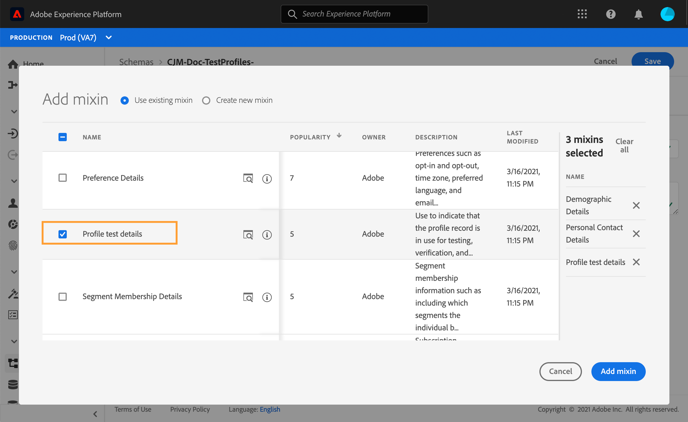
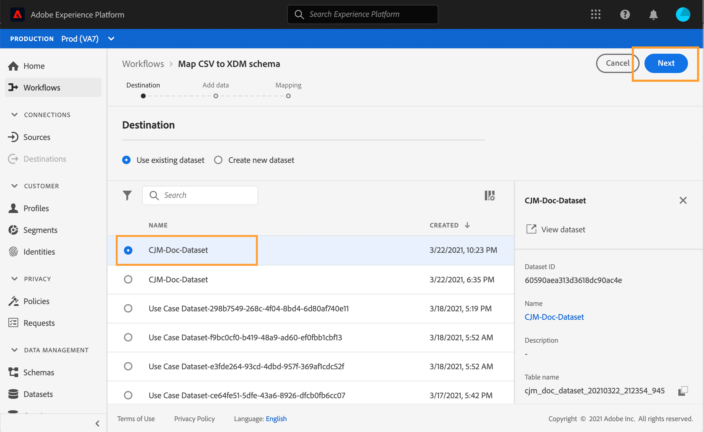

# Criar perfis de teste {#create-test-profiles}

Os perfis de teste são necessários ao usar o modo de teste em uma jornada. Para saber como usar o modo de teste, consulte [esta seção](../building-journeys/testing-the-journey.md).

Há diferentes maneiras de criar um perfil de teste no Adobe Experience Platform. Nesta documentação, enfocamos dois métodos: carregar um [arquivo csv](../building-journeys/creating-test-profiles.md#create-test-profiles-csv) e usar [chamadas de API](../building-journeys/creating-test-profiles.md#create-test-profiles-api). Também é possível carregar um arquivo json em um conjunto de dados. Consulte a [documentação de Assimilação de dados](https://experienceleague.adobe.com/docs/experience-platform/ingestion/tutorials/ingest-batch-data.html#add-data-to-dataset).

Esses métodos de importação também permitem atualizar os atributos do perfil. Dessa forma, você pode transformar um perfil existente em um perfil de teste. Basta usar um arquivo semelhante ou uma chamada de API e incluir apenas o campo &quot;testProfile&quot; com o valor &quot;true&quot;.

A criação de um perfil de teste é semelhante à criação de perfis comuns no Adobe Experience Platform. Para obter mais informações, consulte a [documentação de Perfil do cliente em tempo real](https://experienceleague.adobe.com/docs/experience-platform/profile/home.html?lang=pt-BR).

## Pré-requisitos{#test-profile-prerequisites}

Para criar perfis, primeiro é necessário criar um esquema e um conjunto de dados na Adobe Experience Platform.

Primeiro, você precisa **criar um esquema**. Siga estas etapas:

1. No Adobe Experience Platform, clique em **[!UICONTROL Schemas]**, no menu esquerdo.
   
1. Clique em **[!UICONTROL Create schema]**, no canto superior direito, e selecione um tipo de esquema, por exemplo **[!UICONTROL XDM Individual Profile]**.
   
1. Escolha um nome para o esquema.
1. Na seção **[!UICONTROL Mixins]**, clique em **[!UICONTROL Add]**.
   
1. Selecione os mixins apropriados. Certifique-se de adicionar o mixin **[!UICONTROL Profile test details]**. Clique em **[!UICONTROL Add mixin]**.
   
A lista de mixins é exibida na tela de visão geral do schema.
   
1. Na lista de campos, clique no campo que você deseja definir como a identidade principal.
   
1. No painel direito **[!UICONTROL Field properties]**, verifique as opções **[!UICONTROL Identity]** e **[!UICONTROL Primary Identity]** e selecione um namespace. Se quiser que a identidade primária seja um endereço de email, escolha o namespace **[!UICONTROL Email]**. Clique em **[!UICONTROL Apply]**.
   
1. Selecione o esquema e habilite a opção **[!UICONTROL Profile]** no **[!UICONTROL Schema properties]**.
   
1. Clique em **[!UICONTROL Save]**.

>[!NOTE]
>
>Para obter mais informações sobre a criação de esquemas, consulte a [documentação XDM](https://experienceleague.adobe.com/docs/experience-platform/xdm/ui/resources/schemas.html#prerequisites).

Em seguida, é necessário **criar o conjunto de dados** no qual os perfis serão importados. Siga estas etapas:

1. No Adobe Experience Platform, clique em **[!UICONTROL Datasets]**, no menu esquerdo, depois clique em **[!UICONTROL Create dataset]**.
   
1. Escolha **[!UICONTROL Create dataset from schema]**.
   
1. Selecione o esquema criado anteriormente e clique em **[!UICONTROL Next]**.
   
1. Escolha um nome e clique em **[!UICONTROL Finish]**.
   
1. Habilite a opção **[!UICONTROL Profile]**.
   

>[!NOTE]
>
> Para obter mais informações sobre a criação do conjunto de dados, consulte a [documentação do Serviço de Catálogo](https://experienceleague.adobe.com/docs/experience-platform/catalog/datasets/user-guide.html#getting-started).

## Criação de um perfil de teste usando um arquivo csv{#create-test-profiles-csv}

No Adobe Experience Platform, é possível criar perfis carregando um arquivo csv contendo os diferentes campos de perfil no conjunto de dados. Esse é o método mais fácil.

1. Crie um arquivo csv simples usando um software de planilha.
1. Adicione uma coluna para cada campo necessário. Adicione o campo de identidade principal (&quot;personID&quot; no exemplo acima) e o campo &quot;testProfile&quot; definido como &quot;true&quot;.
   
1. Adicione uma linha por perfil e preencha os valores para cada campo.
   
1. Salve a planilha como um arquivo csv. Verifique se as vírgulas são usadas como separadores.
1. No Adobe Experience Platform, clique em **[!UICONTROL Workflows]**, no menu esquerdo.
   
1. Escolha **[!UICONTROL Map CSV to XDM schema]** e clique em **[!UICONTROL Launch]**.
   
1. Selecione o conjunto de dados para o qual você deseja importar os perfis. Clique em **[!UICONTROL Next]**.
   
1. Clique em **[!UICONTROL Choose files]** e selecione seu arquivo csv. Quando o arquivo for carregado, clique em **[!UICONTROL Next]**.
   
1. Mapeie os campos csv de origem para os campos de esquema e clique em **[!UICONTROL Finish]**.
   
1. A importação de dados é iniciada. O status será movido de **[!UICONTROL Processing]** para **[!UICONTROL Success]**. Clique em **[!UICONTROL Preview data set]**, no canto superior direito.
   
1. Verifique se os perfis de teste foram adicionados corretamente.
   

Seus perfis de teste são adicionados e agora podem ser usados ao testar uma jornada. Consulte [esta seção](../building-journeys/testing-the-journey.md).
>[!NOTE]
>
> Para obter mais informações sobre importações csv, consulte a [documentação de Assimilação de dados](https://experienceleague.adobe.com/docs/experience-platform/ingestion/tutorials/map-a-csv-file.html#tutorials).

## Criar perfis de teste usando chamadas de API{#create-test-profiles-api}

Você também pode criar perfis de teste por meio de chamadas de API. Consulte esta [página](https://experienceleague.adobe.com/docs/experience-platform/profile/home.html?lang=pt-BR).

Você deve usar um esquema de Perfil que contenha a combinação &quot;Detalhes do teste de perfil&quot;. O sinalizador testProfile faz parte deste mixin.

Ao criar um perfil, passe o valor: testProfile = true.

Observe que você também pode atualizar um perfil existente para alterar seu sinalizador testProfile para &quot;true&quot;.

Este é um exemplo de uma chamada de API para criar um perfil de teste:

```
curl -X POST \
'https://dcs.adobedc.net/collection/xxxxxxxxxxxxxx' \
-H 'Cache-Control: no-cache' \
-H 'Content-Type: application/json' \
-H 'Postman-Token: xxxxx' \
-H 'cache-control: no-cache' \
-H 'x-api-key: xxxxx' \
-H 'x-gw-ims-org-id: xxxxx' \
-d '{
"header": {
"msgType": "xdmEntityCreate",
"msgId": "xxxxx",
"msgVersion": "xxxxx",
"xactionid":"xxxxx",
"datasetId": "xxxxx",
"imsOrgId": "xxxxx",
"source": {
"name": "Postman"
},
"schemaRef": {
"id": "https://example.adobe.com/mobile/schemas/xxxxx",
"contentType": "application/vnd.adobe.xed-full+json;version=1"
}
},
"body": {
"xdmMeta": {
"schemaRef": {
"contentType": "application/vnd.adobe.xed-full+json;version=1"
}
},
"xdmEntity": {
"_id": "xxxxx",
"_mobile":{
"ECID": "xxxxx"
},
"testProfile":true
}
}
}'
```
