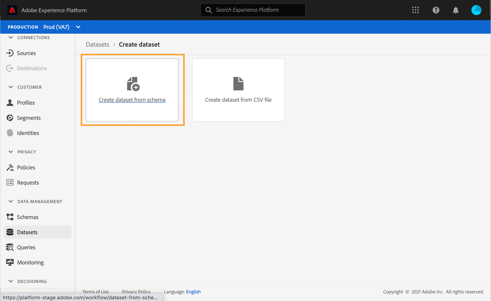

# Criar perfis de teste {#create-test-profiles}


Os perfis de teste são necessários ao usar o modo de teste em uma jornada. Você pode transformar um [perfil existente](../building-journeys/creating-test-profiles.md#turning-profile-into-test) em um perfil de teste ou [criar um perfil de teste](../building-journeys/creating-test-profiles.md#create-test-profiles-csv). Para saber como usar o modo de teste, consulte [esta seção](../building-journeys/testing-the-journey.md).

Há diferentes maneiras de criar um perfil de teste no Adobe Experience Platform. Nesta documentação, nos concentramos em dois métodos: carregar um arquivo [csv](../building-journeys/creating-test-profiles.md#create-test-profiles-csv) e usar [chamadas de API](../building-journeys/creating-test-profiles.md#create-test-profiles-api). Você também pode fazer upload de um arquivo json em um conjunto de dados, consulte a [documentação de assimilação de dados](https://experienceleague.adobe.com/docs/experience-platform/ingestion/tutorials/ingest-batch-data.html#add-data-to-dataset)

Criar um perfil de teste é semelhante à criação de perfis regulares no Adobe Experience Platform. Para obter mais informações, consulte a [documentação do Perfil do cliente em tempo real](https://experienceleague.adobe.com/docs/experience-platform/profile/home.html).

## Pré-requisitos{#test-profile-prerequisites}

Para criar perfis, primeiro é necessário criar um esquema e um conjunto de dados no Adobe Experience Platform.

Primeiro, você precisa **criar um schema**. Siga estas etapas:

1. No Adobe Experience Platform, clique em **Schemas**, no menu à esquerda.
   
1. Clique em **Criar esquema**, na parte superior direita, e selecione um tipo de esquema, por exemplo **Perfil individual XDM**.
   
1. Escolha um nome para o esquema.
1. Na seção **Mixins**, clique em **Adicionar**.
   
1. Selecione as combinações apropriadas. Certifique-se de adicionar a mistura **Detalhes do teste de perfil**. Clique em **Adicionar mixin**.
   
A lista de mixins é exibida na tela de visão geral do schema.

   
1. Na lista de campos, clique no campo que deseja definir como a identidade primária.
   
1. No painel direito **Propriedades do campo**, marque as opções **Identidade** e **Identidade primária** e selecione um namespace. Se desejar que a identidade primária seja um endereço de email, escolha o namespace **Email**. Clique em **Aplicar**.
   
1. Selecione o esquema e habilite a opção **Profile** nas **Schema properties**.
   
1. Clique em **Save**.

>[!NOTE]
>
>Para obter mais informações sobre a criação do schema, consulte a [documentação XDM](https://experienceleague.adobe.com/docs/experience-platform/xdm/ui/resources/schemas.html#prerequisites).

Em seguida, é necessário **criar o conjunto de dados** no qual os perfis serão importados. Siga estas etapas:

1. No Adobe Experience Platform, clique em **Conjuntos de dados**, no menu esquerdo, em seguida, clique em **Criar conjunto de dados**.
   
1. Escolha **Criar conjunto de dados do schema**.
   
1. Selecione o schema criado anteriormente e clique em **Next**.
   
1. Escolha um nome e clique em **Finish**.
   
1. Ative a opção **Profile**.
   

>[!NOTE]
>
> Para obter mais informações sobre a criação do conjunto de dados, consulte a [Documentação do Serviço de Catálogo](https://experienceleague.adobe.com/docs/experience-platform/catalog/datasets/user-guide.html#getting-started).

## Como transformar um perfil em um perfil de teste{#turning-profile-into-test}

Você pode transformar um perfil existente em um perfil de teste. No Adobe Experience Platform, você pode atualizar os atributos de perfil da mesma forma que ao criar um perfil.

Uma maneira mais simples de fazer isso é usando uma atividade de ação **Update profile** em uma jornada e alterar o campo booleano testProfile de false para true.

Sua jornada será composta de um **Read segment** e uma atividade **Update profile**. Primeiro, é necessário criar um segmento direcionado aos perfis que você deseja transformar em perfis de teste.

>[!NOTE]
>
> Como você atualizará o campo **testProfile**, os perfis escolhidos devem incluir este campo. O schema relacionado deve ter a combinação **Profile test details**. Consulte [esta seção](../building-journeys/creating-test-profiles.md#test-profiles-prerequisites).

1. No Gerenciamento de Jornada do cliente, clique em **Segmentos** no menu esquerdo e, em seguida, em **Criar segmento**, no canto superior direito.
   
1. Defina um nome para o segmento e crie o segmento: escolha os campos e os valores para direcionar os perfis desejados.
   
1. Clique em **Save** e verifique se os perfis são direcionados corretamente pelo segmento.
   

   >[!NOTE]
   >
   > O cálculo de segmentos pode levar algum tempo. Saiba mais sobre segmentos em [esta seção](../segment/about-segments.md).

1. Agora crie uma nova jornada e comece com uma atividade de orquestração **Ler segmento**.
1. Escolha o segmento criado anteriormente e o namespace que seus perfis usam.
   
1. Adicione uma atividade de ação **Atualizar perfil** .
1. Selecione o esquema, o campo **testProfiles**, o conjunto de dados e defina o valor como &quot;true&quot;.
   
1. Adicione uma atividade **End** e clique em **Publish**.
   
1. No Adobe Experience Platform, verifique se os perfis foram atualizados corretamente.
   

   >[!NOTE]
   >
   > Para obter mais informações sobre a atividade **Update profile**, consulte [esta seção](../building-journeys/update-profiles.md).

## Criação de um perfil de teste usando um arquivo csv{#create-test-profiles-csv}

No Adobe Experience Platform, é possível criar perfis carregando um arquivo csv contendo os diferentes campos de perfil no conjunto de dados. Este é o método mais fácil.

1. Crie um arquivo csv simples usando um software de planilha.
1. Adicione uma coluna para cada campo necessário. Certifique-se de adicionar o campo de identidade primário (&quot;personID&quot; no nosso exemplo acima) e o campo &quot;testProfile&quot; definidos como &quot;true&quot;.
   
1. Adicione uma linha por perfil e preencha os valores de cada campo.
   
1. Salve a planilha como um arquivo csv. Verifique se as vírgulas são usadas como separadores.
1. No Adobe Experience Platform, clique em **Workflows**, no menu à esquerda.
   
1. Escolha **Mapear CSV para esquema XDM** e clique em **Iniciar**.
   
1. Selecione o conjunto de dados para o qual deseja importar os perfis. Clique em **Next**.
   
1. Clique em **Escolha os arquivos** e selecione o arquivo csv. Quando o arquivo for carregado, clique em **Next**.
   
1. Mapeie os campos csv de origem para os campos de esquema e clique em **Finish**.
   
1. A importação de dados é iniciada. O status será movido de **Processando** para **Sucesso**. Clique em **Visualizar conjunto de dados**, na parte superior direita.
   
1. Verifique se os perfis de teste foram adicionados corretamente.
   

Seus perfis de teste são adicionados e agora podem ser usados ao testar uma jornada. Consulte [esta seção](../building-journeys/testing-the-journey.md).
>[!NOTE]
>
> Para obter mais informações sobre importações de csv, consulte a [documentação sobre assimilação de dados](https://experienceleague.adobe.com/docs/experience-platform/ingestion/tutorials/map-a-csv-file.html#tutorials).

## Criar perfis de teste usando chamadas de API{#create-test-profiles-api}

Também é possível criar perfis de teste por meio de chamadas de API. Consulte esta [página](https://docs.adobe.com/content/help/pt-BR/experience-platform/profile/home.html).

Você deve usar um Esquema de perfil que contenha a combinação &quot;Detalhes do teste de perfil&quot;. O sinalizador testProfile faz parte dessa mistura.

Ao criar um perfil, transmita o valor: testProfile = true.

Observe que você também pode atualizar um perfil existente para alterar seu sinalizador testProfile para &quot;true&quot;.

Este é um exemplo de uma chamada de API para criar um perfil de teste:

```
curl -X POST \
'https://dcs.adobedc.net/collection/xxxxxxxxxxxxxx' \
-H 'Cache-Control: no-cache' \
-H 'Content-Type: application/json' \
-H 'Postman-Token: xxxxx' \
-H 'cache-control: no-cache' \
-H 'x-api-key: xxxxx' \
-H 'x-gw-ims-org-id: xxxxx' \
-d '{
"header": {
"msgType": "xdmEntityCreate",
"msgId": "xxxxx",
"msgVersion": "xxxxx",
"xactionid":"xxxxx",
"datasetId": "xxxxx",
"imsOrgId": "xxxxx",
"source": {
"name": "Postman"
},
"schemaRef": {
"id": "https://example.adobe.com/mobile/schemas/xxxxx",
"contentType": "application/vnd.adobe.xed-full+json;version=1"
}
},
"body": {
"xdmMeta": {
"schemaRef": {
"contentType": "application/vnd.adobe.xed-full+json;version=1"
}
},
"xdmEntity": {
"_id": "xxxxx",
"_mobile":{
"ECID": "xxxxx"
},
"testProfile":true
}
}
}'
```

