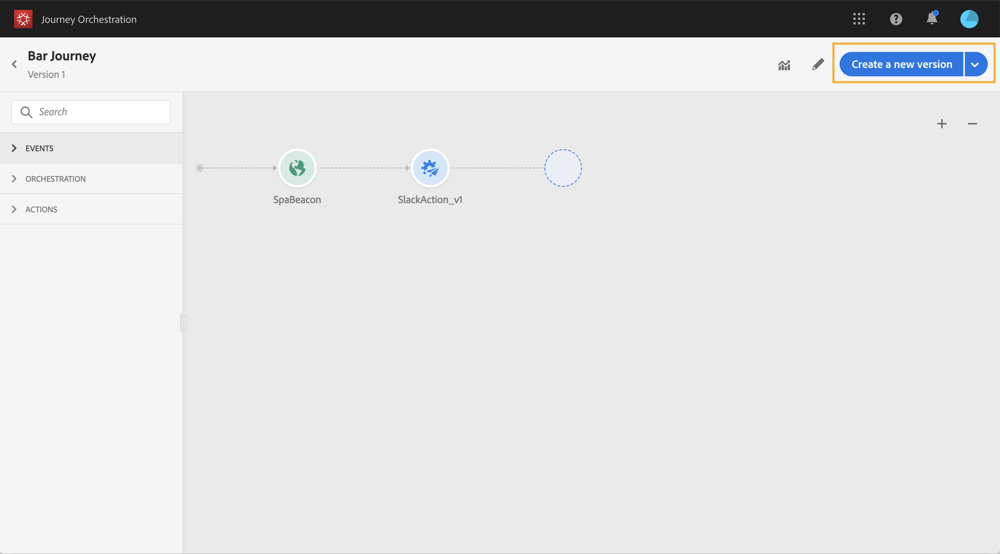

# Versões de jornada{#concept_ldc_k55_zgb}

Na lista jornada, todas as versões do jornada são exibidas com o número da versão. Consulte [esta página](../building-journeys/using-the-journey-designer.md). Quando você pesquisa por uma jornada, as versões mais recentes são exibidas na parte superior da lista na primeira vez que o aplicativo é aberto. Em seguida, você pode definir a classificação desejada e o aplicativo a manterá como uma preferência de usuário. A versão da jornada também é exibida no topo da interface da edição da jornada, acima da tela.

Se precisar modificar para uma jornada ao vivo, será necessário criar uma nova versão da jornada.

>[!NOTE]
>
>Para saber mais sobre as limitações de versões do jornada, consulte [esta página](../about/limitations.md#journey-versions-limitations)

1. Abra a versão mais recente da jornada dinâmica, clique em **[!UICONTROL Create a new version]** e confirme.

   

   >[!NOTE]
   >
   >Você só pode criar uma nova versão a partir da versão mais recente de uma jornada.

1. Faça as modificações, clique em **[!UICONTROL Publish]** e confirme.

   

A partir do momento em que a jornada for publicada, os indivíduos começarão a fluir para a versão mais recente da jornada. As pessoas que já entraram em uma versão anterior ficam nela até terminarem a jornada. Se, posteriormente, eles digitarem novamente a mesma jornada, acessarão a versão mais recente.

As versões do Jornada podem ser interrompidas individualmente. Todas as versões do jornada têm o mesmo nome.

>[!NOTE]
>
>Ao publicar uma nova versão de uma jornada, a versão anterior automaticamente termina e alterna para o status **Closed**. Nenhuma entrada na jornada acontecerá. Mesmo que você pare a versão mais recente, a versão anterior permanecerá fechada.
