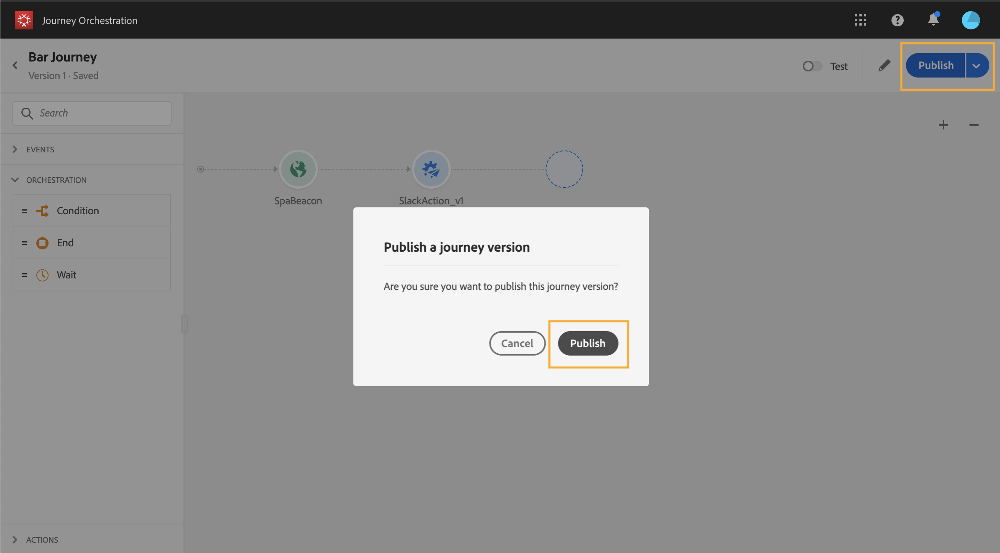

# Versões de jornada{#concept_ldc_k55_zgb}

Na lista de viagem, todas as versões de viagem são exibidas com o número da versão. Consulte . Quando você procura por uma jornada, as versões mais recentes aparecem no topo da lista na primeira vez que o aplicativo é aberto. Em seguida, você pode definir a classificação desejada e o aplicativo a manterá como uma preferência de usuário. A versão da jornada também é exibida no topo da interface da edição da jornada, acima da tela.

Se você precisa modificar uma jornada ao vivo, você precisa criar uma nova versão de sua jornada.

1. Abra a versão mais recente de sua jornada ao vivo, clique **[!UICONTROL Create a new version]** e confirme.

   

   >[!NOTE]
   >
   >Você só pode criar uma nova versão a partir da versão mais recente de uma jornada.

1. Faça suas modificações, clique **[!UICONTROL Publish]** e confirme.

   

A partir do momento em que a jornada for publicada, os indivíduos vão start a fluir para a versão mais recente da jornada. As pessoas que já entraram em uma versão anterior ficam lá até terminarem a jornada. Se mais tarde eles reentrarem na mesma jornada, eles irão para a versão mais recente.

Versões de viagem podem ser interrompidas individualmente. Todas as versões das viagens têm o mesmo nome.

>[!NOTE]
>
>Quando você publica uma nova versão de uma jornada, a versão anterior automaticamente termina e alterna para o status **Fechado** . Nenhuma entrada na viagem acontecerá. Mesmo se você interromper a versão mais recente, a versão anterior permanecerá fechada.
