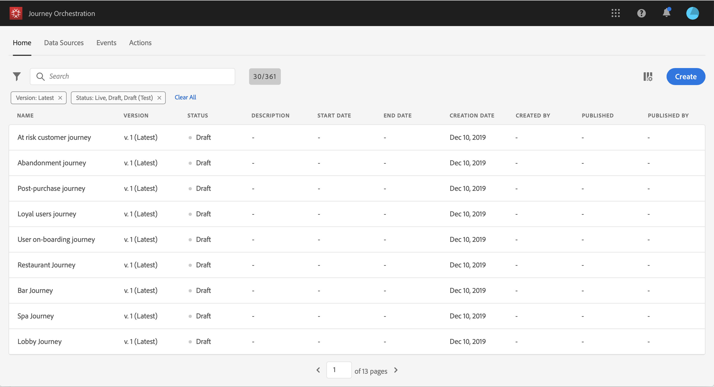
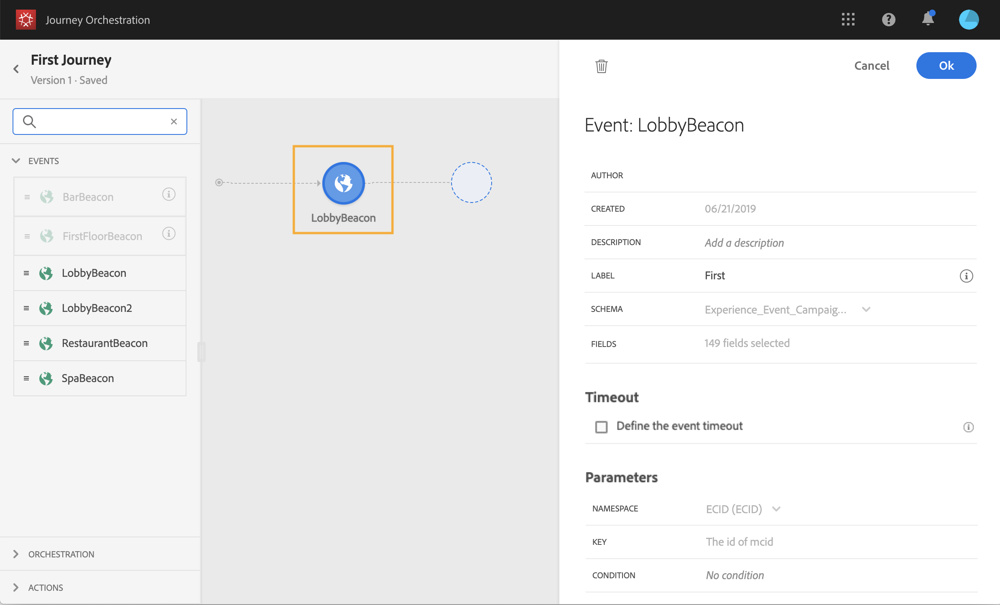

# Criar uma jornada {#concept_gq5_sqt_52b}

Esta etapa é executada pelo **usuário empresarial**. É aqui que você cria suas jornadas. Combine diferentes atividades de evento, orquestração e ação para criar cenários de canais em várias etapas.

A interface de jornada permite arrastar e soltar facilmente as atividades da paleta na tela. Você também pode clicar duas vezes em uma atividade para adicioná-la à tela na próxima etapa disponível. Cada atividade tem uma função e um lugar específicos no processo. As atividades são sequenciadas. Quando uma atividade é concluída, o fluxo continua e processa a próxima atividade e assim por diante.

Somente um namespace é permitido por jornada. Ao soltar o primeiro evento, os eventos com namespaces diferentes serão esmaecidos. Se o primeiro evento não tiver um namespace, todos os eventos com um namespace serão esmaecidos. Consulte [esta página](../event/selecting-the-namespace.md). Além disso, os grupos de campos do Adobe Experience Platform ficam esmaecidos se a jornada tiver eventos sem um namespace. Por fim, se você usar vários eventos na mesma jornada, eles precisarão usar o mesmo namespace.

Ao iniciar uma nova jornada, os elementos que não podem ser soltos na tela como a primeira etapa são ocultos. Isso se refere a todas as ações, à atividade de condição, à espera e à reação.

## Início rápido {#creating_journey}

Estas são as etapas principais para criar e publicar uma jornada.

1. No menu superior, clique na guia **[!UICONTROL Home]**.

   A lista de jornadas é exibida. Consulte [esta página](../building-journeys/using-the-journey-designer.md) para obter mais informações sobre a interface.

   

1. Clique em **[!UICONTROL Create]** para criar uma nova jornada.

   

1. Edite as propriedades da jornada no painel de configuração exibido no lado direito. Consulte [esta página](../building-journeys/changing-properties.md).

   

1. Comece arrastando e soltando uma atividade de evento da paleta na tela. Você também pode clicar duas vezes em uma atividade para adicioná-la à tela.

   

1. Arraste e solte suas outras atividades e configure-as. Consulte as páginas [Atividades de evento](../building-journeys/event-activities.md), [Sobre atividades de orquestração](../building-journeys/about-orchestration-activities.md) e [Sobre atividades de ação](../building-journeys/about-action-activities.md).

   

1. Sua jornada é salva automaticamente. Teste sua jornada e publique-a. Consulte [testando a jornada](../building-journeys/testing-the-journey.md) e [Publicando a jornada](../building-journeys/publishing-the-journey.md).

   

## Encerrar uma jornada {#ending_a_journey}

Uma jornada pode terminar para um indivíduo por dois motivos:

* A pessoa chega à última atividade de um caminho. Essa última atividade pode ser uma atividade final ou outra atividade. Não há obrigação de encerrar um caminho com uma atividade final. Consulte [esta página](../building-journeys/end-activity.md).
* A pessoa chega a uma atividade de condição (ou uma atividade de espera com uma condição) e não corresponde a nenhuma das condições.

A pessoa pode então entrar novamente na jornada se a reentrada for permitida. Consulte [esta página](../building-journeys/changing-properties.md).

Uma jornada pode ser fechada pelos seguintes motivos:

* A jornada é fechada manualmente por meio do botão **[!UICONTROL Close to new entrances]**.
* A data de término da jornada é atingida.

Quando uma jornada é fechada (por qualquer um dos motivos acima), ela terá o status **[!UICONTROL Closed (no entrance)]**. A jornada deixará de permitir que novos indivíduos entrem na jornada. Pessoas que já estão na jornada vão terminar a jornada normalmente. Após o tempo limite global padrão de 30 dias, a jornada mudará para o status **Finished**. Consulte esta [seção](../building-journeys/changing-properties.md#entrance).

Caso precise parar o progresso de todos os indivíduos na jornada, você pode pará-la. Parar a jornada atingirá o tempo limite para todos os indivíduos na jornada.

Para saber como fechar ou parar uma jornada manualmente, consulte esta [seção](../building-journeys/terminating-a-journey.md).