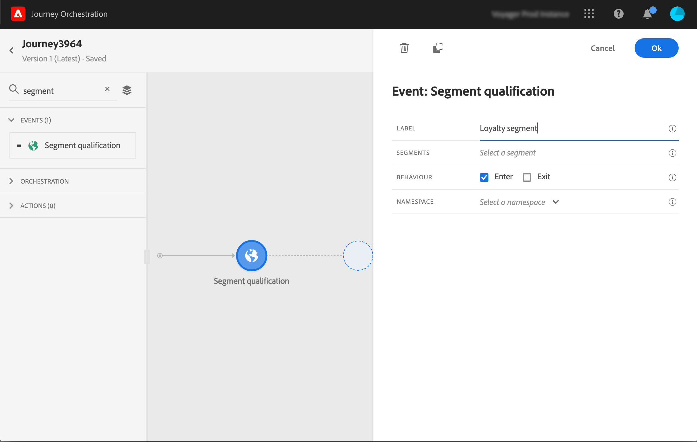
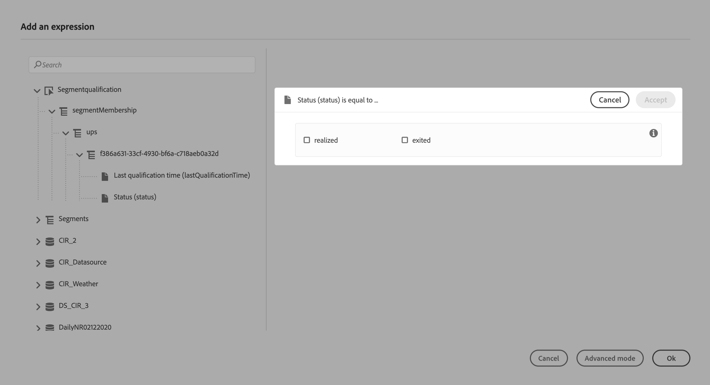

# Eventos de qualificação de segmento {#segment-qualification}

## Sobre eventos de qualificação de segmento{#about-segment-qualification}

Essa atividade permite que sua jornada escute as entradas e saídas dos perfis nos segmentos do Adobe Experience Platform para fazer com que os indivíduos entrem ou avancem em uma jornada. Para obter mais informações sobre a criação de segmentos, consulte esta [seção](../segment/about-segments.md).

Digamos que você tenha um segmento de &quot;cliente prateado&quot;. Com essa atividade, você pode fazer com que todos os novos clientes de prata insiram uma jornada e enviem uma série de mensagens personalizadas.

Esse tipo de evento pode ser posicionado como a primeira etapa ou posterior na jornada.

>[!IMPORTANT]
>
>Lembre-se de que os segmentos do Adobe Experience Platform são calculados uma vez por dia (**segmentos batch**) ou em segmentos em tempo real (**transmitidos**, usando a opção Públicos de alta frequência do Adobe Experience Platform).
>
>Se o segmento selecionado for transmitido, os indivíduos pertencentes a esse segmento potencialmente entrarão na jornada em tempo real. Se o segmento for em lote, as pessoas recém-qualificadas para esse segmento potencialmente inserirão a jornada quando o cálculo de segmentos for executado na Adobe Experience Platform.

1. Expanda a categoria **[!UICONTROL Events]** e solte uma atividade **[!UICONTROL Segment qualification]** na tela.

   

1. Adicione um **[!UICONTROL Label]** à atividade. Esta etapa é opcional.

1. Clique em no campo **[!UICONTROL Segment]** e selecione os segmentos que deseja aproveitar.

   >[!NOTE]
   >
   >Observe que você pode personalizar as colunas exibidas na lista e classificá-las.

   

   Depois que o segmento é adicionado, o botão **[!UICONTROL Copy]** permite copiar o nome e a ID:

   `{"name":"Loyalty membership“,”id":"8597c5dc-70e3-4b05-8fb9-7e938f5c07a3"}`

   

1. No campo **[!UICONTROL Behavior]** , escolha é escutar as entradas, saídas ou ambos do segmento.

1. Selecione um namespace. Isso só será necessário se o evento for posicionado como a primeira etapa da jornada.

   

A carga contém as seguintes informações de contexto, que podem ser usadas em condições e ações:

* o comportamento (entrada, saída)
* o carimbo de data e hora da qualificação
* a id do segmento

Ao usar o editor de expressão em uma condição ou ação que segue uma atividade **[!UICONTROL Segment qualification]**, você tem acesso ao nó **[!UICONTROL SegmentQualification]**. Você pode escolher entre **[!UICONTROL Last qualification time]** e **[!UICONTROL status]** (inserir ou sair).

Consulte [Atividade de condição](../building-journeys/condition-activity.md#about_condition).

## Práticas recomendadas {#best-practices-segments}

A atividade **[!UICONTROL Segment Qualification]** permite a entrada imediata em jornadas de indivíduos que se qualificam ou se desqualificam de um segmento do Adobe Experience Platform.

A velocidade de recepção dessas informações é alta. As medições efetuadas mostram uma velocidade de 10 000 eventos recebidos por segundos. Como resultado, você deve entender como os picos de entrada podem ocorrer, como evitá-los e como preparar sua jornada para eles.

### Segmentos em lote{#batch-speed-segment-qualification}

Ao usar a qualificação de segmento para um segmento de lote, observe que um pico de entrada ocorrerá no momento do cálculo diário. O tamanho do pico dependerá do número de indivíduos que entram (ou saem) no segmento diariamente.

Além disso, se o segmento de lote for recém-criado e usado imediatamente em uma jornada, o primeiro lote de cálculo pode fazer com que um grande número de indivíduos insira a jornada.

### Segmentos transmitidos{#streamed-speed-segment-qualification}

Ao usar a qualificação de segmento para segmentos dinamizados, há menos risco de obter grandes picos de entradas/saídas devido à avaliação contínua do segmento. Ainda assim, se a definição do segmento levar a que um grande volume de clientes se qualifique ao mesmo tempo, também pode haver um pico.

Para obter mais informações sobre a segmentação de transmissão, consulte esta [página](https://experienceleague.adobe.com/docs/experience-platform/segmentation/api/streaming-segmentation.html#api)

### Como evitar sobrecargas{#overloads-speed-segment-qualification}

Estas são algumas práticas recomendadas que ajudarão a evitar sobrecarga de sistemas aproveitados no jornada (fontes de dados, ações personalizadas, ações do Adobe Campaign Standard).

Não use, em uma atividade **[!UICONTROL Segment Qualification]**, um segmento de lote imediatamente após sua criação. Ele evitará o primeiro pico de cálculo. Observe que haverá um aviso amarelo na tela de jornada se você estiver prestes a usar um segmento que nunca foi calculado.

Coloque uma regra de limitação para fontes de dados e ações usadas em jornadas para evitar sobrecarregá-las (consulte esta [seção](../api/capping.md)). Observe que a regra de limitação não tem nenhuma tentativa. Se precisar tentar novamente, use um caminho alternativo na jornada, marcando a caixa **[!UICONTROL Add an alternative path in case of a timeout or an error]** em condições ou ações.

Antes de usar o segmento em uma jornada de produção, sempre avalie primeiro o volume de indivíduos qualificados para esse segmento a cada dia. Para fazer isso, você pode verificar a seção **[!UICONTROL Segments]** no Adobe Experience Platform e examinar o gráfico no lado direito.

