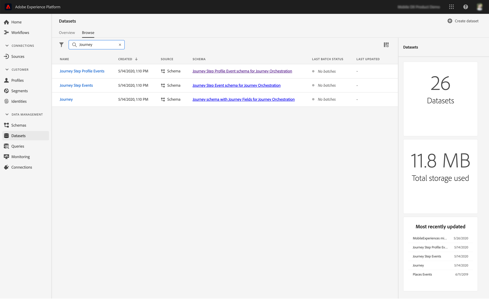

# Visão geral do compartilhamento de etapas de jornada{#sharing-overview}

O Journey Orchestration envia automaticamente os dados de desempenho da jornada para a Adobe Experience Platform para que possam ser combinados com outros dados para fins de análise.

Por exemplo, você configurou uma jornada que envia vários emails. Esse recurso permite combinar dados do Journey Orchestration com dados de evento downstream, como quantas conversões ocorreram, quanto envolvimento aconteceu no site ou quantas transações ocorreram na loja. As informações de viagem podem ser combinadas com dados na Plataforma, de outras propriedades digitais ou de propriedades offline, para proporcionar uma visualização mais abrangente de desempenho.

A Journey Orchestration cria automaticamente os schemas e fluxos necessários em conjuntos de dados para a Plataforma para cada etapa que um indivíduo realizar em uma jornada. Um evento Step corresponde a um indivíduo que se move de um nó para outro em uma jornada. Por exemplo, em uma jornada que tem um evento, uma condição e uma ação, eventos de três etapas são enviados para a Plataforma.

A lista de campos XDM que são passados é abrangente. Alguns contêm códigos gerados pelo sistema e outros têm nomes amigáveis e legíveis. Os exemplos incluem o rótulo da atividade de viagem ou o status da etapa: quantas vezes uma ação atingiu o tempo limite ou terminou com erro.

>[!CAUTION]
>
>Por padrão, os conjuntos de dados não são ativados para o serviço de perfil em tempo real. Se você quiser um conjunto de dados no serviço do perfil, é necessário ativá-lo (alternância de **Perfil** ). Esteja ciente de que um grande volume de eventos assumirá armazenamento em sua cota. Prossiga cuidadosamente antes de ativar um conjunto de dados para perfis
>
>

As viagens enviam os dados como ocorrem, de forma contínua. É possível query desses dados usando o Serviço de Query. Você pode se conectar ao Customer Journey Analytics ou a outras ferramentas BI para visualização de dados relacionados a essas etapas.

Os seguintes schemas são criados:

* schema de Perfil da Etapa da Jornada para a Orquestração da Jornada - Experimente Eventos para as etapas realizadas em uma Jornada junto com um Mapa de Identidade a ser usado para mapear para um Participante da Jornada.
* schema de Evento de passo de jornada para a orquestração de jornada - evento de passo de jornada vinculado a um Metadado de jornada.
* schema de Jornada com Campos de Jornada para Orquestração de Jornada - Metadados de Jornada para descrever Jornadas.

Os seguintes conjuntos de dados são enviados:

* schema do Perfil Journey Step para a orquestração de viagens
* Eventos de Etapa de Jornada
* Jornadas

As listas dos campos XDM passados para a Plataforma são detalhadas aqui:

* [campos comuns de eventos de passos](../building-journeys/sharing-common-fields.md)
* [campos de execução de ação de eventos JourStep](../building-journeys/sharing-execution-fields.md)
* [campos de busca de dados dos eventos JourStep](../building-journeys/sharing-fetch-fields.md)
* [campos de identidade do evento JourStep](../building-journeys/sharing-identity-fields.md)
* [campos de viagem](../building-journeys/sharing-journey-fields.md)

