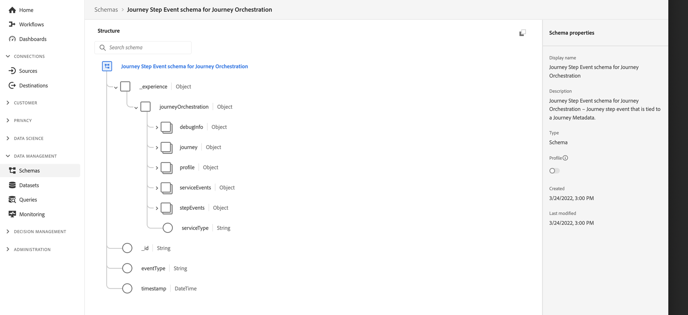

# Visão geral do compartilhamento de etapas da jornada{#sharing-overview}

>[!CAUTION]
>
>**Procurando Adobe Journey Optimizer**? Clique [aqui](https://experienceleague.adobe.com/pt-br/docs/journey-optimizer/using/ajo-home){target="_blank"} para obter a documentação do Journey Optimizer.
>
>
>_Esta documentação se refere ao material herdado do Journey Orchestration que foi substituído pelo Journey Optimizer. Entre em contato com a equipe de conta em caso de dúvidas sobre o acesso ao Journey Orchestration ou Journey Optimizer._

O [!DNL Journey Orchestration] envia automaticamente dados de desempenho do jornada para a Adobe Experience Platform para que ele possa ser combinado com outros dados para fins de análise.

>[!NOTE]
>
>Esse recurso é ativado por padrão em todas as instâncias para eventos de etapas de jornada. Não é possível modificar ou atualizar os esquemas e conjuntos de dados que foram criados durante o provisionamento para eventos da etapa. Por padrão, esses esquemas e conjuntos de dados estão no modo somente leitura.

Por exemplo, você configurou uma jornada que envia vários emails. Esse recurso permite combinar dados do [!DNL Journey Orchestration] com dados de eventos downstream, como quantas conversões ocorreram, quanto de engajamento aconteceu no site ou quantas transações ocorreram no armazenamento. As informações da jornada podem ser combinadas com dados no Adobe Experience Platform, seja de outras propriedades digitais ou offline, para fornecer uma visualização mais abrangente do desempenho.

O [!DNL Journey Orchestration] cria automaticamente os esquemas e fluxos necessários em conjuntos de dados para a Adobe Experience Platform para cada etapa que um indivíduo realiza em uma jornada. Um evento de etapa corresponde a um indivíduo movendo-se de um nó para outro em uma jornada. Por exemplo, em uma jornada que tenha um evento, uma condição e uma ação, os eventos de três etapas são enviados para a Adobe Experience Platform.

A lista de campos XDM transmitidos é abrangente. Alguns contêm códigos gerados pelo sistema e outros têm nomes amigáveis legíveis. Os exemplos incluem o rótulo da atividade de jornada ou o status da etapa: quantas vezes uma ação atingiu o tempo limite ou terminou com erro.

>[!CAUTION]
>
>Os conjuntos de dados não podem ser ativados para o serviço de perfil em tempo real. Certifique-se de que o botão de alternância **[!UICONTROL Profile]** esteja desativado.

O Jornada envia dados à medida que ocorrem, de forma contínua. Você pode consultar esses dados usando o Serviço de consulta. É possível conectar-se ao Customer Journey Analytics ou a outras ferramentas de BI para visualizar dados relacionados a essas etapas.

Os seguintes esquemas são criados:

* Esquema de Evento de Etapa de Jornada para [!DNL Journey Orchestration] - Evento de etapa de Jornada vinculado a Metadados de Jornada.
* Esquema de Jornada com Campos de Jornada para [!DNL Journey Orchestration] - Jornada Metadados para descrever Jornadas.

Os seguintes conjuntos de dados são transmitidos:

* Jornada eventos de etapa
* Jornadas

As listas de campos XDM transmitidas para o Adobe Experience Platform estão detalhadas aqui:

* [Lista de campos de evento de etapa](../building-journeys/sharing-field-list.md)
* [Campos de evento de etapa herdado](../building-journeys/sharing-legacy-fields.md)

## Integração com o Customer Jornada Analytics{#integration-cja}

Os eventos de etapa do Journey Orchestration podem ser vinculados a outros conjuntos de dados no [Adobe Customer Journey Analytics](https://experienceleague.adobe.com/docs/analytics-platform/using/cja-overview/cja-overview.html?lang=pt-BR). Este é o workflow geral:

* A Customer Journey Analytics assimila o conjunto de dados &quot;Jornada evento de etapa&quot;.
* O campo **profileID** no esquema associado de &quot;Evento de Etapa de Jornada para Journey Orchestration&quot; está definido como um campo de Identidade. No Customer Journey Analytics, você pode vincular esse conjunto de dados a qualquer outro que tenha o mesmo valor que o identificador com base em pessoa.
* Se você quiser usar esse conjunto de dados no Customer Journey Analytics, para análise de jornada entre canais, consulte esta [documentação](https://experienceleague.adobe.com/docs/analytics-platform/using/cja-usecases/cross-channel.html?lang=pt-BR).
