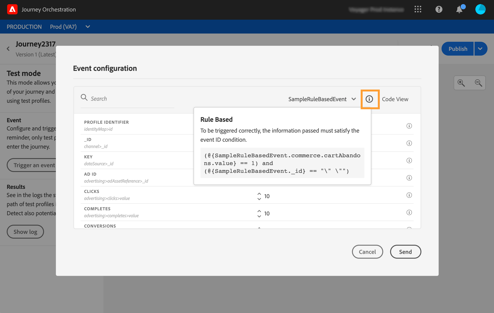

# Testar a jornada{#testing_the_journey}

Antes de poder testar sua jornada, você deve resolver todos os erros, se houver. Consulte [esta seção](../about/troubleshooting.md#section_h3q_kqk_fhb).

Você tem a possibilidade de testar sua jornada antes da publicação, usando perfis de teste. Isso permite analisar como os indivíduos fluem na jornada e solucionam problemas antes da publicação.

Somente perfis de teste podem inserir uma jornada no modo de teste. Você pode criar um novo perfil de teste ou transformar um perfil existente em um perfil de teste. Consulte esta [seção](../building-journeys/creating-test-profiles.md).

Para usar o modo de teste, siga estas etapas:

1. Antes de testar sua jornada, verifique se ela é válida e se não há erro. Você não poderá iniciar um teste de uma jornada com erros. Consulte [esta seção](../about/troubleshooting.md#section_h3q_kqk_fhb). Um símbolo de aviso é exibido quando há erros.

1. Para ativar o modo de teste, clique no botão **[!UICONTROL Test]** , localizado no canto superior direito.

   

1. Use o parâmetro **[!UICONTROL Wait time]**, no canto inferior esquerdo, para definir o tempo que cada atividade de espera e tempo limite do evento durarão no modo de teste. O tempo padrão é de 10 segundos para esperas e tempos limite do evento. Isso garantirá que os resultados do teste sejam obtidos rapidamente. Esse parâmetro só será exibido se você tiver soltado uma ou mais atividades de espera na jornada.

   

   >[!NOTE]
   >
   >Quando um evento de reação é usado em uma jornada, o tempo de espera padrão e o valor mínimo são 40 segundos. Consulte [esta seção](../building-journeys/reaction-events.md).

1. Clique em **[!UICONTROL Trigger an event]** para configurar e enviar eventos para a jornada.

   

1. Configure os diferentes campos esperados. No campo **Profile Identifier**, insira o valor do campo usado para identificar o perfil de teste. Pode ser o endereço de email, por exemplo. Certifique-se de enviar eventos relacionados a perfis de teste. Consulte [Acionando seus eventos](#firing_events).

   

1. Depois que os eventos forem recebidos, clique no botão **[!UICONTROL Show log]** para visualizar o resultado do teste e verificá-los. Consulte [Visualização dos logs](#viewing_logs).

   

1. Se houver algum erro, desative o modo de teste, modifique sua jornada e teste novamente. Quando o teste for conclusivo, você poderá publicar sua jornada. Consulte [esta página](../building-journeys/publishing-the-journey.md).

## Observações importantes {#important_notes}

* Uma interface é fornecida para acionar eventos na jornada testada, mas os eventos também podem ser enviados por sistemas de terceiros, como o Postman.
* Somente indivíduos sinalizados como &quot;perfis de teste&quot; no Serviço de perfil do cliente em tempo real poderão entrar na jornada testada. Consulte esta [seção](../building-journeys/creating-test-profiles.md).
* O modo de teste só está disponível em jornadas de rascunho que usam um namespace. O modo de teste precisa verificar se uma pessoa que entra na jornada é ou não um perfil de teste e, portanto, deve conseguir acessar a Adobe Experience Platform.
* O número máximo de perfis de teste que podem ser inseridos em uma jornada durante uma sessão de teste é 100.
* Quando você desativa o modo de teste, ele esvazia as jornadas de todas as pessoas que entraram no modo no passado ou que estão nele no momento. Também limpa o relatório.
* Você pode ativar/desativar o modo de teste quantas vezes forem necessárias.
* Não é possível modificar a jornada quando o modo de teste é ativado. Quando estiver no modo de teste, você pode publicar diretamente a jornada, não é necessário desativar o modo de teste antes.
* Ao alcançar uma divisão, a ramificação superior é sempre escolhida. Você pode reorganizar a posição das ramificações divididas se quiser que o teste escolha um caminho diferente.

## Como transformar um perfil em um perfil de teste{#turning-profile-into-test}

Você pode transformar um perfil existente em um perfil de teste. Na Adobe Experience Platform, é possível atualizar os atributos de perfil por meio de chamadas de API, mas ele não pode ser executado por meio da interface.

A maneira mais fácil de fazer isso é usando uma atividade de ação **Update profile** e alterar o campo booleano do perfil de teste de false para true. Consulte [esta seção](../building-journeys/update-profiles.md#using-the-test-mode).

## Criação de um perfil de teste{#create-test-profile}

Se você quiser criar um novo perfil de teste, o procedimento será o mesmo que criar um perfil no Adobe Experience Platform. Ele é executado por meio de chamadas de API. Consulte esta [página](https://experienceleague.adobe.com/docs/experience-platform/profile/home.html)

Você deve usar um esquema Profile que contenha a combinação &quot;detalhes do teste de perfil&quot;. O sinalizador testProfile faz parte dessa mistura.

Ao criar um perfil, transmita o valor: testProfile = true.

Observe que você também pode atualizar um perfil existente para alterar seu sinalizador testProfile para &quot;true&quot;.

Este é um exemplo de uma chamada de API para criar um perfil de teste:

```
curl -X POST \
'https://dcs.adobedc.net/collection/xxxxxxxxxxxxxx' \
-H 'Cache-Control: no-cache' \
-H 'Content-Type: application/json' \
-H 'Postman-Token: xxxxx' \
-H 'cache-control: no-cache' \
-H 'x-api-key: xxxxx' \
-H 'x-gw-ims-org-id: xxxxx' \
-d '{
"header": {
"msgType": "xdmEntityCreate",
"msgId": "xxxxx",
"msgVersion": "xxxxx",
"xactionid":"xxxxx",
"datasetId": "xxxxx",
"imsOrgId": "xxxxx",
"source": {
"name": "Postman"
},
"schemaRef": {
"id": "https://example.adobe.com/mobile/schemas/xxxxx",
"contentType": "application/vnd.adobe.xed-full+json;version=1"
}
},
"body": {
"xdmMeta": {
"schemaRef": {
"contentType": "application/vnd.adobe.xed-full+json;version=1"
}
},
"xdmEntity": {
"_id": "xxxxx",
"_mobile":{
"ECID": "xxxxx"
},
"testProfile":true
}
}
}'
```

## Acionar seus eventos {#firing_events}

O botão **[!UICONTROL Trigger an event]** permite configurar um evento que fará com que uma pessoa entre na jornada.

>[!NOTE]
>
>Quando você aciona um evento no modo de teste, um evento real é gerado, o que significa que ele também acessará outras jornadas ao ouvir esse evento.

Como pré-requisito, você deve saber quais perfis são sinalizados como perfis de teste no Adobe Experience Platform. Na verdade, o modo de teste permite somente esses perfis na jornada e o evento deve conter uma ID. A ID esperada depende da configuração do evento. Pode ser um ECID ou um endereço de email, por exemplo. O valor dessa chave precisa ser adicionado no campo **Identificador de perfil**.

>[!NOTE]
>
>Uma lista suspensa é exibida para campos que esperam uma enumeração. Basta selecionar um dos valores disponíveis.

Se a jornada contiver vários eventos, use a lista suspensa para selecionar um evento. Em seguida, para cada evento, configure os campos transmitidos e a execução do envio do evento. A interface ajuda a transmitir as informações certas na carga do evento e garantir que o tipo de informação esteja correto. O modo de teste salva os últimos parâmetros usados em uma sessão de teste para uso posterior.


A interface permite que você passe parâmetros de evento simples. Se quiser transmitir coleções ou outros objetos avançados no evento, clique em **[!UICONTROL Code View]** para ver todo o código do payload e modificá-lo. Por exemplo, você pode copiar e colar informações do evento preparadas por um usuário técnico.


Um usuário técnico também pode usar essa interface para compor cargas de evento e acionar eventos sem precisar usar uma ferramenta de terceiros.

Ao clicar no botão **[!UICONTROL Send]**, o teste é iniciado. A progressão do indivíduo na jornada é representada por um fluxo visual. O caminho se torna progressivamente verde à medida que o indivíduo se move pela jornada. Se ocorrer um erro, um símbolo de aviso será exibido na etapa correspondente. Você pode colocar o cursor nele para exibir mais informações sobre o erro e acessar detalhes completos (quando disponível).


Quando você seleciona um perfil de teste diferente na tela de configuração do evento e executa o teste novamente, o fluxo visual é limpo e mostra o caminho do novo indivíduo.

Ao abrir uma jornada no teste, o caminho exibido corresponde ao último teste executado.

O fluxo visual funciona se o evento é acionado por meio da interface ou externamente (usando Postman, por exemplo).

## Modo de teste para jornadas baseadas em regras {#test-rule-based}

O modo de teste também está disponível para jornadas que usam um evento com base em regras. Para obter mais informações sobre eventos com base em regras, consulte [esta página](../event/about-events.md).

Ao acionar um evento, a tela **Configuração do evento** permite que você defina os parâmetros do evento que serão passados no teste. Você pode exibir a condição de ID do evento clicando no ícone de dica de ferramenta no canto superior direito. Uma dica de ferramenta também está disponível ao lado de cada campo que faz parte da avaliação da regra.



Para obter mais informações sobre como usar o modo de teste, consulte [esta página](../building-journeys/testing-the-journey.md).

## Visualização dos logs {#viewing_logs}

O botão **[!UICONTROL Show log]** permite visualizar os resultados do teste. Esta página exibe as informações atuais da jornada no formato JSON. Um botão permite copiar nós inteiros. Você precisa atualizar manualmente a página para atualizar os resultados de teste da jornada.


>[!NOTE]
>
>Nos logs de teste, em caso de erro ao chamar um sistema de terceiros (fonte de dados ou ação), o código de erro e a resposta do erro são exibidos.

O número de indivíduos (tecnicamente chamados de instâncias) atualmente na jornada é exibido. Estas são informações úteis exibidas para cada indivíduo:

* _Id_: a ID interna da pessoa na jornada. Isso pode ser usado para fins de depuração.
* _etapa atual_: a etapa em que o indivíduo está na jornada. Recomendamos adicionar rótulos às suas atividades para identificá-las mais facilmente.
* _currentstep_ > fase: o status da jornada do indivíduo (em execução, concluído, erro ou tempo limite). Consulte abaixo para obter mais informações.
* _currentstep_  >  _extraInfo_: descrição do erro e outras informações contextuais.
* _currentstep_  >  _fetchErrors_: informações sobre erros de busca de dados ocorridos durante esta etapa.
* _externalKeys_: o valor da fórmula-chave definida no evento.
* _enriquecidoData_: os dados que a jornada recuperou se a jornada usar fontes de dados.
* _transitionHistory_: a lista de etapas que o indivíduo seguiu. Para eventos, a carga é exibida.
* _actionExecutionErrors_ : informações sobre os erros que ocorreram.

Estes são os diferentes status da jornada de um indivíduo:

* _Em execução_: o indivíduo está atualmente na jornada.
* _Concluído_: o indivíduo está no final da jornada.
* _Erro_: o indivíduo é interrompido na jornada por causa de um erro.
* _Tempo limite_: o indivíduo é parado na jornada devido a um passo que levou demasiado tempo.

Quando um evento é acionado usando o modo de teste, um conjunto de dados é gerado automaticamente com o nome da fonte.

Quando um evento é acionado usando o modo de teste, um conjunto de dados é gerado automaticamente com o nome da fonte.

O modo de teste cria automaticamente um Evento de experiência e o envia para o Adobe Experience Platform. O nome da origem desse evento de experiência é &quot;Journey Orchestration Test Events&quot;.

No caso de vários eventos acionados por várias jornadas

Há um cenário em que há vários eventos enviados de várias jornadas que terão esquemas diferentes. Um esquema pode mapear para 1 conjunto de dados? Caso contrário, teremos vários conjuntos de dados necessários.

A criação e nomeação automáticas desses conjuntos de dados é realizada se um conjunto de dados de destino não estiver incluído no evento da experiência. É por isso que vemos o &quot;Conjunto de dados criado automaticamente para o explorador&quot; hoje.

A nomeação de nossa origem gera a criação automática. Se houver vários eventos, devemos concatenar e fazer com que seja &quot;Evento de teste de Journey Orchestration - NOME DO SCHEMA&quot;. Isso se tornará automaticamente em &quot;Conjunto de dados gerado automaticamente para Journey Orchestration Test Event - NAME OF SCHEMA&quot;.
