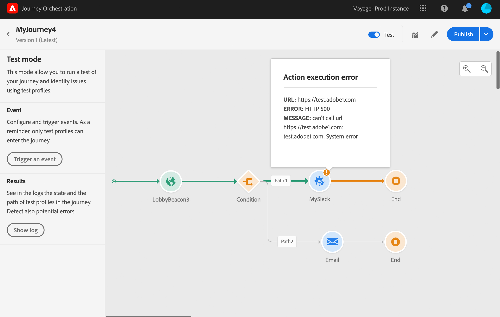

# Testar a jornada{#testing_the_journey}

Antes de poder testar sua jornada, você deve resolver todos os erros, se houver. Consulte [](../about/troubleshooting.md#section_h3q_kqk_fhb).

Você tem a possibilidade de testar sua jornada antes da publicação, usando perfis de teste. Isso permite analisar como os indivíduos fluem na jornada e solucionam problemas antes da publicação.

Para usar o modo de teste, siga estas etapas:

1. Antes de testar sua jornada, verifique se ela é válida e se não há erro. Você não poderá iniciar um teste de uma jornada com erros. Consulte [](../about/troubleshooting.md#section_h3q_kqk_fhb). Um símbolo de aviso é exibido quando há erros.

1. Para ativar o modo de teste, clique na **[!UICONTROL Test]** alternância localizada no canto superior direito.

   

1. Use o **[!UICONTROL Wait time in test]** parâmetro, no canto inferior esquerdo, para definir o tempo que cada atividade de espera durará no modo de teste. O tempo padrão é de 10 segundos. Isso garantirá que você obtenha os resultados do teste rapidamente. Este parâmetro só será exibido se você tiver soltado uma ou mais atividades de espera em sua jornada.

   

1. Clique **[!UICONTROL Trigger an event]** para configurar e enviar eventos para a jornada. Certifique-se de enviar eventos relacionados aos perfis de teste. Consulte [Disparando seus eventos](#firing_events).

   

1. Depois que os eventos forem recebidos, clique no **[!UICONTROL Show log]** botão para visualização do resultado do teste e verificá-los. Consulte [Visualização dos registros](#viewing_logs).

   

1. Se houver algum erro, desative o modo de teste, modifique sua jornada e teste novamente. Quando o teste é conclusivo, você pode publicar sua jornada. Consulte [](../building-journeys/publishing-the-journey.md).

## Observações importantes {#important_notes}

* É fornecida uma interface para disparar eventos para a viagem testada, mas eventos também podem ser enviados por sistemas de terceiros, como o Postman.
* Somente indivíduos marcados como &quot;perfis de teste&quot; no Serviço de Perfil do Cliente em tempo real poderão entrar na jornada testada. Consulte [](../building-journeys/testing-the-journey.md#create-test-profile).
* O modo de teste só está disponível em viagens de rascunho que utilizem uma namespace. O modo de teste deve verificar se uma pessoa que entra na viagem é ou não um perfil de teste e, portanto, deve poder chegar ao Adobe Experience Platform.
* O número máximo de perfis de teste que podem entrar em uma jornada durante uma sessão de teste é 100.
* Quando você desativa o modo de teste, ele esvazia as viagens de todas as pessoas que entraram no modo de teste ou que estão atualmente nele. Ela também limpa o relatórios.
* Você pode ativar/desativar o modo de teste quantas vezes forem necessárias.
* Não é possível modificar sua jornada quando o modo de teste é ativado. Quando estiver no modo de teste, você pode publicar diretamente a jornada, não é necessário desativar o modo de teste antes.

## Creating a test profile{#create-test-profile}

O processo para criar um perfil de teste é o mesmo que quando você cria um perfil no Adobe Experience Platform. Ela é executada por meio de chamadas de API. See this [page](https://docs.adobe.com/content/help/pt-BR/experience-platform/profile/home.html)

Você deve usar um schema que contenha a combinação &quot;detalhes do teste do perfil&quot;. O sinalizador testProfile faz parte dessa mistura.

Ao criar um perfil, certifique-se de enviar o valor: testprofile = true.

Observe que você também pode atualizar um perfil existente para alterar seu sinalizador testProfile para &quot;true&quot;.

Este é um exemplo de uma chamada de API para criar um perfil de teste:

```
curl -X POST \
'https://dcs.adobedc.net/collection/xxxxxxxxxxxxxx' \
-H 'Cache-Control: no-cache' \
-H 'Content-Type: application/json' \
-H 'Postman-Token: xxxxx' \
-H 'cache-control: no-cache' \
-H 'x-api-key: xxxxx' \
-H 'x-gw-ims-org-id: xxxxx' \
-d '{
"header": {
"msgType": "xdmEntityCreate",
"msgId": "xxxxx",
"msgVersion": "xxxxx",
"xactionid":"xxxxx",
"datasetId": "xxxxx",
"imsOrgId": "xxxxx",
"source": {
"name": "Postman"
},
"schemaRef": {
"id": "https://example.adobe.com/mobile/schemas/xxxxx",
"contentType": "application/vnd.adobe.xed-full+json;version=1"
}
},
"body": {
"xdmMeta": {
"schemaRef": {
"contentType": "application/vnd.adobe.xed-full+json;version=1"
}
},
"xdmEntity": {
"_id": "xxxxx",
"_mobile":{
"ECID": "xxxxx"
},
"testProfile":true
}
}
}'
```

## Acionando seus eventos {#firing_events}

O **[!UICONTROL Trigger an event]** botão permite configurar um evento que fará com que uma pessoa entre na jornada.

>[!NOTE]
>
>Quando você aciona um evento no modo de teste, um evento real é gerado, o que significa que ele também atingirá outra jornada ouvindo esse evento.

Como pré-requisito, você deve saber quais perfis são sinalizados como perfis de teste no Adobe Experience Platform. Na verdade, o modo de teste só permite esses perfis na jornada e o evento deve conter uma ID. A ID esperada depende da configuração do evento. Pode ser um ECID, por exemplo.

Se sua jornada contiver vários eventos, use a lista suspensa para selecionar um evento. Em seguida, para cada evento, configure os campos transmitidos e a execução do envio do evento. A interface o ajuda a passar as informações certas na carga do evento e a verificar se o tipo de informações está correto. O modo de teste salva os últimos parâmetros usados em uma sessão de teste para uso posterior.


A interface permite que você passe parâmetros de evento simples. Se quiser passar coleções ou outros objetos avançados no evento, clique em para ver todo o código da carga e modificá-lo. **[!UICONTROL Code View]** Por exemplo, você pode copiar e colar informações do evento preparadas por um usuário técnico.


Um usuário técnico também pode usar essa interface para compor cargas úteis de eventos e acionar eventos sem precisar usar uma ferramenta de terceiros.

Ao clicar no **[!UICONTROL Send]** botão, o teste é iniciado. A progressão do indivíduo na jornada é representada por um fluxo visual. O caminho se torna progressivamente verde à medida que o indivíduo se move através da jornada. Se ocorrer um erro, um símbolo de aviso será exibido na etapa correspondente. Você pode colocar o cursor nele para exibir mais informações sobre o erro e acessar os detalhes completos (quando disponíveis).



Quando você seleciona um perfil de teste diferente na tela de configuração do evento e executa o teste novamente, o fluxo visual é apagado e mostra o caminho do novo indivíduo.

Ao abrir uma jornada no teste, o caminho exibido corresponde ao último teste executado.

O fluxo visual funciona se o evento é disparado pela interface ou externamente (usando o Postman, por exemplo).

## Exibição dos registros {#viewing_logs}

O **[!UICONTROL Show log]** botão permite que você visualização os resultados do teste. Esta página exibe as informações atuais da jornada no formato JSON. Um botão permite copiar nós inteiros. É necessário atualizar manualmente a página para atualizar os resultados de teste da jornada.


>[!NOTE]
>
>Nos registros de teste, no caso de erro ao chamar um sistema de terceiros (fonte de dados ou ação), o código de erro e a resposta do erro são exibidos.

O número de indivíduos (tecnicamente chamados de instâncias) atualmente dentro da jornada é exibido. Estas são informações úteis exibidas para cada indivíduo:

* _Id_: a ID interna da pessoa na jornada. Isso pode ser usado para fins de depuração.
* _etapa atual_: a etapa em que o indivíduo está na viagem. Recomendamos adicionar etiquetas às suas atividades para identificá-las mais facilmente.
* _etapa atual_ > fase: o estado da viagem da pessoa (em execução, concluída, erro ou tempo limite). Consulte abaixo para obter mais informações.
* _etapa atual_ > _extraInfo_: descrição do erro e outras informações contextuais.
* _currentstep_ > _fetchErrors_: informações sobre erros de busca de dados ocorridos durante esta etapa.
* _externalKeys_: o valor da fórmula de chave definida no evento.
* _EnhedData_: os dados que a jornada recuperou se a jornada utiliza fontes de dados.
* _TransitionHistory_: a lista de etapas que o indivíduo seguiu. Para eventos, a carga é exibida.
* _actionExecutionErrors_ : informações sobre os erros que ocorreram.

Estes são os diferentes status da jornada de um indivíduo:

* _Em execução_: o indivíduo está atualmente na viagem.
* _Concluído_: o indivíduo está no final da viagem.
* _Erro_: o indivíduo é parado na viagem por causa de um erro.
* _Tempo limite_: o indivíduo é parado na viagem por causa de um passo que levou muito tempo.

Quando um evento é acionado usando o modo de teste, um conjunto de dados é gerado automaticamente com o nome da fonte.

Quando um evento é acionado usando o modo de teste, um conjunto de dados é gerado automaticamente com o nome da fonte.

O modo de teste cria automaticamente um Evento da Experiência e o envia para a Adobe Experience Platform. O nome da origem desse Evento de experiência é &quot;Eventos de teste de Journey Orchestration&quot;.

No caso de eventos múltiplos acionados a partir de viagens múltiplas

Há um cenário em que vários eventos são enviados de várias viagens que terão Schemas diferentes. Um schema pode mapear para 1 conjunto de dados? Caso contrário, teremos vários conjuntos de dados necessários.

A criação e nomeação automáticas desses conjuntos de dados será realizada se um conjunto de dados de destino não for incluído no evento da experiência. É por isso que vemos o &quot;Conjunto de dados criado automaticamente para o viajante&quot; hoje.

A nomeação de nossa fonte impulsiona a criação automática. Se tivermos vários eventos, devemos concatenar e fazer com que seja &quot;Evento de teste de Journey Orchestration - NOME DO SCHEMA&quot;. Isso será automaticamente direcionado para &quot;Conjunto de dados gerado automaticamente para Evento de teste de Journey Orchestration - NOME DO SCHEMA&quot;.

