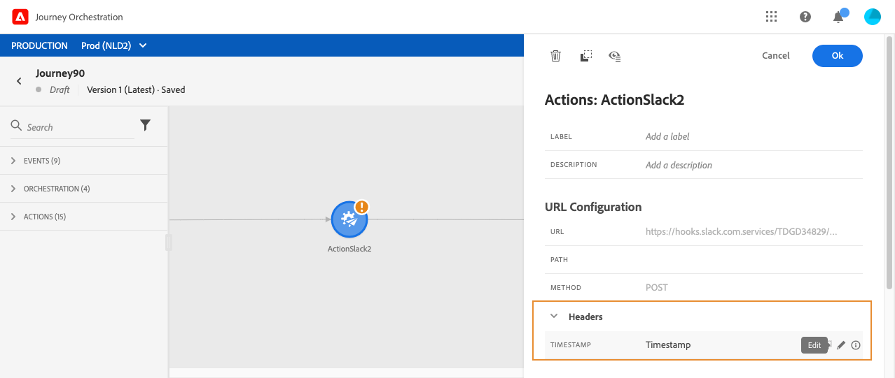

# Usar ações personalizadas {#section_f2c_hbg_nhb}

O painel de configuração da atividade mostra os parâmetros de configuração do URL e os parâmetros de autenticação configurados para a ação personalizada. [Saiba mais](../action/about-custom-action-configuration.md).

>[!NOTE]
>
>Não é possível passar uma coleção simples em parâmetros de ação personalizados. Campos de coleção mais complexos (arrays de objetos) não são compatíveis.  Observe também que os parâmetros têm um formato esperado (por exemplo: string, decimal, etc.). Você deve ter cuidado para respeitar esses formatos esperados.

## Configurar o URL

### Caminho dinâmico

Se o URL incluir um caminho dinâmico, especifique o caminho no campo **[!UICONTROL Path]**.

>[!NOTE]
>
>Não é possível configurar a parte estática do URL na jornada, mas na configuração global da ação personalizada. [Saiba mais](../action/about-custom-action-configuration.md).

Para concatenar campos e strings de texto sem formatação, use as funções String ou o sinal de Mais (+) no editor de expressão avançado. Insira sequências de texto sem formatação em aspas simples (&#39;) ou aspas duplas (&quot;). [Saiba mais](../expression/expressionadvanced.md).

Esta tabela mostra um exemplo de configuração:

| Campo | Valor |
| --- | --- |
| URL | `https://xxx.yyy.com:8080/somethingstatic/` |
| Path | `The id of marketingCampaign + '/messages'` |

O URL concatenado tem este formulário:

`https://xxx.yyy.com:8080/somethingstatic/`\&lt;campaign ID=&quot;&quot;>`/messages`

### Cabeçalhos

A seção **[!UICONTROL URL Configuration]** mostra os campos de cabeçalho dinâmicos, mas não os campos de cabeçalho constantes. Os campos de cabeçalho dinâmicos são campos de cabeçalho HTTP cujo valor é configurado como uma variável. [Saiba mais](../action/about-custom-action-configuration.md).

Se necessário, especifique o valor dos campos de cabeçalho dinâmico:

1. Selecione a ação personalizada na jornada.
1. No painel de configuração, clique no ícone de lápis ao lado do campo de cabeçalho na seção **[!UICONTROL URL Configuration]**.

   

1. Selecione um campo e clique em **[!UICONTROL OK]**.

## Parâmetros de ação

Na seção **[!UICONTROL Action parameters]**, você verá os parâmetros de mensagem definidos como _&quot;Variável&quot;_. Para esses parâmetros, você pode definir onde obter essas informações (exemplo: eventos, fontes de dados), passe os valores manualmente ou use o editor de expressão avançado para casos de uso avançado. Casos de uso avançados podem ser manipulação de dados e outro uso da função. [Saiba mais](../expression/expressionadvanced.md).

**Tópicos relacionados**

[Configurar uma ação](../action/about-custom-action-configuration.md)
