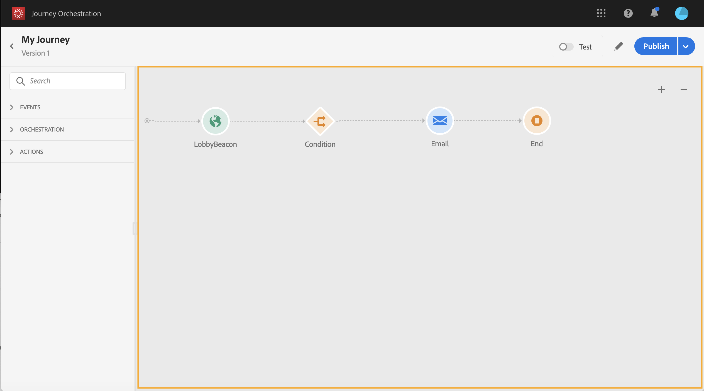
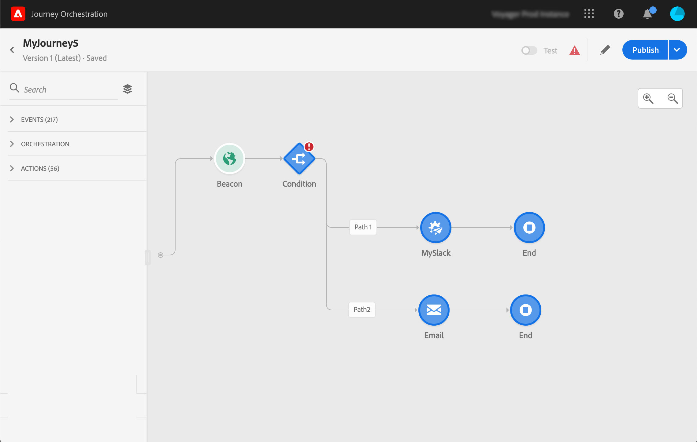

# Usar o designer de jornada {#concept_m1g_5qt_52b}

O menu Início da jornada permite que você visualize o **lista de jornadas**. Crie uma nova jornada ou clique em uma existente para abrir a **Interface do designer do jornada**. O desenhador é composto pelas seguintes zonas: a paleta, a tela e o painel de configuração da atividade.

## A lista de jornadas {#journey_list}

O **Lista de jornadas** O permite que você visualize todas as jornadas ao mesmo tempo, veja o status e execute ações básicas. Você pode duplicar, interromper ou excluir suas jornadas. Dependendo da jornada, certas ações podem não estar disponíveis. Por exemplo, você não pode excluir ou reiniciar uma jornada encerrada. Você pode criar uma nova versão dela, duplicá-la ou pará-la. Você também pode usar a barra de pesquisa para procurar uma jornada.

Os **[!UICONTROL Filters]** podem ser acessados com um clique no ícone de filtro na parte superior esquerda da lista. O menu de filtros permite filtrar as jornadas exibidas de acordo com critérios diferentes (status, aqueles criados, os modificados nos últimos 30 dias, somente as versões mais recentes etc.). Você também pode optar por exibir somente as jornadas que usam um evento, grupo de campos ou ação específica. As colunas exibidas na lista podem ser configuradas. Todos os filtros e colunas são salvos por usuário.

Todas as versões das jornadas são exibidas na lista com o número da versão. Consulte [esta página](../building-journeys/journey-versions.md).

>[!NOTE]
>
>Para abrir uma tela de jornada em uma guia diferente do navegador, mantenha pressionada a tecla **Controle** ou **Comando** e clique na jornada.

## A paleta {#palette}

O **paleta** está no lado esquerdo da tela. Todas as atividades disponíveis são classificadas em várias categorias: **[!UICONTROL Events]**, **[!UICONTROL Orchestration]** e **[!UICONTROL Actions]**. É possível expandir/recolher as diferentes categorias clicando no nome. Para usar uma atividade na jornada, arraste-a e solte-a da paleta na tela. Também é possível clicar duas vezes em uma atividade na paleta para adicioná-la à tela, na próxima etapa disponível. É necessário configurar cada atividade adicionada a partir da paleta antes de publicar a jornada. Se soltar uma atividade na tela e não finalizar sua configuração, ela permanecerá na tela, mas um aviso vermelho indicará que a configuração não foi concluída para essa atividade.

>[!NOTE]
>
>Observe que há regras ao configurar uma jornada. A configuração não permitida será descartada. Por exemplo, não é possível colocar ações em paralelo, vincular uma atividade a uma etapa anterior para criar um loop, iniciar uma jornada com algo diferente de um evento etc.

O **[!UICONTROL Filter items]** no canto superior esquerdo, é possível exibir os seguintes filtros:

* **Mostrar apenas itens disponíveis**: ocultar ou exibir elementos indisponíveis na paleta, por exemplo, os eventos que usam um namespace diferente daqueles usados na jornada. Por padrão, os itens indisponíveis ficam ocultos. Se você optar por exibi-las, elas aparecerão esmaecidas.

* **Mostrar apenas itens recentes**: esse filtro permite exibir somente os cinco últimos eventos e ações usados, além dos prontos para uso. Isso é específico para cada usuário. Por padrão, todos os itens são exibidos.

Também é possível usar a variável **[!UICONTROL Search]** campo. Somente eventos e ações são filtrados.

## A tela {#canvas}

O **tela** é a zona central no designer de jornadas. É nessa zona que você pode soltar suas atividades e configurá-las. Clique em uma atividade na tela para configurá-la. Isso abre o painel de configuração da atividade no lado direito. É possível ampliar e diminuir o zoom usando os botões &quot;+&quot; e &quot;-&quot; na parte superior direita. Na tela, todas as atividades permitem adicionar uma próxima etapa após elas, exceto **[!UICONTROL End]** atividades (consulte [esta página](../building-journeys/end-activity.md)).

## O painel de configuração da atividade {#configuration_pane}

O **painel de configuração da atividade** é exibida ao clicar em uma atividade na paleta. Preencha os campos obrigatórios. Clique no botão **[!UICONTROL Delete]** ícone para excluir a atividade. Clique em **[!UICONTROL Cancel]** para anular as modificações ou **[!UICONTROL Ok]** para confirmar. Para excluir atividades, você também pode selecionar uma atividade (ou várias) e pressionar a tecla Backspace. Pressionar a tecla escape fechará o painel de configuração da atividade.

Na tela, suas atividades de ação e evento são representadas por um ícone com o nome do evento ou ação exibido abaixo. No painel de configuração da atividade, você pode usar o **[!UICONTROL Label]** para adicionar um sufixo ao nome da atividade. Esses rótulos ajudarão você a contextualizar o uso de eventos e ações, especialmente quando você usar o mesmo evento ou ação várias vezes na jornada. Você também poderá ver os rótulos adicionados no [!DNL Journey Orchestration] relatórios. Você também pode definir rótulos para suas atividades de condição.

Por padrão, os campos somente leitura ficam ocultos. Para mostrar campos somente leitura, clique no botão **Mostrar campos somente leitura** ícone na parte superior esquerda do painel de configuração da atividade. Essa configuração se aplica a todas as atividades em todas as jornadas.

## As ações da barra superior {#top_actions}

Dependendo do status da jornada, você pode executar ações diferentes em sua jornada usando os botões disponíveis no canto superior direito: **[!UICONTROL Publish]**, **[!UICONTROL Duplicate]**, **[!UICONTROL Delete]**, **[!UICONTROL Journey properties]**, **[!UICONTROL Test]**. Esses botões são exibidos quando nenhuma atividade é selecionada. Alguns botões serão exibidos contextualmente. O botão log do modo de teste aparece quando o modo de teste é ativado (consulte [esta página](../building-journeys/testing-the-journey.md)). O botão de relatório é exibido quando a jornada está ativa, interrompida ou fechada.

## O uso de caminhos na tela {#paths}

Várias atividades (**[!UICONTROL Condition]**, **[!UICONTROL Action]** atividades do ) permitem definir uma ação de fallback em caso de erro ou tempo limite. No painel de configuração da atividade, marque a caixa : **[!UICONTROL Add an alternative path in case of a timeout or an error]**. Outro caminho é adicionado após a atividade . A duração do tempo limite é definida nas propriedades da jornada (consulte [esta página](../building-journeys/changing-properties.md) por um usuário administrador. Por exemplo, se um email demorar muito para ser enviado ou estiver com erro, você pode decidir enviar um SMS.

Várias atividades (evento, ação, espera) permitem adicionar vários caminhos após elas. Para fazer isso, coloque o cursor na atividade e clique no símbolo &quot;+&quot;. Somente atividades de evento e espera podem ser definidas em paralelo. Se vários eventos forem definidos em paralelo, o caminho escolhido será o primeiro evento que ocorrer.

Ao ouvir um evento, recomendamos que você não espere o evento indefinidamente. Não é obrigatório, é apenas uma boa prática. Se quiser ouvir um ou vários eventos somente durante um determinado tempo, você colocará um ou vários eventos e uma atividade de espera em paralelo. Consulte [esta seção](../building-journeys/event-activities.md#section_vxv_h25_pgb).

Para excluir o caminho, coloque o cursor nele e clique no botão **[!UICONTROL Delete arrow]** ícone .

Na tela, quando duas atividades são desconectadas, um aviso é exibido. Coloque o cursor no ícone de aviso para exibir a mensagem de erro. Para corrigir o problema, basta mover a atividade desconectada e conectá-la à atividade anterior.

## Copiar e colar atividades {#copy-paste}

É possível copiar uma ou várias atividades de uma jornada e colá-las na mesma jornada ou em uma diferente. Isso permite economizar tempo se quiser reutilizar várias atividades que já foram configuradas em uma jornada anterior.

**Observações importantes**

* Você pode copiar/colar em diferentes guias e navegadores. Você só pode copiar/colar atividades na mesma instância.
* Não é possível copiar/colar um evento se a jornada de destino tiver um evento que use um namespace diferente.
* Atividades coladas podem fazer referência a dados que não existem na jornada de destino, por exemplo, se você copiar/colar em diferentes sandboxes. Sempre verifique se há erros e faça os ajustes necessários.
* Esteja ciente de que não é possível desfazer uma ação. Para excluir atividades coladas, é necessário selecioná-las e excluí-las. Portanto, selecione somente as atividades necessárias antes de copiá-las.
* Você pode copiar atividades de qualquer jornada, mesmo as que estão em somente leitura.
* Você pode selecionar qualquer atividade, mesmo aquelas que não estão vinculadas. As atividades vinculadas permanecerão vinculadas após serem coladas.

Estas são as etapas para copiar/colar atividades:

1. Abra uma jornada.
1. Selecione as atividades que deseja copiar movendo o mouse e clicando. Você também pode clicar em cada atividade enquanto pressiona o **Ctrl/Command** chave. Use **Ctrl/Command + A** se desejar selecionar todas as atividades.
   
1. Press **Ctrl/Command + C**.
Se quiser copiar apenas uma atividade, clique nela e use a variável **Copiar** ícone na parte superior esquerda do painel de configuração da atividade.
   
1. Em qualquer jornada, pressione **Ctrl/Command + V** para colar as atividades sem vinculá-las a um nó existente. As atividades coladas são colocadas na mesma ordem. Após serem coladas, as atividades permanecem selecionadas para que você possa movê-las facilmente. Também é possível colocar o cursor em um espaço reservado vazio e pressionar **Ctrl/Command + V**. As atividades coladas serão vinculadas ao nó .
   
