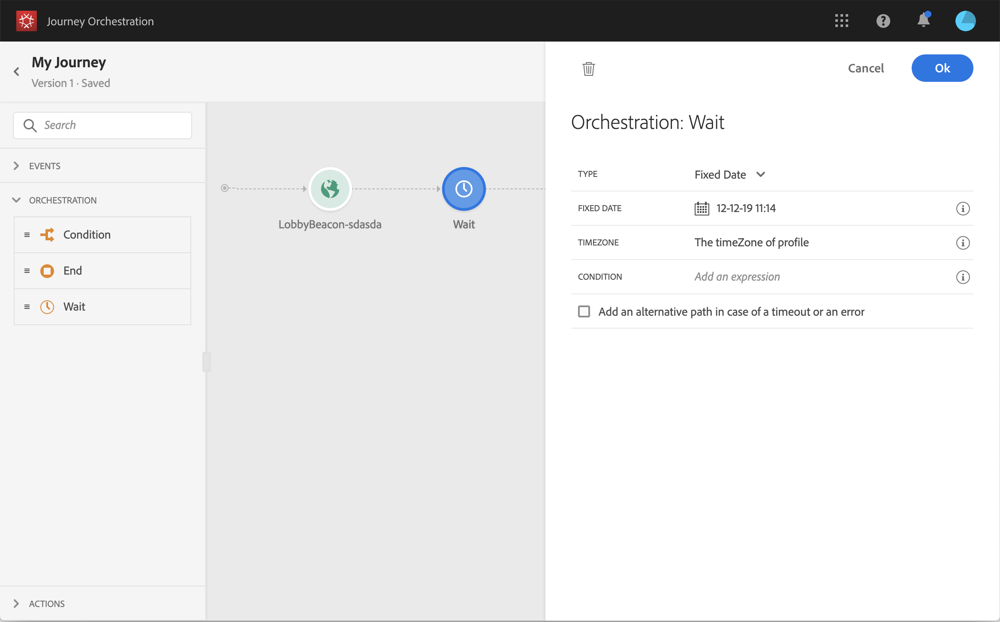

# Atividade de espera{#section_rlm_nft_dgb}

Se desejar esperar antes de executar a próxima atividade no caminho, você pode usar uma atividade **[!UICONTROL Wait]** . Ela permite definir o momento em que a próxima atividade será executada. Três opções estão disponíveis:

* [Duração](#duration)
* [Data fixa](#fixed_date)
* [Personalizado](#custom)

<!--* [Email send time optimization](#email_send_time_optimization)-->

## Sobre a atividade Wait{#about_wait}

Veja como as esperas são priorizadas quando você usa várias esperas em paralelo. Se eles tiverem a mesma configuração de tempo e uma condição diferente, mas sobreposta, a espera posicionada acima será a priorizada. Por exemplo, a condição da primeira espera é &quot;ser mulher&quot; e a condição da segunda espera em paralelo é &quot;ser um VIP&quot;. A primeira atividade de espera será priorizada

Observe também que, se duas esperas diferentes estiverem em paralelo, a que ocorrer primeiro será priorizada, independentemente de sua posição vertical. Por exemplo, se uma espera de 1 hora estiver acima e uma espera de 30 minutos estiver abaixo, após 30 minutos, a espera de 30 minutos será processada.

Você pode definir uma condição se quiser restringir a espera para uma determinada população.

>[!NOTE]
>
>A duração máxima da espera é de 30 dias.
>
>No modo de teste, o parâmetro **[!UICONTROL Wait time in test]** permite definir o tempo que cada atividade de espera durará. O tempo padrão é de 10 segundos. Isso garantirá que os resultados do teste sejam obtidos rapidamente. Consulte [esta página](../building-journeys/testing-the-journey.md)

## Duração da espera{#duration}

Selecione a duração da espera antes da execução da próxima atividade.

## Data de espera fixa{#fixed_date}

Selecione a data para a execução da próxima atividade.

## Aguardar personalizado{#custom}

Essa opção permite definir uma data personalizada, por exemplo, 12 de julho de 2020 às 17h, usando uma expressão avançada com base em um campo proveniente de um evento ou uma fonte de dados. Ela não permite definir uma duração personalizada, por exemplo, 7 dias. A expressão no editor de expressão deve fornecer um formato dateTimeOnly . Consulte [esta página](../expression/expressionadvanced.md). Para obter mais informações sobre o formato dateTimeOnly, consulte [esta página](../expression/data-types.md).

>[!NOTE]
>
>Você pode utilizar uma expressão dateTimeOnly ou usar uma função para converter em dateTimeOnly. Por exemplo: toDateTimeOnly(@{Event.offerOpened.activity.endTime}), o campo no evento é do formulário 2016-08-12T09:46:06Z.
>
>O **fuso horário** é esperado nas propriedades da sua jornada. Como resultado, hoje não é possível da interface apontar diretamente para um carimbo de data e hora ISO-8601 completo, tempo de combinação e deslocamento de fuso horário como 2016-08-12T09:46:06.982-05. Consulte [esta página](../building-journeys/timezone-management.md).

<!--## Email send time optimization{#email_send_time_optimization}

>[!CAUTION]
>
>The email send time optimization capability is only available to customers who use the [Adobe Experience Platform Data Connector](https://docs.adobe.com/content/help/en/campaign-standard/using/developing/mapping-campaign-and-aep-data/aep-about-data-connector.html).

This type of wait uses a score calculated in the Adobe Experience Platform. The score calculates the propensity to click or open an email in the future based on past behavior. Note that the algorithm calculating the score needs a certain amount of data to work. As a result, when it does not have enough data, the default wait time will apply. At publication time, you’ll be notified that the default time applies.

>[!NOTE]
>
>The first event of your journey must have a namespace.
>
>This capability is only available after an **[!UICONTROL Email]** activity. You need to have Adobe Campaign Standard.

1. In the **[!UICONTROL Amount of time]** field, define the number of hours to consider to optimize email sending.
1. In the **[!UICONTROL Optimization type]** field, choose if the optimization should increase clicks or opens.
1. In the **[!UICONTROL Default time]** field, define the default time to wait if the predictive send time score is not available.

    >[!NOTE]
    >
    >Note that the send time score can be unavailable because there is not enough data to perform the calculation. In this case, you will be informed, at publication time, that the default time applies.

-->
