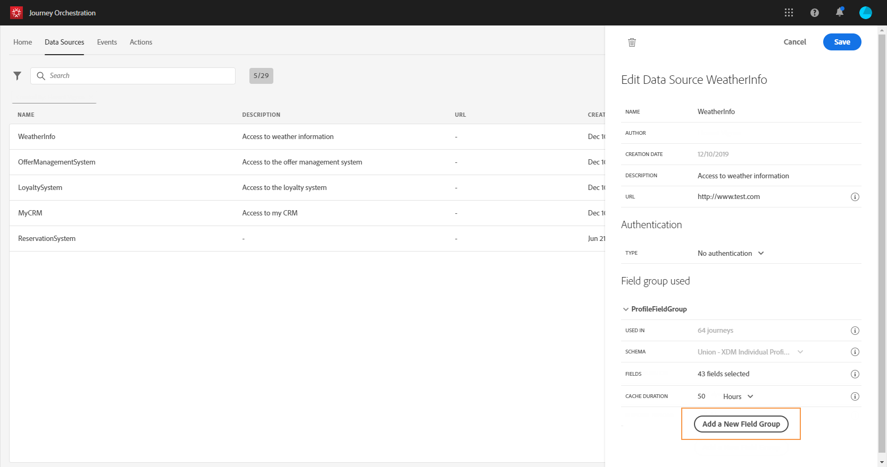

# Fonte de dados da Adobe Experience Platform {#concept_zrb_nqt_52b}

>[!CAUTION]
>
>**Está procurando pelo Adobe Journey Optimizer**? Clique [aqui](https://experienceleague.adobe.com/pt-br/docs/journey-optimizer/using/ajo-home){target="_blank"} para acessar a documentação do Journey Optimizer.
>
>
>_Essa documentação refere-se ao material herdado do Journey Orchestration, que foi substituído pelo Journey Optimizer. Entre em contato com a equipe de contas em caso de dúvidas sobre como acessar o Journey Orchestration ou o Journey Optimizer._

A fonte de dados do Adobe Experience Platform define a conexão com o Serviço de perfil do cliente em tempo real. Essa fonte de dados é integrada e pré-configurada. Ela não pode ser excluída. Essa fonte de dados foi projetada para recuperar e usar dados do Serviço de perfil do cliente em tempo real (por exemplo, verificar se a pessoa que inseriu uma jornada é do sexo feminino). Ela permite usar os dados de Perfil e de Eventos de experiência. Para obter mais informações sobre o Serviço de Perfil do Cliente em Tempo Real, consulte esta [página](https://experienceleague.adobe.com/docs/experience-platform/profile/home.html?lang=pt-BR).

>[!NOTE]
>
>Você pode recuperar os 1000 eventos de experiência mais recentes criados há menos de um ano.

Para permitir a conexão com o Serviço de perfil do cliente em tempo real, devemos usar uma chave para identificar uma pessoa e um namespace que contextualiza a chave. Como resultado, você só poderá usar essa fonte de dados se suas jornadas começarem com um evento contendo uma chave e um namespace. Consulte [esta página](../building-journeys/journey.md).

Você pode editar o grupo de campos pré-configurado chamado &quot;ProfileFieldGroup&quot;, adicionar novos e remover os que não são usados em nenhum rascunho ou jornada em tempo real. Consulte [esta página](../datasource/field-groups.md).

Estas são as etapas principais para adicionar grupos de campos à fonte de dados integrada.

1. Na lista de fontes de dados, selecione a fonte de dados integrada do Adobe Experience Platform.

   Essa ação abre o painel de configuração da fonte de dados no lado direito da tela.

   

1. Clique em **[!UICONTROL Add a New Field Group]** para definir uma nova série de campos a serem recuperados. Consulte [esta página](../datasource/field-groups.md).

   

1. Selecione um esquema no menu suspenso **[!UICONTROL Schema]**. Este campo lista os esquemas de Perfil e Eventos de experiência disponíveis na Adobe Experience Platform. A criação do esquema não foi executada em [!DNL Journey Orchestration]. É realizado na Adobe Experience Platform.
1. Selecione os campos que deseja usar.
1. Clique em **[!UICONTROL Save]**.

Ao colocar o cursor no nome de um grupo de campos, você verá dois ícones à direita. Eles permitem excluir e duplicar o grupo de campos. Observe que o ícone **[!UICONTROL Delete]** só estará disponível se o grupo de campos não for usado em nenhuma jornada ativa ou de rascunho (informações exibidas no campo **[!UICONTROL Used in]**).
