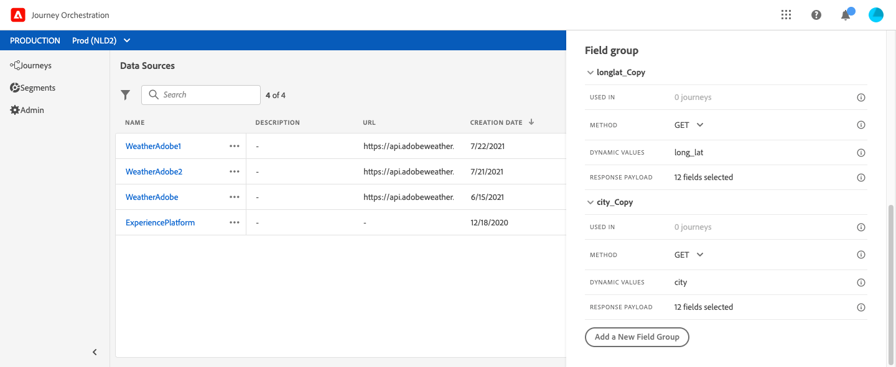

# Fontes de dados externas {#concept_t2s_kqt_52b}

Fontes de dados externas permitem definir uma conexão com sistemas de terceiros, por exemplo, se você estiver usando um sistema de reserva de hotel para verificar se a pessoa reservou um quarto. Ao contrário da fonte de dados integrada da Adobe Experience Platform, você pode criar quantas fontes de dados externas forem necessárias.

As APIs REST que usam POST ou GET e devolvem JSON são compatíveis. A chave de API, os modos de autenticação básicos e personalizados são compatíveis.

Vamos ver o exemplo de um serviço de API meteorológica usada para personalizar os comportamentos da jornada de acordo com os dados climáticos em tempo real.

Dois exemplos da chamada de API:

* _https://api.adobeweather.org/weather?city=London,uk&amp;appid=1234_
* _https://api.adobeweather.org/weather?lat=35&amp;lon=139&amp;appid=1234_

A chamada é composta de um URL principal (_https://api.adobeweather.org/weather_), dois conjuntos de parâmetros (&quot;city&quot; para a cidade e &quot;lat/long&quot; para a latitude e a longitude) e a chave da API (appid).

Estas são as principais etapas para criar e configurar uma nova fonte de dados externa:

1. Na lista de fontes de dados, clique em **[!UICONTROL Create data source]** para criar uma nova fonte de dados externa.

   

   Essa ação abre o painel de configuração da fonte de dados no lado direito da tela.

   

1. Insira um nome para a sua fonte de dados.

   >[!NOTE]
   >
   >Não use espaços ou caracteres especiais. Não use mais de 30 caracteres.

1. Adicione uma descrição à fonte de dados. Esta etapa é opcional.
1. Adicione o URL do serviço externo. Em nosso exemplo: _https://api.adobeweather.org/weather_.

   >[!CAUTION]
   >
   >Recomendamos o uso de HTTPS por motivos de segurança. Observe também que não permitimos o uso de endereços da Adobe que não estejam disponíveis publicamente, bem como o uso de endereços IP.

   

1. Configure a autenticação dependendo da configuração do serviço externo: **[!UICONTROL No authentication]**, **[!UICONTROL Basic]**, **[!UICONTROL Custom]** ou **[!UICONTROL API key]**. Para obter mais informações sobre o modo de autenticação personalizado, consulte [esta seção](../datasource/external-data-sources.md#section_wjp_nl5_nhb). Em nosso exemplo, escolhemos:


   * **[!UICONTROL Type]**: &quot;Chave de API&quot;
   * **[!UICONTROL Value]**: &quot;1234&quot; (este é o valor da nossa chave de API)
   * **[!UICONTROL Name]**: &quot;appid&quot; (este é o nome do parâmetro da chave de API)
   * **[!UICONTROL Location]**: &quot;Parâmetro de query&quot; (a chave de API está localizada no URL)

   

1. Adicione um novo grupo de campos para cada conjunto de parâmetros da API clicando em **[!UICONTROL Add a New Field Group]**. Não use espaços ou caracteres especiais no nome do grupo de campos. Em nosso exemplo, precisamos criar dois grupos de campo, um para cada conjunto de parâmetros (city e long/lat).

Para o conjunto de parâmetros &quot;long/lat&quot;, criamos um grupo de campos com as seguintes informações:

* **[!UICONTROL Used in]**: exibe o número de jornadas que usam um grupo de campos. Você pode clicar no ícone **[!UICONTROL View journeys]** para exibir a lista de jornadas usando esse grupo de campos.
* **[!UICONTROL Method]**: selecione o método POST ou GET. No nosso caso, selecionamos o método GET.
* **[!UICONTROL Response Payload]**: clique dentro do campo **[!UICONTROL Payload]** e cole um exemplo da carga útil retornada pela chamada. Para nosso exemplo, usamos uma carga encontrada em um site da API de meteorologia. Verifique se os tipos de campo estão corretos. Cada vez que a API é chamada, o sistema recuperará todos os campos incluídos no exemplo de carga útil. Observe que você pode clicar em **[!UICONTROL Paste a new payload]** se desejar alterar a carga útil transmitida no momento.
* **[!UICONTROL Dynamic Values]**: insira os diferentes parâmetros separados por vírgula, &quot;long,lat&quot; no nosso exemplo. Como os valores dos parâmetros dependem do contexto de execução, eles serão definidos nas jornadas. Consulte [esta página](../expression/expressionadvanced.md).
* **[!UICONTROL Sent Payload]**: este campo não aparece no nosso exemplo. Ele só estará disponível se você selecionar o método POST. Cole a carga útil que será enviada para o sistema de terceiros.

No caso de uma chamada GET que exige parâmetros, você informa os parâmetros no campo **[!UICONTROL Dynamic Values]** e eles são adicionados automaticamente no final da chamada. No caso de uma chamada POST, é necessário:

* listar os parâmetros que serão transmitidos no momento da chamada no campo **[!UICONTROL Dynamic Values]** (no exemplo abaixo: &quot;identificador&quot;).
* especificá-los também com a mesma sintaxe no corpo da carga útil enviada. Para fazer isso, é necessário adicionar: &quot;param&quot;: &quot;nome do parâmetro&quot; (no exemplo abaixo: &quot;identificador&quot;). Siga a sintaxe abaixo:

   ```
   {"id":{"param":"identifier"}}
   ```



Clique em **[!UICONTROL Save]**.

A fonte de dados agora está configurada e pronta para ser usada em suas jornadas, por exemplo em suas condições ou para personalizar um email. Se a temperatura estiver acima de 30°C, você pode decidir enviar uma comunicação específica.

## Modo de autenticação personalizado{#section_wjp_nl5_nhb}

>[!CONTEXTUALHELP]
>id="jo_authentication_payload"
>title="Sobre a autenticação personalizada"
>abstract="O modo de autenticação personalizado é usado para autenticação complexa para chamar protocolos de empacotamento automático de API, como OAuth2. A execução da ação é um processo em duas etapas. Primeiro, uma chamada para o ponto de acesso é executada para gerar o token de acesso. Em seguida, o token de acesso é inserido na solicitação HTTP da ação."

Esse modo de autenticação é usado para autenticação complexa, frequentemente usada para chamar protocolos de empacotamento de API como OAuth2, para recuperar um token de acesso que será inserido na solicitação real HTTP para a ação.

Ao configurar a autenticação personalizada, você pode clicar no botão abaixo para verificar se a carga útil de autenticação personalizada está configurada corretamente.


Se o teste for bem-sucedido, o botão ficará verde.


Com essa autenticação, a execução da ação é um processo de duas etapas:

1. Chame o endpoint para gerar o token de acesso.
1. Chame a REST API inserindo de maneira correta o token de acesso.

Esta autenticação tem duas partes.

A definição do endpoint que será chamado para gerar o token de acesso:

* endpoint: URL que será usado para gerar o endpoint
* método da solicitação HTTP no endpoint (GET ou POST)
* cabeçalhos: pares de chave/valor que serão inseridos como cabeçalhos nesta chamada, caso necessário
* corpo: descreve o corpo da chamada se o método for POST. Oferecemos suporte a uma estrutura de corpo limitada, definida em bodyParams (pares de chaves/valores). O bodyType descreve o formato e a codificação do corpo na chamada:
   * &#39;form&#39;: significa que o tipo de conteúdo será application/x-www-form-urlencoded (charset UTF-8) e os pares chave/valor serão serializados como estão: key1=value1&amp;key2=value2&amp;...
   * &#39;json&#39;: significa que o tipo de conteúdo será application/json (charset UTF-8) e que os pares de valores principais serão serializados como um objeto json como a seguir: _{ &quot;key1&quot;: &quot;value1&quot;, &quot;key2&quot;: &quot;value2&quot;, ...}_

A definição da forma como o token de acesso deve ser inserido na solicitação HTTP da ação:

* authorizationType: define como o token de acesso gerado deve ser inserido na chamada HTTP para a ação. Os valores possíveis são:

   * bearer: indica que o token de acesso deve ser injetado no cabeçalho da Autorização, como: _Authorization: Bearer &lt;access token>_
   * header: indica que o token de acesso deve ser inserido como um cabeçalho, o nome do cabeçalho definido pela propriedade tokenTarget. Por exemplo, se o tokenTarget for myHeader, o token de acesso será inserido como um cabeçalho como: _myHeader: &lt;access token>_
   * queryParam: indica que o token de acesso deve ser inserido como um queryParam, o nome do parâmetro do query definido pela propriedade tokenTarget. Por exemplo, se o tokenTarget for myQueryParam, o URL da chamada de ação será: _&lt;url>?myQueryParam=&lt;access token>_

* tokenInResponse: indica como extrair o token de acesso da chamada de autenticação. Essa propriedade pode ser:
   * &#39;response&#39;: indica que a resposta HTTP é o token de acesso
   * um seletor em um json (supondo que a resposta seja um json, não oferecemos suporte a outros formatos, como XML). O formato desse seletor é _json://&lt;path to the access token property>_. Por exemplo, se a resposta da chamada for: _{ &quot;access_token&quot;: &quot;theToken&quot;, &quot;timestamp&quot;: 12323445656 }_, o tokenInResponse será: _json: //access_token_

O formato dessa autenticação é:

```
{
    "type": "customAuthorization",
    "authorizationType": "<value in 'bearer', 'header' or 'queryParam'>",
    (optional, mandatory if authorizationType is 'header' or 'queryParam') "tokenTarget": "<name of the header or queryParam if the authorizationType is 'header' or 'queryParam'>",
    "endpoint": "<URL of the authentication endpoint>",
    "method": "<HTTP method to call the authentication endpoint, in 'GET' or 'POST'>",
    (optional) "headers": {
        "<header name>": "<header value>",
        ...
    },
    (optional, mandatory if method is 'POST') "body": {
        "bodyType": "<'form'or 'json'>,
        "bodyParams": {
            "param1": value1,
            ...

        }
    },
    "tokenInResponse": "<'response' or json selector in format 'json://<field path to access token>'"
}
```

É possível alterar a duração do cache do token para uma fonte de dados de autenticação personalizada. Encontre abaixo um exemplo de payload de autenticação personalizada. A duração do cache é definida no parâmetro &quot;cacheDuration&quot;. Especifica a duração de retenção do token gerado no cache. A unidade pode ser milissegundos, segundos, minutos, horas, dias, meses, anos.

```
"authentication": {
    "type":"customAuthorization",
    "authorizationType":"Bearer",
    "endpoint":"http://localhost:${port}/epsilon/oauth2/access_token",
    "method":"POST",
    "headers": {
        "Authorization":"Basic EncodeBase64(${epsilonClientId}:${epsilonClientSecret})"
        },
    "body": {
        "bodyType":"form",
        "bodyParams": {
             "scope":"cn mail givenname uid employeeNumber",
             "grant_type":"password",
             "username":"${epsilonUserName}",
             "password":"${epsilonUserPassword}"
             }
        },
    "tokenInResponse":"json://access_token",
    "cacheDuration":
             { "duration":5, "timeUnit":"seconds" }
    }
```

>[!NOTE]
>
>A duração do cache ajuda a evitar muitas chamadas para os pontos de extremidade de autenticação. A retenção de token de autenticação está armazenada em cache nos serviços, não há persistência. Se um serviço for reiniciado, ele será iniciado com um cache limpo. A duração padrão do cache é de 1 hora. Na carga de autenticação personalizada, ela pode ser adaptada especificando outra duração de retenção.
