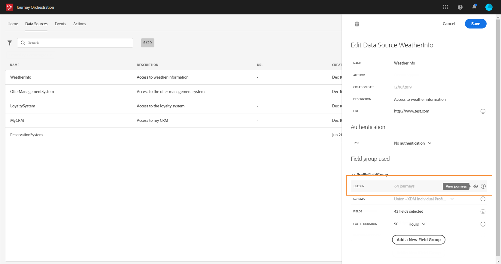

# Grupos de campos {#concept_ntl_ypt_52b}

>[!CAUTION]
>
>**Está procurando pelo Adobe Journey Optimizer**? Clique [aqui](https://experienceleague.adobe.com/pt-br/docs/journey-optimizer/using/ajo-home){target="_blank"} para acessar a documentação do Journey Optimizer.
>
>
>_Essa documentação refere-se ao material herdado do Journey Orchestration, que foi substituído pelo Journey Optimizer. Entre em contato com a equipe de contas em caso de dúvidas sobre como acessar o Journey Orchestration ou o Journey Optimizer._

Grupos de campos são conjuntos de campos que você pode recuperar de uma fonte de dados e usar em uma jornada.

## Definição de grupos de campos {#section_dsz_kjd_fjb}

Para cada fonte de dados, é possível definir vários grupos de campos.

Por exemplo, você pode criar um grupo de campos com o número de telefone, o email, o nome e o endereço do perfil. Você poderá usar esses dados na jornada para criar condições. Por exemplo, você pode decidir enviar um SMS somente se o número de telefone do perfil não estiver vazio. Se estiver vazio, você poderá enviar um email.

Embora um nome padrão seja adicionado automaticamente, recomendamos que você dê um nome ao seu grupo de campos. Na verdade, o nome do grupo de campos ficará visível para outros usuários em [!DNL Journey Orchestration]. Dar um nome relevante aos grupos de campo é uma prática recomendada.

Quando um campo de fonte de dados é usado em uma jornada, o sistema recupera todos os campos definidos para esse grupo de campos. Portanto, selecionar apenas os campos necessários para suas jornadas é uma prática recomendada. Isso reduzirá a latência de solicitação em suas jornadas, aumentando o desempenho. Observe que mais tarde é possível adicionar facilmente mais campos em grupos de campos.

O número de jornadas que usam um grupo de campos é exibido no campo **[!UICONTROL Used in]**. Você pode clicar no botão **[!UICONTROL View journeys]** para exibir a lista de jornadas usando este grupo de campos.

>[!NOTE]
>
>Observe que se um grupo de campos não tiver um campo, ele não será exibido no editor de expressão.

## Ciclo de vida do grupo de campos {#section_abk_njd_fjb}

Você pode adicionar ou remover campos de um grupo de campos que não é usado em nenhum rascunho ou jornada em tempo real.

Você pode adicionar, mas não pode remover, um campo de um grupo de campos usado em uma ou mais jornadas de rascunho ou ativas. Isso evitará quebrar as jornadas.

Para excluir um campo de um grupo de campos usado em uma ou mais jornadas, siga estas etapas. Vamos usar um exemplo de um grupo de campos chamado &quot;Grupo de campos A&quot;.

1. Na lista de grupos de campos, coloque o cursor em &quot;Grupo de campos A&quot; e clique no ícone **[!UICONTROL Duplicate]** localizado à direita. Nomeie o grupo de campos duplicado como &quot;Grupo de campos B&quot;, por exemplo.
1. Em &quot;Grupo de campos B&quot;, remova os campos que não deseja mais.
1. Em &quot;Grupo de campos A&quot;, verifique onde esse grupo de campos é usado. Essas informações são exibidas no campo **[!UICONTROL Used in]**.
1. Abra todas as jornadas que usam &quot;Grupo de campos A&quot;.
1. Crie novas versões de cada uma dessas jornadas. Edite todas as atividades usando &quot;Grupo de campos A&quot; e selecione &quot;Grupo de campos B&quot;.
1. Interrompa versões antigas de jornadas que usam &quot;Grupo de campos A&quot;. Você não deve ter nenhuma jornada usando o &quot;Grupo de campos A&quot;.
1. Remova o &quot;Grupo de campos A&quot; pois ele não é mais usado.
