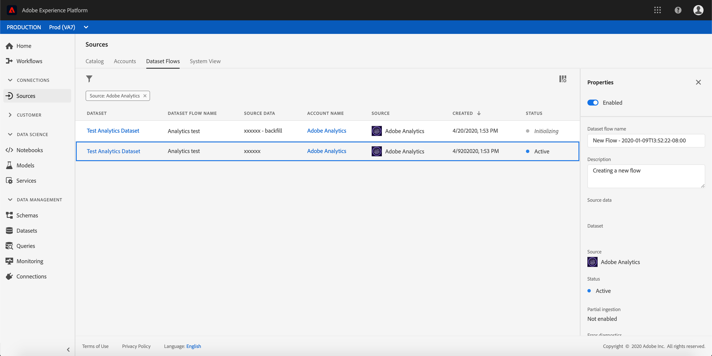

# Aproveitamento dos dados do Adobe Analytics{#analytics-data}

>[!CAUTION]
>
>**Está procurando pelo Adobe Journey Optimizer**? Clique [aqui](https://experienceleague.adobe.com/pt-br/docs/journey-optimizer/using/ajo-home){target="_blank"} para acessar a documentação do Journey Optimizer.
>
>
>_Essa documentação refere-se ao material herdado do Journey Orchestration, que foi substituído pelo Journey Optimizer. Entre em contato com a equipe de contas em caso de dúvidas sobre como acessar o Journey Orchestration ou o Journey Optimizer._

>[!NOTE]
>
>Essa seção se aplica somente a eventos com base em regras e clientes que precisam usar dados do Adobe Analytics.

Você pode aproveitar todos os dados de evento comportamental do Adobe Analytics que já estão sendo capturados e transmitidos na plataforma para acionar jornadas e automatizar experiências para seus clientes.

Para que isso funcione, é necessário ativar no Adobe Experience Platform o conjunto de relatórios que você deseja usar:

1. No Adobe Experience Platform, selecione **[!UICONTROL Sources]** e depois **[!UICONTROL Add data]** na seção Adobe Analytics. A lista de conjuntos de relatórios do Adobe Analytics disponíveis é exibida.

1. Escolha o conjunto de relatórios que deseja habilitar, clique em **[!UICONTROL Next]** e em **[!UICONTROL Finish]**.

1. Compartilhe a ID de dados de origem com o ponto de contato do programa Alpha.

Isso ativa o conector de origem do Analytics para esse conjunto de relatórios. Sempre que os dados entram, são transformados em um evento de experiência e enviados para o Adobe Experience Platform.

Para obter mais informações sobre o conector de origem do Adobe Analytics, consulte a [documentação](https://experienceleague.adobe.com/docs/experience-platform/sources/connectors/adobe-applications/analytics.html?lang=pt-BR) e o [tutorial](https://experienceleague.adobe.com/docs/experience-platform/sources/ui-tutorials/create/adobe-applications/analytics.html?lang=pt-BR).
