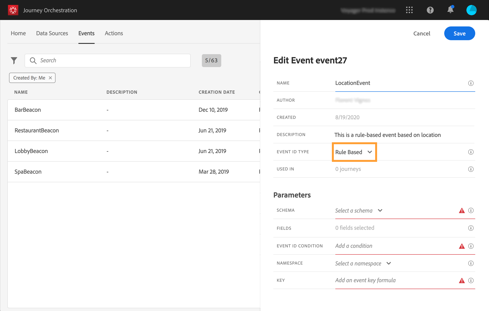

# Criar um novo evento {#section_tbk_5qt_pgb}

Estas são as etapas principais para configurar um novo evento:

1. No menu superior, clique na guia **[!UICONTROL Events]**. A lista dos eventos é exibida. Consulte [esta página](../about/user-interface.md) para obter mais informações sobre a interface.

   

1. Clique em **[!UICONTROL Add]** para criar um novo evento. O painel de configuração do evento é aberto no lado direito da tela. Digite um nome para o evento. Você também pode adicionar uma descrição.

   

   >[!NOTE]
   >
   >Não use espaços ou caracteres especiais. Não use mais de 30 caracteres.

1. No campo **[!UICONTROL Event ID type]**, selecione o tipo de evento que deseja usar.

   

   * **Baseados** em regras: esse tipo de evento não gera uma eventID. No campo **Event ID condition**, basta definir uma regra que será usada pelo sistema para identificar os eventos relevantes que acionarão suas jornadas. Essa regra pode ser baseada em qualquer campo disponível no payload do evento, por exemplo, o local do perfil ou o número de itens adicionados ao carrinho do perfil.

   * **Eventos** gerados pelo sistema: esse tipo requer uma eventID. Esse campo eventID é gerado automaticamente ao criar o evento e adicionado à pré-visualização de carga. O sistema que envia o evento não deve gerar uma ID, mas sim passar a disponível na pré-visualização de carga. Consulte [esta seção](../event/previewing-the-payload.md).
   >[!NOTE]
   >
   >Leia mais sobre tipos de evento em [esta seção](../event/about-events.md).
1. O número de jornadas que usam esse evento é exibido no campo **[!UICONTROL Used in]**. Você pode clicar no ícone **[!UICONTROL View journeys]** para exibir a lista de jornadas usando esse evento.
1. Defina os campos schema e payload: é aqui que você seleciona as informações do evento (normalmente chamadas de payload) que o [!DNL Journey Orchestration] espera receber. Você poderá então usar essas informações em sua jornada. Consulte [esta página](../event/defining-the-payload-fields.md).
   >[!NOTE]
   >
   >Quando você seleciona o tipo **[!UICONTROL System Generated]** , somente os esquemas que têm o tipo eventID mixin estão disponíveis. Quando você seleciona o tipo **[!UICONTROL Rule Based]** , todos os esquemas do Evento de experiência ficam disponíveis.

1. Para eventos baseados em regras, clique dentro do campo **[!UICONTROL Event ID condition]**. Usando o editor de expressões simples, defina a condição que será usada pelo sistema para identificar os eventos que acionarão sua jornada.
   

   Em nosso exemplo, escrevemos uma condição baseada na cidade do perfil. Isso significa que sempre que o sistema receber um evento que corresponda a essa condição (campo **[!UICONTROL City]** e valor **[!UICONTROL Paris]**), ele o passará para o Journey Orchestration.

1. Adicione um namespace. Esta etapa é opcional, mas é recomendada, pois a adição de namespace permite que você aproveite as informações armazenadas no Serviço de perfil do cliente em tempo real. Ela define o tipo de chave que o evento tem. Consulte [esta página](../event/selecting-the-namespace.md).
1. Defina a chave: escolha um campo a partir dos campos de carga útil ou defina uma fórmula para identificar a pessoa associada ao evento. Essa chave é configurada automaticamente (mas ainda pode ser editada) se você selecionar um namespace. Na verdade, o [!DNL Journey Orchestration] escolhe a chave que deve corresponder ao namespace (por exemplo, se você selecionar um namespace de email, a chave de email será selecionada). Consulte [esta página](../event/defining-the-event-key.md).
1. Para eventos gerados pelo sistema, é possível adicionar uma condição. Esta etapa é opcional. Ela permite que o sistema processe apenas os eventos que atendem à condição. A condição só pode ter como base as informações contidas no evento. Consulte [esta página](../event/adding-a-condition.md).
1. Clique em **[!UICONTROL Save]**.

   

   Agora o evento está configurado e pronto para ser lançado em uma jornada. Etapas de configuração adicionais são necessárias para receber eventos. Consulte [esta página](../event/additional-steps-to-send-events-to-journey-orchestration.md).
