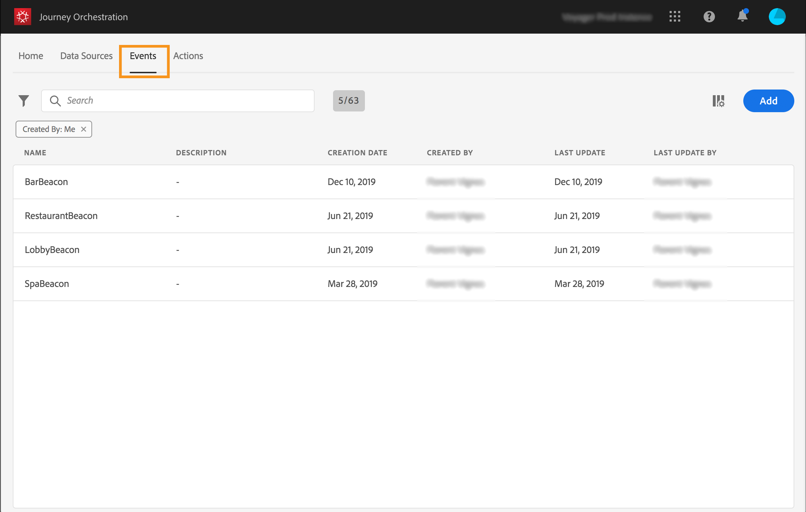

# Sobre eventos {#concept_gfj_fqt_52b}

>[!CONTEXTUALHELP]
>id=&quot;jo_events&quot;
>title=&quot;Sobre eventos&quot;
>abstract=&quot;Um evento está vinculado a uma pessoa. Relacionado ao comportamento de uma pessoa (por exemplo, uma pessoa comprou um produto, visitou uma loja, saiu de um site etc.) ou algo que esteja a acontecer ligado a uma pessoa (por exemplo, uma pessoa atingiu 10 000 pontos de fidelidade). Isto é o que a Journey Orchestration vai ouvir em viagens para orquestrar as melhores próximas ações.&quot;

Um evento está vinculado a uma pessoa. Relacionado ao comportamento de uma pessoa (por exemplo, uma pessoa comprou um produto, visitou uma loja, saiu de um site etc.) ou algo que esteja a acontecer ligado a uma pessoa (por exemplo, uma pessoa atingiu 10 000 pontos de fidelidade). Isto é o que a Journey Orchestration vai ouvir em viagens para orquestrar as melhores ações futuras.

Essa configuração é **obrigatória**, pois a Journey Orchestration é projetada para acompanhar eventos e sempre executada por um usuário **** técnico.

A configuração do evento permite que você defina as informações que a Journey Orchestration receberá como eventos. Você pode usar vários eventos (em diferentes etapas de uma viagem) e várias viagens podem usar o mesmo evento.

Se você editar um evento usado em uma jornada de rascunho ou ao vivo, poderá apenas alterar o nome, a descrição ou adicionar campos de carga. Limitamos rigorosamente a edição de viagens de trabalho ou de trabalho em direto, a fim de evitar a quebra de viagens.

## Princípio geral {#section_r1f_xqt_pgb}

Os eventos são chamadas de API POST. Os eventos são enviados para a plataforma de dados da Adobe Experience Cloud por meio de APIs de ingestão de fluxo contínuo. O destino URL dos eventos enviados por meio de APIs de mensagens transacionais é chamado de &quot;entrada&quot;. A carga de eventos segue a formatação XDM.

A carga contém as informações necessárias para que as APIs de ingestão de fluxo funcionem (no cabeçalho) e as informações necessárias para que o Journey Orchestration funcione (a ID do evento, parte do corpo da carga) e as informações a serem usadas em viagens (no corpo, por exemplo, a quantidade de um carrinho abandonado). Há dois modos para a ingestão de streaming, autenticados e não autenticados. Para obter detalhes sobre as APIs de ingestão de fluxo, consulte [este link](https://www.adobe.io/apis/experienceplatform/home/data-ingestion/data-ingestion-services.html#!api-specification/markdown/narrative/technical_overview/streaming_ingest/getting_started_with_platform_streaming_ingestion.md).

Após chegar pelas APIs de ingestão de fluxo, os eventos fluem para um serviço interno chamado Pipeline e, em seguida, na Plataforma de dados. Se o esquema do evento tiver o sinalizador de Serviço de Perfil do Cliente em tempo real ativado e uma ID de conjunto de dados que também tenha o sinalizador de Perfil do Cliente em tempo real, ele fluirá para o Serviço de Perfil do Cliente em tempo real.

O Pipeline filtra eventos que têm uma carga contendo as IDs de evento do Journey Orchestration (consulte o processo de criação de eventos abaixo) fornecido pelo Journey Orchestration e contido na carga do evento. Esses eventos são ouvidos pela Journey Orchestration e a jornada correspondente é acionada.

## Creating a new event {#section_tbk_5qt_pgb}

Estas são as etapas principais para configurar um novo evento:

1. No menu superior, clique na **[!UICONTROL Events]**guia. A lista de eventos é exibida. Consultepara obter mais informações sobre a interface.

   

1. Clique em **[!UICONTROL Add]**para criar um novo evento. O painel de configuração do evento é aberto no lado direito da tela.

   

1. Digite um nome para o seu evento.

   >[!NOTE]
   >
   >Não use espaços ou caracteres especiais. Não use mais de 30 caracteres.

1. Adicione uma descrição ao seu evento. Esta etapa é opcional.
1. Defina os campos de esquema e carga: é aqui que você seleciona as informações do evento (normalmente chamadas de carga) que o Journey Orchestration espera receber. Você poderá então usar essas informações em sua jornada. Consulte .
1. O número de viagens que usam esse evento é exibido no **[!UICONTROL Used in]**campo. Você pode clicar no**[!UICONTROL View journeys]** ícone para exibir a lista de viagens usando esse evento.
1. Adicione um namespace. Essa etapa é opcional, mas é recomendada, pois a adição de um namespace permite aproveitar as informações armazenadas no Serviço de perfil do cliente em tempo real. Ela define o tipo de chave que o evento tem. Consulte .
1. Defina a chave: escolha um campo dos campos de carga ou defina uma fórmula para identificar a pessoa associada ao evento. Essa chave será configurada automaticamente (mas ainda poderá ser editada) se você selecionar um namespace. Na verdade, o Journey Orchestration escolhe a chave que deve corresponder ao namespace (por exemplo, se você selecionar um namespace de email, a chave de email será selecionada). Consulte .
1. Adicione uma condição. Esta etapa é opcional. Isso permite que o sistema processe somente os eventos que atendem à condição. A condição só pode ser baseada nas informações contidas no evento. Consulte .
1. Clique em **[!UICONTROL Save]**.

   

   O evento agora está configurado e pronto para ser lançado em uma jornada. Etapas de configuração adicionais são necessárias para receber eventos. Consulte .
