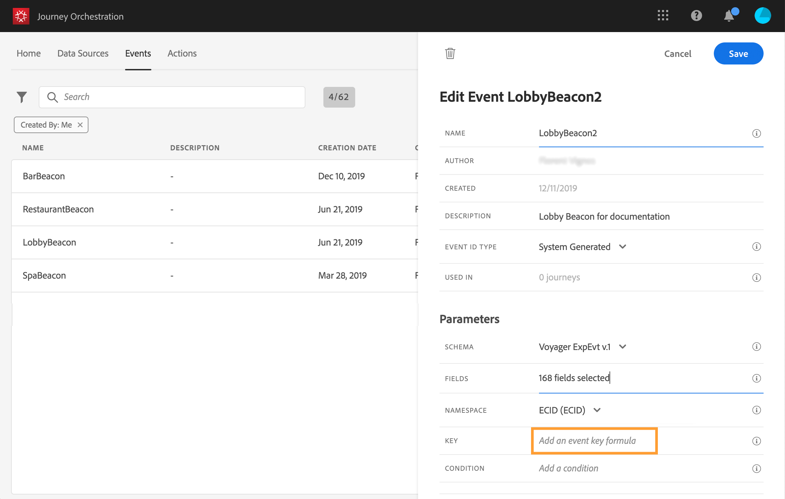

# Definir a chave de evento {#concept_ond_hqt_52b}

>[!CAUTION]
>
>**Está procurando pelo Adobe Journey Optimizer**? Clique [aqui](https://experienceleague.adobe.com/pt-br/docs/journey-optimizer/using/ajo-home){target="_blank"} para acessar a documentação do Journey Optimizer.
>
>
>_Essa documentação refere-se ao material herdado do Journey Orchestration, que foi substituído pelo Journey Optimizer. Entre em contato com a equipe de contas em caso de dúvidas sobre como acessar o Journey Orchestration ou o Journey Optimizer._

A chave é o campo ou a combinação de campos que faz parte dos dados de payload do evento e que permitirá que o sistema identifique a pessoa associada ao evento. A chave pode ser, por exemplo, a Experience Cloud ID, uma ID do CRM ou um endereço de email.

Se você planeja aproveitar os dados armazenados no banco de dados de Perfil do cliente em tempo real, deverá selecionar, como chave de evento, as informações definidas como a identidade de um perfil no [Serviço de perfil do cliente em tempo real](https://experienceleague.adobe.com/docs/experience-platform/profile/home.html?lang=pt-BR).

Ele permitirá que o sistema execute a reconciliação entre o evento e o perfil do indivíduo. Se você selecionar um esquema que tenha uma identidade primária, os campos **[!UICONTROL Key]** e **[!UICONTROL Namespace]** serão preenchidos previamente. Se não houver identidade definida, selecionamos _identityMap > id_ como a chave primária. Em seguida, é necessário selecionar um namespace e a chave será preenchida previamente (abaixo do campo **[!UICONTROL Namespace]**) usando _identityMap > id_.

Ao selecionar campos, os campos de identidade principais são marcados.

Se você precisar usar uma chave diferente, como uma ID do CRM ou um endereço de email, precisará adicioná-la manualmente:

1. Clique dentro do campo **[!UICONTROL Key]** ou no ícone de lápis.

   

1. Selecione o campo escolhido como a chave na lista de campos de carga. Você também pode alternar para o editor de expressão avançado para criar chaves mais complexas (por exemplo, uma concatenação de dois campos dos eventos). Consulte abaixo, nesta seção.

   

Quando o evento for recebido, o valor da chave permitirá que o sistema identifique a pessoa associada ao evento. Associada a um namespace (consulte [esta página](../event/selecting-the-namespace.md)), a chave pode ser usada para executar consultas no Adobe Experience Platform. Consulte [esta página](../building-journeys/about-orchestration-activities.md).
A chave também é usada para verificar se uma pessoa está em uma jornada. De fato, uma pessoa não pode estar em dois lugares diferentes na mesma jornada. Como resultado, o sistema não permite que a mesma chave, por exemplo, a chave CRMID=3224, esteja em locais diferentes na mesma jornada.

Você também tem acesso às funções de expressão avançadas (**[!UICONTROL Advanced mode]**) se desejar executar manipulações adicionais. Essas funções permitem manipular os valores usados para realizar consultas específicas, como alterar formatos e executar concatenações de campo, levando em conta apenas uma parte de um campo (por exemplo, os 10 primeiros caracteres). Consulte [esta página](../expression/expressionadvanced.md).
