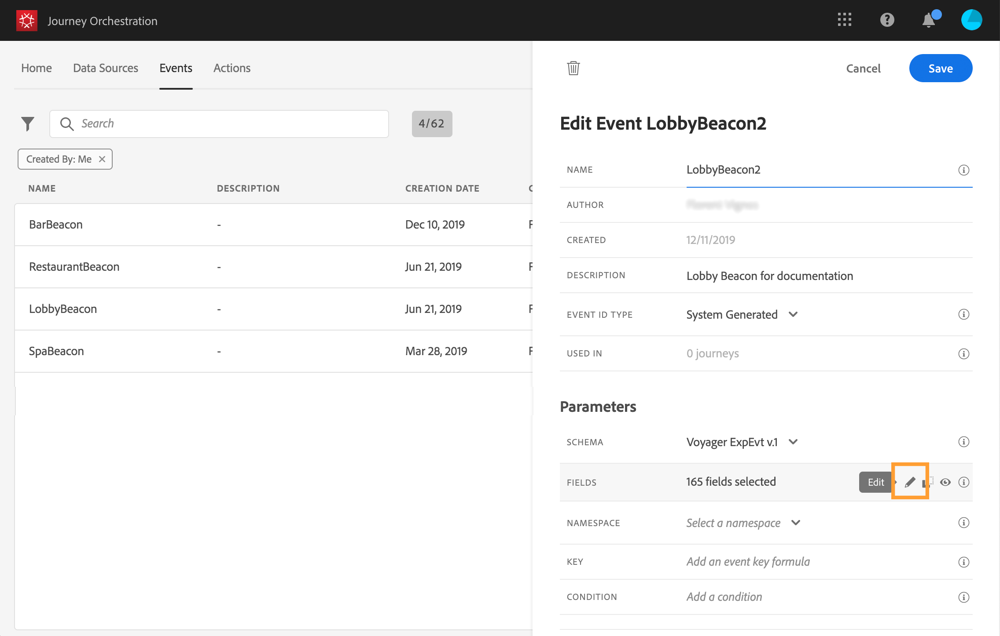
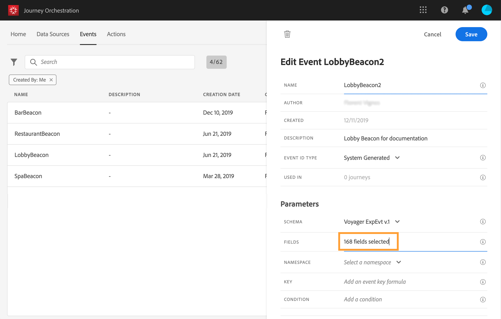

# Definir campos de carga {#concept_yrw_3qt_52b}

A definição da carga permite escolher as informações que o sistema espera receber do evento em sua jornada e a chave para identificar qual pessoa está associada ao evento. A carga é baseada na definição do campo Experience Cloud XDM. For more information on XDM, refer to this [page](https://docs.adobe.com/content/help/pt-BR/experience-platform/xdm/home.html).

1. Selecione um schema XDM na lista e clique no **[!UICONTROL Payload]** campo ou no **[!UICONTROL Edit]** ícone.

   

   Todos os campos definidos no schema são exibidos. A lista dos campos varia de um schema para outro. Você pode pesquisar por um campo específico ou usar os filtros para exibir todos os nós e campos ou apenas os campos selecionados. De acordo com a definição do schema, alguns campos podem ser obrigatórios e pré-selecionados. Não é possível desmarcá-los.

   >[!NOTE]
   >
   >Certifique-se de ter adicionado a mistura &quot;orquestração&quot; ao schema XDM. Isso garantirá que seu schema contenha todas as informações necessárias para trabalhar [!DNL Journey Orchestration].

   

1. Selecione os campos que você espera receber do evento. Estes são os campos que o usuário do negócio vai aproveitar na jornada. Eles também devem incluir a chave que será usada para identificar a pessoa associada ao evento (consulte ).

   

   >[!NOTE]
   >
   >O **[!UICONTROL eventID]** campo é adicionado automaticamente na lista dos campos selecionados para que [!DNL Journey Orchestration] seja possível identificar o evento. O sistema que envia o evento não deve gerar uma ID; ele deve usar a que está disponível na pré-visualização de carga. Consulte .

1. Quando terminar de selecionar os campos necessários, clique **[!UICONTROL Save]** ou pressione **[!UICONTROL Enter]**.

   

   O número de campos selecionados é exibido no **[!UICONTROL Payload]** campo.

   
