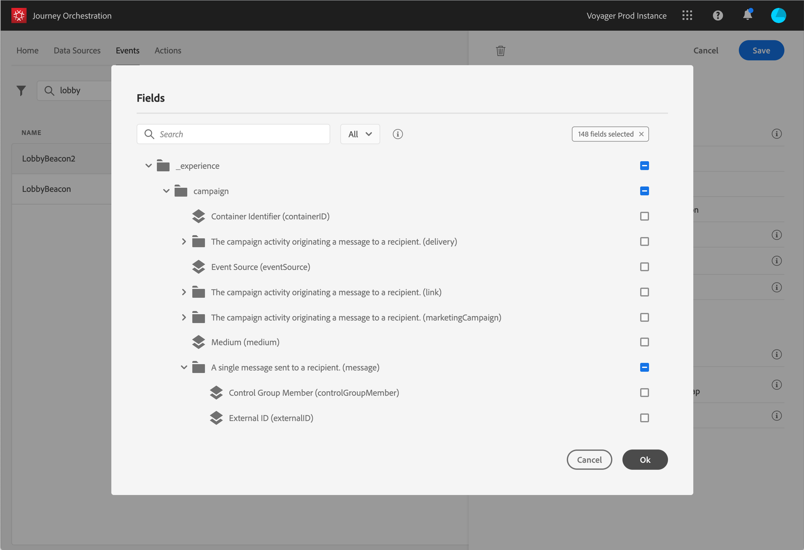
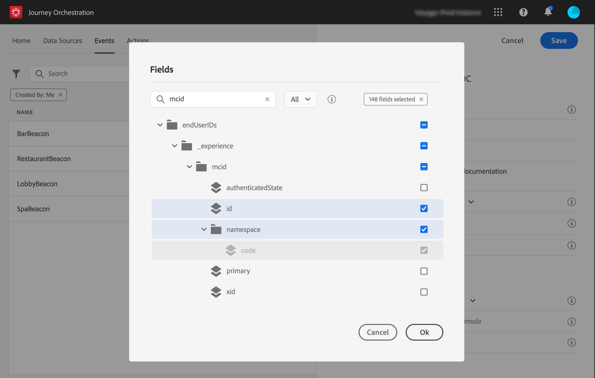

# Definir os campos de carga {#concept_yrw_3qt_52b}

>[!CAUTION]
>
>**Está procurando pelo Adobe Journey Optimizer**? Clique [aqui](https://experienceleague.adobe.com/pt-br/docs/journey-optimizer/using/ajo-home){target="_blank"} para acessar a documentação do Journey Optimizer.
>
>
>_Essa documentação refere-se ao material herdado do Journey Orchestration, que foi substituído pelo Journey Optimizer. Entre em contato com a equipe de contas em caso de dúvidas sobre como acessar o Journey Orchestration ou o Journey Optimizer._

A definição de carga útil permite escolher as informações que o sistema espera receber do evento em sua jornada e a chave para identificar qual pessoa está associada ao evento. A carga é baseada na definição do campo XDM da Experience Cloud. Para obter mais informações sobre XDM, consulte [esta página](https://experienceleague.adobe.com/docs/experience-platform/xdm/home.html?lang=pt-BR).

1. Selecione um esquema XDM na lista e clique no campo **[!UICONTROL Payload]** ou no ícone **[!UICONTROL Edit]**.

   

   Todos os campos definidos no esquema são exibidos. A lista de campos varia de um esquema para outro. Você pode pesquisar um campo específico ou usar os filtros para exibir todos os nós e campos ou apenas os campos selecionados. De acordo com a definição do esquema, alguns campos podem ser obrigatórios e pré-selecionados. Não é possível desmarcá-los. Todos os campos obrigatórios para o evento ser recebido corretamente pelo Journey Orchestration são selecionados por padrão.

   >[!NOTE]
   >
   >Verifique se você adicionou a combinação &quot;orquestração&quot; ao esquema XDM. Isso garantirá que seu esquema contenha todas as informações necessárias para trabalhar com [!DNL Journey Orchestration].

   

1. Selecione os campos que você espera receber do evento. Esses são os campos que o usuário empresarial utilizará na jornada. Eles também devem incluir a chave que será usada para identificar a pessoa associada ao evento (consulte [esta página](../event/defining-the-event-key.md)).

   

   >[!NOTE]
   >
   >Para eventos gerados pelo sistema, o campo **[!UICONTROL eventID]** é automaticamente adicionado à lista de campos selecionados para que [!DNL Journey Orchestration] possa identificar o evento. O sistema que envia o evento não deve gerar uma ID, mas usar a disponível na pré-visualização de carga. Consulte [esta página](../event/previewing-the-payload.md).

1. Quando terminar de selecionar os campos necessários, clique em **[!UICONTROL Save]** ou pressione **[!UICONTROL Enter]**.

   

   O número de campos selecionados aparece no campo **[!UICONTROL Payload]**.

   
