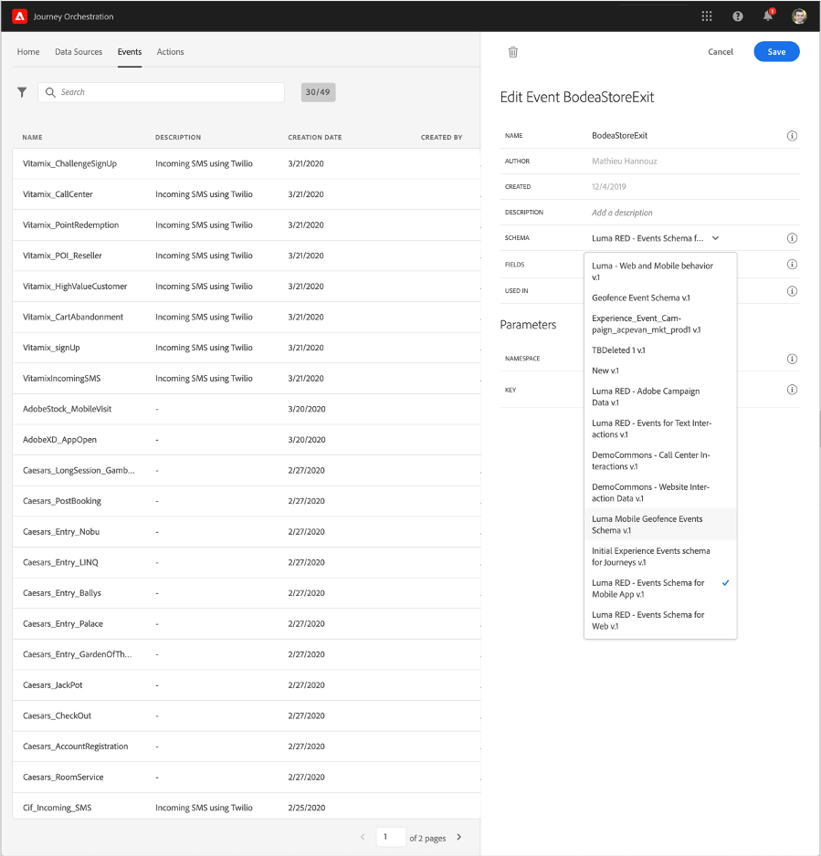
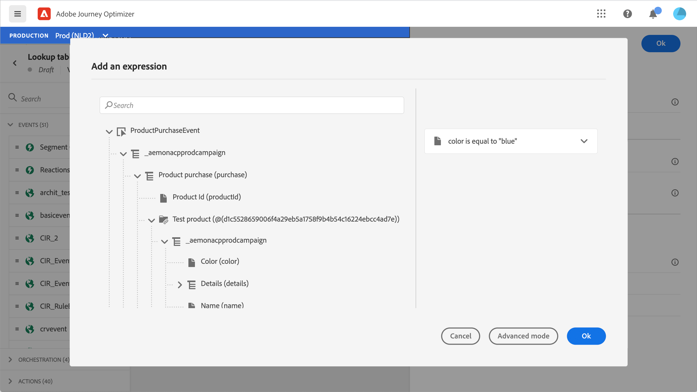

# Sobre Esquemas ExperienceEvent para [!DNL Journey Orchestration] Eventos

>[!CAUTION]
>
>**Procurando Adobe Journey Optimizer**? Clique [aqui](https://experienceleague.adobe.com/pt-br/docs/journey-optimizer/using/ajo-home){target="_blank"} para obter a documentação do Journey Optimizer.
>
>
>_Esta documentação se refere ao material herdado do Journey Orchestration que foi substituído pelo Journey Optimizer. Entre em contato com a equipe de conta em caso de dúvidas sobre o acesso ao Journey Orchestration ou Journey Optimizer._

[!DNL Journey Orchestration] eventos são Eventos de experiência XDM enviados para a Adobe Experience Platform por meio da assimilação de streaming.

Assim, um pré-requisito importante para configurar eventos para o [!DNL Journey Orchestration] é que você esteja familiarizado com o Experience Data Model (ou XDM) da Adobe Experience Platform e saiba como compor esquemas de Evento de experiência XDM, bem como transmitir dados formatados em XDM para a Adobe Experience Platform.

## Requisitos de esquema para [!DNL Journey Orchestration] eventos

A primeira etapa na configuração de um evento para [!DNL Journey Orchestration] é garantir que você tenha um esquema XDM definido para representar o evento e um conjunto de dados criado para registrar instâncias do evento na Adobe Experience Platform. Ter um conjunto de dados para seus eventos não é estritamente necessário, mas enviar os eventos para um conjunto de dados específico permitirá manter o histórico de eventos dos usuários para referência e análise futuras, sempre sendo uma boa ideia. Se você ainda não tiver um esquema e um conjunto de dados adequados para o seu evento, essas duas tarefas poderão ser feitas na interface da Web do Adobe Experience Platform.

Qualquer esquema XDM que será usado para [!DNL Journey Orchestration] eventos deve atender aos seguintes requisitos:

* O esquema deve ser da classe XDM ExperienceEvent.

  

* Para eventos gerados pelo sistema, o esquema deve incluir a combinação de eventID de orquestração. [!DNL Journey Orchestration] usa este campo para identificar eventos usados em jornadas.

  

* Declare um campo de identidade para identificar o assunto do evento. Se nenhuma identidade for especificada, um mapa de identidade poderá ser usado. Isso não é recomendado.

  

* Se desejar que esses dados estejam disponíveis para pesquisa posteriormente em uma Jornada, marque o esquema e o conjunto de dados para o perfil.

  

  

* Sinta-se à vontade para incluir campos de dados para capturar quaisquer outros dados de contexto que deseja incluir com o evento, como informações sobre o usuário, o dispositivo do qual o evento foi gerado, o local ou qualquer outra circunstância significativa relacionada ao evento.

  

  

## Aproveitar relacionamentos de esquema{#leverage_schema_relationships}

O Adobe Experience Platform permite definir relações entre esquemas para usar um conjunto de dados como uma tabela de pesquisa para outro.

Digamos que o modelo de dados da sua marca tenha um esquema que captura compras. Você também tem um esquema para o catálogo de produtos. Você pode capturar a ID do produto no esquema de compra e usar um relacionamento para pesquisar detalhes mais completos do produto no catálogo de produtos. Isso permite criar um segmento para todos os clientes que compraram um laptop, por exemplo, sem precisar listar explicitamente todas as IDs de laptop ou capturar todos os detalhes de produto em sistemas transacionais.

Para definir uma relação, você precisa ter um campo dedicado no esquema de origem, neste caso, o campo ID do produto no esquema de compra. Este campo precisa fazer referência ao campo de ID do produto no esquema de destino. As tabelas de origem e destino devem ser habilitadas para perfis e o esquema de destino deve ter esse campo comum definido como sua identidade principal.

Este é o esquema do catálogo de produtos habilitado para o perfil com a ID do produto definida como a identidade principal.

Este é o esquema de compra com o relacionamento definido no campo ID do produto.

>[!NOTE]
>
>Saiba mais sobre relações de esquema na [documentação do Experience Platform](https://experienceleague.adobe.com/docs/platform-learn/tutorials/schemas/configure-relationships-between-schemas.html?lang=pt-BR).

No Journey Orchestration, você pode aproveitar todos os campos das tabelas vinculadas:

* ao configurar um evento unitário, [Leia mais](../event/experience-event-schema.md#unitary_event_configuration)
* ao usar condições em uma jornada, [Leia mais](../event/experience-event-schema.md#journey_conditions_using_event_context)
* na personalização de ação personalizada, [Leia mais](../event/experience-event-schema.md#custom_action_personalization_with_journey_event_context)

### Configuração de evento unitário{#unitary_event_configuration}

Os campos de esquema vinculados estão disponíveis na configuração de evento unitário:

* ao navegar pelos campos de esquema do evento na tela de configuração do evento.
* ao definir uma condição para eventos gerados pelo sistema.

Os campos vinculados não estão disponíveis:

* na fórmula da chave de evento
* condição in event id (eventos com base em regras)

Para saber como configurar um evento unitário, consulte esta [página](../event/about-creating.md).

### Jornada condições usando o contexto do evento{#journey_conditions_using_event_context}

Você pode usar dados de uma tabela de pesquisa vinculada a um evento usado em uma jornada para criação de condição (editor de expressão).

Adicione uma condição em uma jornada, edite a expressão e expanda o nó do evento no editor de expressão.

Para saber como definir condições de jornada, consulte esta [página](../building-journeys/condition-activity.md).

### Personalização de ação com contexto de evento de jornada{#custom_action_personalization_with_journey_event_context}

Os campos vinculados estão disponíveis ao configurar os parâmetros de ação de uma atividade de ação de jornada.

Para saber como usar ações personalizadas, consulte esta [página](../building-journeys/using-custom-actions.md).

