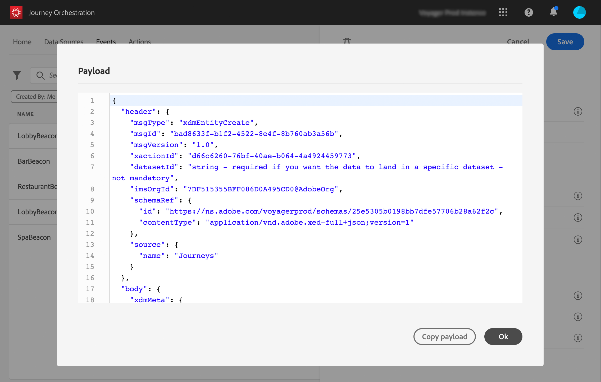

# Visualizar a carga {#concept_jgf_4yk_4fb}

>[!CAUTION]
>
>**Está procurando pelo Adobe Journey Optimizer**? Clique [aqui](https://experienceleague.adobe.com/pt-br/docs/journey-optimizer/using/ajo-home){target="_blank"} para acessar a documentação do Journey Optimizer.
>
>
>_Essa documentação refere-se ao material herdado do Journey Orchestration, que foi substituído pelo Journey Optimizer. Entre em contato com a equipe de contas em caso de dúvidas sobre como acessar o Journey Orchestration ou o Journey Optimizer._

A pré-visualização de carga permite validar a definição de carga útil.

>[!NOTE]
>
>Para eventos gerados pelo sistema, ao criar um evento, antes de visualizar a pré-visualização de carga, salve o evento e abra-o novamente. Essa etapa é necessária para gerar uma ID de evento na carga.

1. Clique no ícone **[!UICONTROL View Payload]** para visualizar a carga útil esperada pelo sistema.

   

   Você pode observar que os campos selecionados são exibidos.

   

1. Verifique a visualização para validar a definição de carga.

1. Em seguida, é possível compartilhar a pré-visualização do conteúdo com a pessoa responsável pelo envio do evento. Esta carga pode ajudá-los a criar a configuração de envio de evento para [!DNL Journey Orchestration]. Consulte [esta página](../event/additional-steps-to-send-events-to-journey-orchestration.md).
