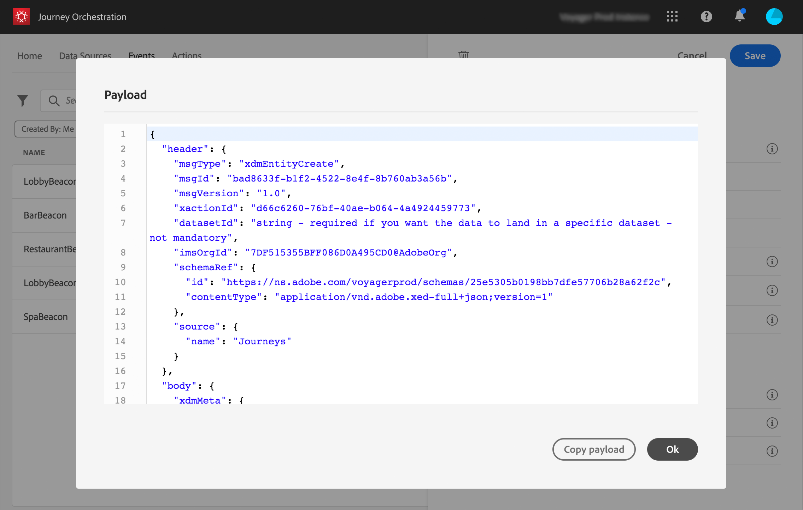

# Visualizar a carga {#concept_jgf_4yk_4fb}

A pré-visualização payload permite validar a definição da carga.

>[!NOTE]
>
>Para eventos gerados pelo sistema, ao criar um evento, antes de exibir a pré-visualização de carga, salve o evento e abra-o novamente. Essa etapa é necessária para gerar uma ID de evento na carga.

1. Clique no **[!UICONTROL View Payload]** ícone para pré-visualização da carga esperada pelo sistema.

   

   Você pode notar que os campos selecionados são exibidos.

   

1. Verifique a pré-visualização para validar a definição da carga.

1. Em seguida, você pode compartilhar a pré-visualização de carga com a pessoa responsável pelo envio do evento. Essa carga pode ajudá-lo a projetar a configuração de um evento que é direcionado para [!DNL Journey Orchestration]. Consulte [esta página](../event/additional-steps-to-send-events-to-journey-orchestration.md).
