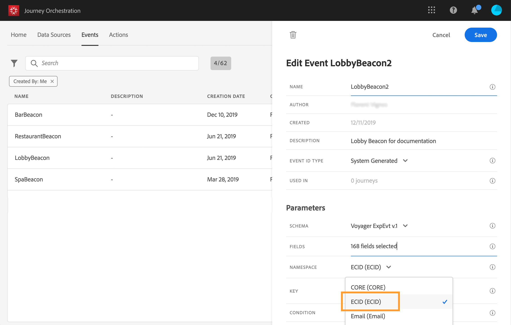

# Selecionar namespace {#concept_ckb_3qt_52b}

A namespace permite definir o tipo de chave usada para identificar a pessoa associada ao evento. Sua configuração é opcional. É necessário se você quiser recuperar, em suas viagens, informações adicionais provenientes do [Perfil do cliente em tempo real](https://docs.adobe.com/content/help/pt-BR/experience-platform/profile/home.html). A definição da namespace não é necessária se você estiver usando apenas dados provenientes de um sistema de terceiros por meio de uma fonte de dados personalizada.

Você pode usar um dos predefinidos ou criar um novo usando o serviço de Namespace de identidade. Consulte esta [página](https://docs.adobe.com/content/help/pt-BR/experience-platform/identity/home.html).

Se você selecionar um schema que tenha uma identidade primária, os campos **[!UICONTROL Key]** e **[!UICONTROL Namespace]** serão preenchidos previamente. Se não houver identidade definida, selecionamos _identityMap > id_ como a chave primária. Em seguida, é necessário selecionar uma namespace e a chave será pré-preenchida (abaixo do campo **[!UICONTROL Namespace]**) usando _identityMap > id_.

Ao selecionar campos, os campos de identidade primários são marcados com tags.

Selecione uma namespace na lista suspensa.

Apenas uma namespace é permitida por viagem. Se você usar vários eventos na mesma jornada, eles precisam usar a mesma namespace. Consulte [esta página](../building-journeys/journey.md).
