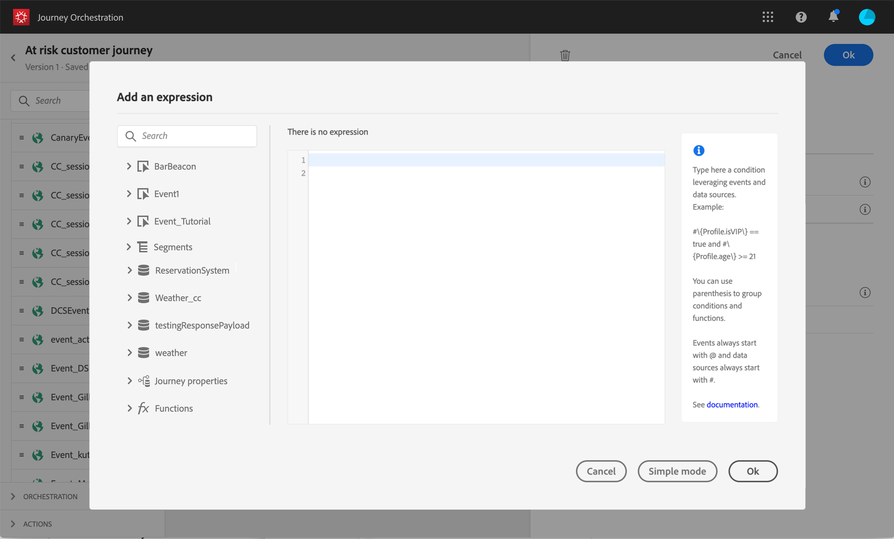

# Sobre o editor de expressões avançadas {#concept_uyj_trt_52b}

O editor de expressões avançado permite criar expressões avançadas em várias telas da interface, por exemplo, ao definir uma condição de fonte de dados.
Ele também está disponível sempre que for necessário definir parâmetros de ação que exijam manipulações de dados específicas. Você pode aproveitar os dados provenientes dos eventos ou informações adicionais recuperadas da fonte de dados. Em uma jornada, a lista exibida de campos de evento é contextual e varia de acordo com os eventos adicionados na jornada.

O editor de expressões avançado oferta um conjunto de funções e operadores incorporados para permitir que você manipule valores e defina uma expressão que se ajuste especificamente às suas necessidades. O editor de expressões avançado também permite que você defina os valores do parâmetro de fonte de dados externa, manipule campos de mapa e coleções, como eventos de experiência.

_A interface avançada do editor de expressões_

O editor de expressões avançado pode ser usado para:

* criar condições  avançadas em fontes de dados e informações do evento
* definir atividades de [espera personalizadas](../building-journeys/wait-activity.md#custom)
* definir mapeamento de parâmetros de ação

Quando possível, você pode alternar entre os dois modos usando o botão **[!UICONTROL Advanced mode]** / **[!UICONTROL Simple mode]** . O modo simples é descrito [aqui](../building-journeys/condition-activity.md#about_condition).

>[!NOTE]
>
>As condições podem ser definidas no editor de expressões simples ou avançado. Eles sempre retornam um tipo booleano.
>
>Parâmetros de ações podem ser definidos selecionando campos ou por meio do editor de expressões avançado. Eles retornam um tipo de dados específico de acordo com sua expressão.

## Accessing the advanced expression editor {#section_fdz_4nj_cjb}

Você pode acessar o editor de expressões avançado de diferentes maneiras:

* Ao criar uma condição de fonte de dados, você pode acessar o editor avançado clicando em **[!UICONTROL Advanced mode]**.

   

* Ao criar um temporizador personalizado, o editor avançado será exibido diretamente.
* Ao mapear o parâmetro de ação, clique em **[!UICONTROL Advanced mode]**.

## Descobrir a interface{#section_otq_tnj_cjb}

Esta tela permite que você escreva manualmente sua expressão.

Na parte esquerda da tela, são exibidos os campos e as funções disponíveis:

* **[!UICONTROL Events]**: escolha um dos campos recebidos do evento de entrada. A lista exibida dos campos do evento é contextual e varia de acordo com os eventos adicionados na jornada.
* **[!UICONTROL Data Sources]**: escolha na lista de campos disponíveis nos grupos de campos de suas fontes de dados.
* **[!UICONTROL Functions]**: escolha entre uma lista de funções incorporadas que permitem executar filtragem complexa. As funções são organizadas pelo categoria.

Um mecanismo de autocompletar exibe sugestões contextuais.

Um mecanismo de validação de sintaxe verifica a integridade do seu código. Erros são exibidos na parte superior do editor.

**Necessidade de parâmetros ao criar condições com o editor de expressões avançado**

Se você selecionar um campo de uma fonte externa de dados que requer um parâmetro para ser chamado (consulte . Por exemplo, em uma fonte de dados relacionada ao clima, um parâmetro frequentemente usado será &quot;cidade&quot;. Como resultado, você deve selecionar onde deseja obter esse parâmetro city. As funções também podem ser aplicadas aos parâmetros para executar alterações de formato ou concatenações.

Para casos de uso mais complexos, se você quiser incluir os parâmetros da fonte de dados na expressão principal, poderá definir seus valores usando a palavra-chave &quot;params&quot;. Consulte [esta página](../expression/field-references.md).
