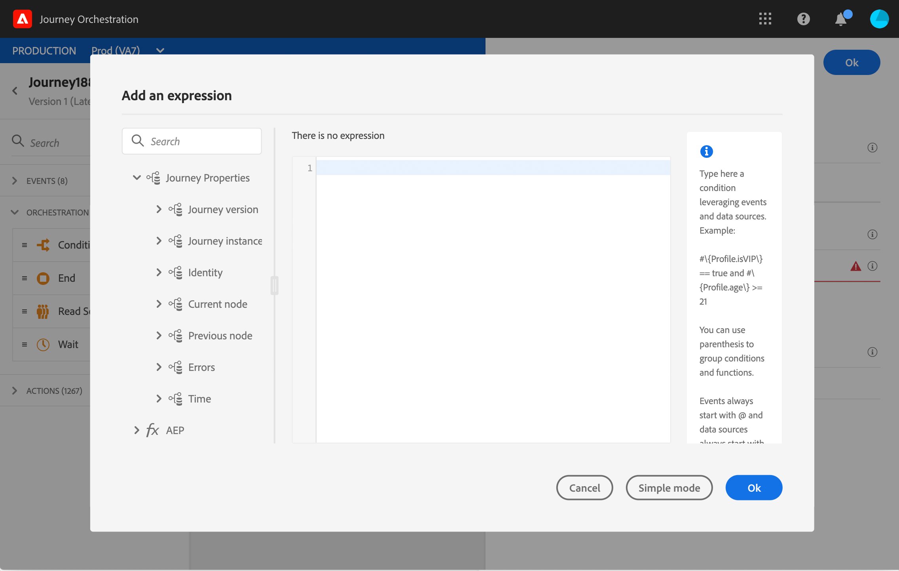

# Jornada atributos de propriedades {#journey-properties}

No editor de expressão avançado, você encontrará a variável **Jornada propriedades** abaixo das categorias de evento e fonte de dados. Essa categoria contém campos técnicos relacionados à jornada para um determinado perfil. Essas são as informações recuperadas pelo sistema a partir das jornadas ativas, como a ID da jornada ou os erros específicos encontrados.

>[!NOTE]
>
>Os atributos de propriedades de Jornada também estão disponíveis no editor de expressões simples. Consulte esta [seção](../building-journeys/condition-activity.md#about_condition)

Você encontrará informações, por exemplo, sobre:

* Versão do jornada: uid do jornada, uid da versão do jornada, uid da instância etc.
* erros: busca de dados, execução de ação etc.
* etapa atual, última etapa atual etc.
* perfis descartados

Você pode usar esses campos para criar expressões. Durante a execução da jornada, os valores serão recuperados diretamente da jornada.

Estes são alguns exemplos de casos de uso:

* **Registrar em log os perfis descartados**: você pode enviar todos os perfis excluídos de uma mensagem por uma regra de limitação para um sistema de terceiros para fins de registro. Para isso, configure um caminho em caso de tempo limite e erro e adicione uma condição para filtrar por um tipo de erro específico, por exemplo: &quot;descartar pessoas ao limitar a regra&quot;. Em seguida, você pode enviar os perfis descartados para um sistema de terceiros por meio de uma ação personalizada.

* **Enviar alertas em caso de erros**: você pode enviar uma notificação para um sistema de terceiros sempre que ocorrer um erro em uma mensagem. Para isso, configure um caminho em caso de erro, adicione uma condição e uma ação personalizada. É possível enviar uma notificação em um canal Slack, por exemplo, com a descrição do erro encontrado.

* **Refinar erros nos relatórios** : em vez de ter apenas um caminho para mensagens com erro, você pode definir uma condição por tipo de erro. Isso permitirá que você refine os relatórios e visualize todos os dados de tipos de erro.

## List of fields {#journey-properties-fields}

| Categoria | Nome do campo | Rótulo | Descrição |
|---|---|---|------------|
| Versão do Jornada | journeyUID | Identificador de Jornada |  |
|  | journeyVersionUID | Identificador de versão do Jornada |  |
|  | journeyVersionName | Nome da versão do Jornada |  |
|  | journeyVersionDescription | Descrição da versão do Jornada |  |
|  | journeyVersion | Versão do Jornada |  |
| Jornada instância | instanceUID | Identificador de instância do Jornada | ID da instância |
|  | externalKey | Chave externa | Identificador individual que aciona a jornada |
|  | organizationId | Identificador da organização | Organização da marca |
|  | sandboxName | Nome da sandbox | Nome da sandbox |
| Identidade | profileId | Identificador de identidade do perfil | Identificador do perfil na jornada |
|  | namespace | Namespace de identidade do perfil | Namespace do perfil na jornada (exemplo: ECID) |
| Nó Atual | currentNodeId | Identificador do nó atual | Identificador da atividade atual (nó) |
|  | currentNodeName | Nome do nó atual | Nome da atividade atual (nó) |
| Nó anterior | previousNodeId | Identificador do nó anterior | Identificador da atividade anterior (nó) |
|  | previousNodeName | Nome do nó anterior | Nome da atividade anterior (nó) |
| Erros | lastNodeUIDInError | Último identificador de nó com erro | Identificador da atividade mais recente (nó) com erro |
|  | lastNodeNameInError | Nome do último nó com erro | Nome da atividade mais recente (nó) com erro |
|  | lastNodeTypeInError | Último tipo de nó com erro | Tipo de erro da atividade mais recente (nó) com erro. Tipos possíveis:<ul><li>Eventos: Eventos, Reações, SQ (exemplo: Qualificação de segmento)</li><li>Controle de fluxo: Fim, Condição, Espera</li><li>Ações: ACS actions, Jump, Custom Action</li></ul> |
|  | lastErrorCode | Último código de erro | Código de erro da atividade mais recente (nó) com erro. Possíveis erros: <ul><li>Códigos de erro HTTP</li><li>limitado</li><li>timedOut</li><li>erro (exemplo: padrão no caso de um erro inesperado. Não deve/extremamente raramente acontece)</li></ul> |
|  | lastExecutionActionErrorCode | Código de erro da última ação executada | Código de erro da ação mais recente com erro |
|  | lastDataFetchErrorCode | Código de erro da última busca de dados | Código de erro da última busca de dados nas fontes de dados |
| Hora | lastActionExecutionElapsedTime | Tempo decorrido da execução da última ação | Tempo gasto para executar a ação mais recente |
|  | lastDataFetchElapsedTime | Tempo decorrido da última busca de dados | Tempo gasto para executar a última busca de dados a partir de fontes de dados |
