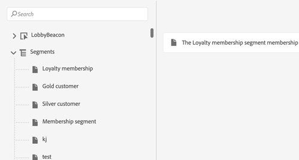
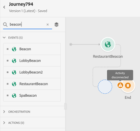

# Notas de versão {#release-notes}

Esta página lista todos os novos recursos e melhorias do Journey Orchestration.
Você também pode consultar as [Atualizações de documentação mais recentes](../release-notes/documentation-updates.md).

## Versão de outubro de 2021 {#october-2021-release}

<!--table>
<thead>
<tr>
<th><strong>Profile cap condition</strong> </th>
</thead>
<tbody>
<tr>
<td>

When using a <strong>Condition</strong> activity in a journey, you can now define a <strong>Profile cap</strong> condition. This new condition type allows you set a maximum number of profiles for a journey path. When this limit is reached, the selected profiles take a second path. This allows you to optimize your IP ramp up. For example, you may want to ramp up your deliveries on a domain to 50 millions by splitting the execution: send 1000 messages on day 1, 2000 on day 2, etc.

For more information, refer to the <a href="../building-journeys/condition-activity.md#profile_cap}">detailed documentation</a>.

</td>
</tr>
</tbody>
</table-->

### Melhorias

* **Editor de expressão** - Como um usuário avançado, agora você pode usar funções para trabalhar com mapas. [Saiba mais](../expression/field-references.md)
* **Acessibilidade** - Foram implementadas melhorias de acessibilidade. O Journey Orchestration agora é totalmente compatível em termos de acessibilidade.
* **Coleções** - Matrizes de objetos que contêm subobjetos agora são compatíveis. [Leia mais](../usecase/collections.md)
* **Monitoramento** - Os eventos de etapa para jornadas ativas e modo de teste foram aprimorados. [Novos campos](../building-journeys/sharing-field-list.md#serviceevents) foram adicionados relacionados a trabalhos de exportação de perfil. Para obter uma melhor experiência do usuário, os campos de evento de etapa agora são organizados em categorias diferentes no schema Evento de etapa de Jornada para Journey Orchestration. Todos os campos de eventos de etapa anteriores ainda estão disponíveis no [stepEvents](../building-journeys/sharing-legacy-fields.md) categoria .

## Versão de setembro de 2021 {#september-2021-release}

<table>
<thead>
<tr>
<th><strong>Transmita listas de dados dinamicamente usando ações personalizadas</strong> </th>
</tr>
</thead>
<tbody>
<tr>
<td>

Agora é possível enviar coleções ou uma lista de dados nos parâmetros de ação personalizados que serão preenchidos dinamicamente no tempo de execução. Há suporte para dois tipos de coleções: coleções simples e coleções de objetos. As ações personalizadas criadas anteriormente continuarão funcionando. 

Para obter mais informações sobre coleções, consulte <a href="../usecase/collections.md">documentação detalhada</a>. 

As funções de filtro e interseção foram adicionadas à lista de funções disponíveis no editor de expressão avançado. Isso oferece mais possibilidades para filtragem e comparação de coleção.

Consulte a documentação no <a href="../functions/functionfilter.md">filter</a> e <a href="../functions/functionintersect.md">interseção</a> funções.

</td>
</tr>
</tbody>
</table>

### Melhorias

* Os esquemas e conjuntos de dados gerados pelo sistema que foram criados durante o provisionamento para eventos da etapa agora estão no modo somente leitura, protegendo contra qualquer modificação inadvertida em esquemas críticos. [Saiba mais](../building-journeys/sharing-overview.md)
* Rotule claramente o **Aguardar** atividade com um rótulo que será exibido na tela. O rótulo também é usado em registros de relatórios e modos de teste para identificar claramente o que você está fazendo. [Saiba mais](../building-journeys/using-the-journey-designer.md)
* Encontre seus eventos e ações mais rapidamente filtrando elementos no **Eventos** e **Ação** categorias usando pesquisa. As atividades de orquestração não são mais filtradas. [Saiba mais](../building-journeys/using-the-journey-designer.md)
* Ao definir uma condição de ID de evento em uma regra baseada, o operador &quot;contains&quot; agora está disponível para tipos de cadeia de caracteres de campos. [Saiba mais](../event/about-creating.md)

## Versão de agosto de 2021 {#august-2021-release}

### Melhorias

**Jornadas**

* **Cabeçalhos dinâmicos** - Agora é possível passar dados dinâmicos em parâmetros do cabeçalho HTTP. Esses parâmetros podem ser usados pelos sistemas de integração que recebem as chamadas HTTP da ação de jornada, por exemplo, carimbo de data e hora ou ID de rastreamento. [Leia mais](../action/url-configuration.md)
* **Caminhos dinâmicos do URL** - Agora você pode configurar caminhos dinâmicos de URL para ações personalizadas. [Leia mais](../action/url-configuration.md)

## Versão de julho de 2021 {#july-2021-release}

<table>
<thead>
<tr>
<th><strong>Aproveitar relacionamentos de esquema</strong> </th>
</tr>
</thead>
<tbody>
<tr>
<td>

O Adobe Experience Platform permite definir relações entre esquemas para usar um conjunto de dados como uma tabela de pesquisa para outro. O Journey Orchestration agora pode aproveitar os dados provenientes de um schema vinculado.

Esses campos estão disponíveis na configuração de evento unitário, nas condições de jornada e na personalização da ação personalizada.

Para obter mais informações, consulte a <a href="../event/experience-event-schema.md#leverage_schema_relationships">documentação detalhada</a>.

</td>
</tr>
</tbody>
</table>

### Melhorias

* O **Duração do cache** foi removido do painel de configuração da fonte de dados. [Leia mais](../datasource/about-data-sources.md)

## Versão de junho de 2021 {#june-2021-release}

<table>
<thead>
<tr>
<th><strong> Integração do Adobe Campaign Classic</strong> </th>
</tr>
</thead>
<tbody>
<tr>
<td>

A integração com a Adobe Campaign Classic agora está disponível. Ele permite enviar emails, notificações por push e SMS usando os recursos de Mensagens Transacionais Adobe Campaign v7 ou v8.

A conexão entre as instâncias do Journey Orchestration e do Campaign é configurada pela Adobe no momento do provisionamento.

Para obter mais informações, consulte a <a href="../action/acc-action.md">documentação detalhada</a>.

</td>
</tr>
</tbody>
</table>

### Melhorias

* Para fontes de dados externas, uma regra de limitação de 15 chamadas por segundo agora é definida automaticamente. [Leia mais](../about/external-systems.md#capping)
* Os editores de expressão simples e avançados agora oferecem suporte ao formato de data XDM.
* Na tela jornada list , um novo filtro foi adicionado. Agora é possível filtrar por tipo de jornada: **[!UICONTROL Unitary event]** ou **[!UICONTROL Segment qualification]**. [Leia mais](../about/user-interface.md#section_lgm_hpz_pgb)
* Para jornadas ao vivo, a tela de propriedades da jornada agora exibe a data da publicação e o nome do usuário que publicou a jornada. Essas informações também estão disponíveis ao copiar os detalhes técnicos da jornada. [Leia mais](../building-journeys/changing-properties.md#section_lgm_hpz_pgb)

## Versão de abril de 2021 {#april-2021-release}

### Melhorias

* No **Configuração do evento** no modo de teste, uma lista suspensa é exibida para campos que esperam uma enumeração. Basta selecionar um dos valores disponíveis. Isso evitará erros ao acionar o evento se um valor incorreto for definido. [Leia mais](../building-journeys/testing-the-journey.md#firing_events)

## Versão de março de 2021 {#march-2021-release}

### Melhorias

* Um novo status foi adicionado ao jornada. Quando uma jornada termina ou é fechada manualmente, seu status muda de **Fechado** para **Concluído** 30 dias após o seu encerramento. Isso permitirá identificar jornadas inativas com mais facilidade, garantindo que todos os indivíduos ainda presentes tenham tempo para concluir a jornada. [Leia mais](../building-journeys/journey.md#ending_a_journey)
* Nos painéis à direita da atividade de jornadas de rascunho, os campos somente leitura agora estão ocultos por padrão. Essa simplificação da interface ajudará você a configurar suas atividades com mais facilidade. Para exibi-las, clique no botão **Mostrar campos somente leitura** ícone , disponível no canto superior esquerdo do painel de configuração da atividade. [Leia mais](../building-journeys/using-the-journey-designer.md#configuration_pane)
* No modo de teste, no **Configuração do evento** , a **Chave** o campo usado para definir a ID do perfil de teste foi renomeado **Identificador de perfil** para uma melhor experiência do usuário. [Leia mais](../building-journeys/testing-the-journey.md).
* Para eventos de reação, a duração do tempo limite só pode ser definida entre 40 segundos e 30 dias. Ao testar uma jornada que usa um evento de reação, o modo de teste **[!UICONTROL Wait time]** o valor padrão e mínimo agora é de 40 segundos. [Leia mais](../building-journeys/reaction-events.md).

## Versão de fevereiro de 2021 {#february-2021-release}

<table>
<thead>
<tr>
<th><strong>Atualizar atividade do perfil</strong> </th>
</tr>
</thead>
<tbody>
<tr>
<td>

Essa nova atividade de ação permite atualizar um perfil do Adobe Experience Platform existente com informações provenientes do evento, fonte de dados ou usando um valor específico.

Para obter mais informações, consulte a <a href="../building-journeys/update-profiles.md">documentação detalhada</a>.

</td>
</tr>
</tbody>
</table>

### Outras melhorias

* Agora, ao configurar um evento, somente os campos obrigatórios para a validação XDM são pré-selecionados por padrão. Esses campos não podem ser desmarcados.
* Na paleta jornada, um novo filtro foi adicionado. Ela permite exibir apenas os cinco últimos eventos e ações usados, além dos prontos para uso. Isso é específico para cada usuário. Por padrão, todos os itens são exibidos. [Leia mais](../building-journeys/using-the-journey-designer.md#palette)
* Ao iniciar uma nova jornada, os elementos que não podem ser soltos na tela como a primeira etapa agora ficam ocultos. Isso se refere a todas as ações, à atividade de condição, à espera e à reação.
* Na parte esquerda do editor de expressão avançado, as funções agora são reagrupadas em um **Funções** no final da lista.

## Versão de janeiro de 2021 {#january-2021-release}

Ao selecionar um schema na configuração do evento, somente os campos obrigatórios para o evento ser recebido corretamente pelo Journey Orchestration são selecionados. [Leia mais](../event/defining-the-payload-fields.md)

Os atributos de propriedades do Jornada agora estão disponíveis no editor de expressões simples. [Leia mais](../expression/journey-properties.md)

Dois novos atributos de propriedades de jornada foram adicionados (sandboxName e organizationId). [Leia mais](../expression/journey-properties.md)

Para se alinhar aos SLAs do Adobe Campaign Standard, uma regra de limitação de 13 chamadas por segundo agora é definida automaticamente para ações do Adobe Campaign Standard assim que a integração do Adobe Campaign Standard é configurada. [Leia mais](../action/working-with-adobe-campaign.md)

A duração do tempo limite do evento agora é especificada mais claramente no caminho de tempo limite. [Leia mais](../building-journeys/event-activities.md#listening-to-events-during-a-specific-time)

O [getListItem](../functions/functiongetlistitem.md) e [split](../functions/functionsplit.md) As funções do foram adicionadas à lista de funções disponíveis no editor de expressão avançado. Isso oferecerá mais possibilidades em seus casos de uso de cálculo de string.

## Versão de novembro de 2020 {#november-release}

<table>
<thead>
<tr>
<th><strong>Mudar de uma jornada para outra</strong> </th>
</tr>
</thead>
<tbody>
<tr>
<td>

Uma nova atividade de ação permite enviar indivíduos de uma jornada para outra. O <strong>Salto</strong> permite:

<ul>
<li>simplificar o design de jornadas muito complexas dividindo-as em várias </li>
<li>criar jornadas com base em padrões de jornada comuns e reutilizáveis</li>
</ul>

Para obter mais informações, consulte a <a href="../building-journeys/jump.md">documentação detalhada</a> e o <a href="https://experienceleague.adobe.com/docs/journey-orchestration-learn/tutorials/building-a-journey/jumping-to-another-journey.html?lang=pt-BR">vídeo tutorial</a>.

</td>
</tr>
</tbody>
</table>

<table>
<thead>
<tr>
<th><strong>Uso das propriedades do jornada no editor de expressão</strong> </th>
</tr>
</thead>
<tbody>
<tr>
<td>

No editor de expressão avançado, adicionamos uma nova categoria à lista de campos e funções. Essas são as informações recuperadas pelo sistema a partir das jornadas ativas, como a ID da jornada ou os erros específicos encontrados. Isso lhe dará mais possibilidades ao criar suas jornadas. Por exemplo, você poderá alertar sistemas de terceiros em caso de erros encontrados em uma condição ou ação.

Para obter mais informações, consulte a <a href="../expression/journey-properties.md">documentação detalhada</a>.

</td>
</tr>
</tbody>
</table>

<table>
<thead>
<tr>
<th><strong>Eventos com base em regras (beta)</strong> </th>
</tr>
</thead>
<tbody>
<tr>
<td>

Um novo método está disponível para configurar os eventos com mais facilidade, sem usar uma eventID: os eventos baseados em regras avaliam se o evento deve ser acionado de acordo com uma condição. Você ainda pode usar o método existente, agora chamado de "gerado pelo sistema". Esse recurso, que foi testado entre um conjunto limitado de clientes por meio do programa Alfa, agora está disponível em Beta para todos os clientes.

</td>
</tr>
</tbody>
</table>

### Outras melhorias

Foram adicionadas limitações ao criar novas versões de uma jornada. Essas limitações evitam alterações muito drásticas na jornada para manter alguma consistência entre as versões. [Leia mais](../about/limitations.md#journey-versions-limitations)

O **Qualificação do segmento** não pode mais ser usada em uma jornada que inclui atividades de mensagem de Campaign Standard. Essa restrição protege a integridade das instâncias do Adobe Campaign Standard. Na verdade, o uso de qualificação de segmento pode levar a picos diários de envio de mensagem que sobrecarregariam as mensagens transacionais do Campaign Standard. [Leia mais](../about/limitations.md#segment-qualification)

## Versão de outubro de 2020 {#october-release}

<table>
<thead>
<tr>
<th><strong>Tempo limite do evento</strong> </th>
</tr>
</thead>
<tbody>
<tr>
<td>

Agora é possível configurar um tempo limite para um evento a fim de fazer com que uma jornada escute um evento somente durante um determinado tempo. Não é mais necessário adicionar uma atividade Wait em paralelo ao caminho do evento para fazer isso.

Para obter mais informações, consulte a <a href="../building-journeys/event-activities.md#listening-to-events-during-a-specific-time">documentação detalhada</a>.

</td>
</tr>
</tbody>
</table>

### Outras melhorias

* Quando você publica uma nova versão de uma jornada, a versão anterior automaticamente termina e alterna para o status Closed . [Leia mais](../building-journeys/journey-versions.md)

## Versão de setembro de 2020 {#september-release}

### Atualizações do GA{#september-ga-update}

<table>
<thead>
<tr>
<th><strong>Melhorias da atividade de condição</strong> </th>
</tr>
</thead>
<tbody>
<tr>
<td>

Ao adicionar condições à jornada, agora é possível definir um rótulo. Se você usar várias condições em uma jornada, isso permitirá identificá-las mais facilmente.

Para obter mais informações, consulte a <a href="../building-journeys/condition-activity.md#about_condition">documentação detalhada</a>.

</td>
</tr>
</tbody>
</table>

### Atualizações Alfa{#september-alpha-update}

<table>
<thead>
<tr>
<th><strong>Ler melhorias nas atividades do segmento</strong> </th>
</tr>
</thead>
<tbody>
<tr>
<td>

Foram efetuadas as seguintes melhorias no <strong>Ler segmento</strong> atividade :

<ul>
<li>
Jornadas baseadas em segmentos agora exibem, acima da tela, um lembrete do tipo de agendamento da jornada. Você pode clicar nesse lembrete para acessar o menu de configuração do agendamento.

</li>
<li>
A granularidade dos logs do modo de teste foi aprimorada para exibir o status do progresso da exportação do segmento.

</li>
</ul>
</td>
</tr>
</tbody>
</table>

## Versão de agosto de 2020 {#august-release}

### Atualizações do GA{#august-ga-update}

Agora o payload dos eventos de qualificação de segmento contém as seguintes informações de contexto, que podem ser usadas em condições e ações: o comportamento (entrada, saída), a data e hora da qualificação e a ID do segmento. [Leia mais](../building-journeys/segment-qualification-events.md)

### Atualizações Alfa{#august-alpha-update}

<table>
<thead>
<tr>
<th><strong>Atividade do acionador de segmento</strong> </th>
</tr>
</thead>
<tbody>
<tr>
<td>

As seguintes melhorias foram implantadas na atividade do acionador de segmento:

<ul>
<li>
O nome da atividade foi alterado para "Ler segmento". 

</li>
<li>
A configuração do scheduler de jornada foi removida das propriedades da atividade. Agora ela pode ser acessada diretamente nas Propriedades da jornada, em uma seção dedicada que será exibida se uma atividade Ler segmento tiver sido colocada na tela. 

</li>
<li>
Agora você pode testar a jornada em um perfil unitário e acompanhar seu progresso na jornada usando o fluxo visual.

</li>
</ul>
</td>
</tr>
</tbody>
</table>

<table>
<thead>
<tr>
<th><strong>Eventos com base em regras</strong> </th>
</tr>
</thead>
<tbody>
<tr>
<td>

As seguintes melhorias foram realizadas em eventos baseados em regras:

<ul>
<li>
Agora você pode aproveitar todos os dados de evento comportamental do Adobe Analytics que já estão sendo capturados e transmitidos na plataforma para acionar jornadas e automatizar experiências para seus clientes. <a href="../event/about-analytics.md">Leia mais</a>

</li>
<li>
A partir de agora, ao acionar um evento com base em regras no modo de teste, será possível visualizar diretamente a condição da ID do evento. Além disso, uma dica de ferramenta foi adicionada ao lado de cada campo de avaliação da regra. <a href="../building-journeys/testing-the-journey.md#test-rule-based">Leia mais</a>

</li>
<li>
A tela de definição de evento com base em regras foi reorganizada para obter uma experiência avançada. <a href="../event/about-creating.md">Leia mais</a>

</li>
</ul>
</td>
</tr>
</tbody>
</table>

## Versão Alfa - Julho de 2020 {#alpha-release---july-2020}

O programa Alfa oferece recursos que estão sendo atualmente testados em um conjunto limitado de clientes. Ele permite a melhoria do produto com base no feedback recebido. Esses recursos não estão disponíveis para todos os clientes do Journey Orchestration.

<table>
<thead>
<tr>
<th><strong>Interface do usuário aprimorada</strong> </th>
</tr>
</thead>
<tbody>
<tr>
<td>

A navegação nos menus do Journey Orchestration foi aprimorada para fornecer uma interface consistente com a Adobe Experience Platform:

<ul>
<li>
Os menus foram movidos de cima para o lado esquerdo da interface. 

</li>
<li>
Agrupamento de funcionalidades do administrador em um único painel.

</li>
</ul>
</td>
</tr>
</tbody>
</table>

<table>
<thead>
<tr>
<th><strong>Atividade do acionador de segmento</strong> </th>
</tr>
</thead>
<tbody>
<tr>
<td>

A atividade do acionador de segmento permite que todos os indivíduos pertencentes a um segmento da Adobe Experience Platform possam entrar em uma jornada. A entrada em uma jornada pode ser efetuada uma vez ou regularmente. 

</td>
</tr>
</tbody>
</table>

<table>
<thead>
<tr>
<th><strong>Eventos com base em regras</strong> </th>
</tr>
</thead>
<tbody>
<tr>
<td>

Simplificamos a forma como você configura os eventos na experiência. Estamos introduzindo um novo método que não requer o uso de uma ID de evento. Agora é possível definir um evento com base em regras ao configurar seu evento no Journey Orchestration. <a href="../event/about-events.md">Leia mais</a>

</td>
</tr>
</tbody>
</table>

## Versão do segundo trimestre - Junho de 2020 {#q2-release---june-2020}

<table>
<thead>
<tr>
<th><strong>Aprimoramentos de integração da Adobe Experience Platform</strong> </th>
</tr>
</thead>
<tbody>
<tr>
<td>

Foram realizados os seguintes aprimoramentos de integração na Adobe Experience Platform:

<ul>
<li>
Uma nova atividade permite que a escuta das entradas/saídas do segmento da Adobe Experience Platform possibilite a entrada ou o avanço das pessoas em uma jornada. <a href="../building-journeys/segment-qualification-events.md">Leia mais</a>

</li>
<li>
Graças à nova guia <strong>Segmentos</strong>, agora os segmentos da Adobe Experience Platform podem ser criados e editados sem precisar sair da interface do Journey Orchestration. <a href="../segment/about-segments.md">Leia mais</a>

</li>
<li>
No editor de expressões simples, os segmentos da Adobe Experience Platform são agora listados diretamente na árvore de navegação para permitir uma fácil configuração de condições como "essa pessoa pertence ao segmento A?". <a href="../segment/using-a-segment.md">Leia mais</a>

</li>
<li>
Agora o Journey Orchestration transmite automaticamente as etapas executadas nas jornadas para a Adobe Experience Platform. inclusive possíveis erros que podem ser encontrados. Essas informações podem ser usadas para obter relatórios e solução de problemas executando consultas nos eventos Journey Step para uma determinada jornada ou para todas as jornadas. <a href="../building-journeys/sharing-overview.md">Leia mais</a>

</li>
<li>
Agora o Journey Orchestration pode ser conectado às sandboxes de produção e não produção da Adobe Experience Platform. Observe que as sandboxes são um recurso beta. <a href="../about/access-management.md#sandboxes">Leia mais</a>

</li>
</ul>
</td>
</tr>
</tbody>
</table>

<table>
<thead>
<tr>
<th><strong>Aprimoramentos no designer da jornada e no modo de teste</strong> </th>
</tr>
</thead>
<tbody>
<tr>
<td>

Foram feitos os seguintes aprimoramentos ao designer da jornada e ao modo de teste:

<ul>
<li>
Agora você pode copiar e colar atividades de uma jornada para outra, selecionando 1 ou N atividades da jornada. <a href="../building-journeys/using-the-journey-designer.md#copy-paste">Leia mais</a>

</li>
<li>
Após o disparo de um evento para fazer um perfil de teste entrar em uma jornada, você pode ver o progresso ao longo da jornada graças a um fluxo visual colorido. Em caso de erro na jornada, detalhes do erro também serão exibidos. <a href="../building-journeys/testing-the-journey.md#firing_events">Leia mais</a>

</li>
<li>O estado da jornada <strong>Concluído</strong> foi renomeado para <strong>Fechado (sem entrada)</strong> para refletir melhor o significado do estado.</li>
</ul>
</td>
</tr>
</tbody>
</table>

**Outras melhorias**

Para evitar o envio de muitas chamadas de API para sistemas de terceiros, estamos introduzindo uma nova API pública para configurar regras de &quot;limitação&quot;. As regras de limitação permitem a definição de um número máximo de chamadas para um ponto de entrada de API por milissegundos. [Leia mais](../api/capping.md)

O controle de acesso agora permite mais granularidade no gerenciamento de acesso do usuário. Disponível a partir de 30 de junho de 2020. [Leia mais](../about/access-management.md#create-product-profile)

Agora o Journey Orchestration também está disponível no APAC (Centro de dados australiano). Disponível a partir de 30 de junho de 2020

A interface do Journey Orchestration está disponível em japonês.

## Versão do primeiro trimestre - Março de 2020 {#q1-release---march-2020}

<table>
<thead>
<tr>
<th><strong>Melhorias no modo de teste</strong> </th>
</tr>
</thead>
<tbody>
<tr>
<td>

As seguintes melhorias foram feitas no modo de teste:

<ul>
<li>Quando uma jornada usa vários eventos, é possível acionar cada um deles individualmente a partir de uma lista suspensa na tela <strong>Configuração de evento</strong> do modo de teste. <a href="../building-journeys/testing-the-journey.md#firing_events">Leia mais</a>
</li>
<li>
Quando uma ou mais atividades de <strong>espera</strong> são usadas em uma jornada, é possível definir o tempo que cada uma dessas atividades durará no modo de teste. O tempo padrão é de 10 segundos. Você pode alterar a duração usando o parâmetro<strong>Tempo de espera no teste</strong>, no canto inferior esquerdo. <a href="../building-journeys/testing-the-journey.md">Leia mais</a>

</li>
<li>Nos <strong>logs de teste</strong>, em caso de erro ao chamar um sistema de terceiros (fonte de dados ou ação), o código de erro e a resposta do erro agora são exibidos. <a href="../building-journeys/testing-the-journey.md#viewing_logs">Leia mais</a>
</li>
</ul>
</td>
</tr>
</tbody>
</table>

<table>
<thead>
<tr>
<th><strong>Gerenciamento centralizado de fuso horário</strong> </th>
</tr>
</thead>
<tbody>
<tr> 
<td>

O gerenciamento de fuso horário agora está centralizado no painel de propriedades da jornada. Foram adicionados dois parâmetros às propriedades de jornada:

<ul>
<li>A lista suspensa <strong>Fuso horário</strong> permite selecionar um fuso horário específico. Por padrão, é usado o fuso horário do navegador. </li>
<li>A caixa de seleção <strong>Fuso horário do perfil</strong> permite usar o fuso horário do perfil da Adobe Experience Platform da pessoa que entra na jornada, caso esteja disponível. Caso contrário, é utilizado o fuso horário definido na lista suspensa. Este recurso não é compatível com jornadas que utilizam eventos sem namespace.</li>
</ul>

Para obter mais informações, consulte as seções <a href="../building-journeys/changing-properties.md#timezone">Alteração de propriedades</a> e <a href="../building-journeys/timezone-management.md">Gerenciamento de fuso horário</a>.

</td>
</tr>
</tbody>
</table>

<table>
<thead>
<tr>
<th><strong>Melhorias no designer de jornadas</strong> </th>
</tr>
</thead>
<tbody>
<tr> 
<td>

A <strong>paleta</strong> da jornada, no lado esquerdo do designer de jornada, foi aprimorada:

<ul>
<li>Um novo ícone, ao lado da barra de <strong>Pesquisa</strong>, permite ocultar ou exibir elementos indisponíveis na paleta, por exemplo, os eventos que usam um namespace diferente daqueles usados em sua jornada. Por padrão, os itens indisponíveis ficam ocultos.</li>
<li>Ao usar o campo <strong>Pesquisa</strong>, o número de resultados para cada categoria de atividade da tela agora é exibido.</li>
<li>A navegação entre as diferentes categorias de atividade foi aprimorada.</li>
</ul>

No designer de jornada, você pode verificar se está acessando a versão mais recente da jornada. Essas informações são exibidas ao lado do número da versão.

Na <strong>tela</strong> da jornada, quando duas atividades são desconectadas, uma mensagem de aviso é exibida.

Para obter mais informações, consulte a <a href="../building-journeys/using-the-journey-designer.md">documentação detalhada</a>.

</td>
</tr>
</tbody>
</table>

<table>
<thead>
<tr>
<th><strong>Ajuda contextual</strong> </th>
</tr>
</thead>
<tbody>
<tr>
<td>

Uma ajuda contextual agora está disponível nas diferentes telas de lista do Journey Orchestration (jornadas, eventos, ações e fontes de dados). A ajuda permite visualizar uma descrição rápida da funcionalidade atual e acessar artigos e vídeos relacionados.

Para exibir a ajuda contextual, clique no ícone  no canto superior direito da tela. 

</td>
</tr>
</tbody>
</table>

**Outras melhorias**

* Além dos EUA, o Journey Orchestration agora está disponível na **Europa, no Oriente Médio e na África**. O aplicativo e a documentação estão disponíveis em francês e alemão.

* A Experience League agora está integrada ao produto, o que simplifica o acesso ao conteúdo relacionado e ajuda a aproveitar ao máximo a Experience Cloud. O acesso direto à documentação do Journey Orchestration está disponível na parte inferior da guia Ajuda. Além disso, clique em Ajuda > Feedback para relatar problemas ou compartilhar suas ideias com a Adobe.

* O atalho **C** do teclado, que permite criar um novo item, agora está disponível em todas as telas de lista: jornadas, fontes de dados, ações e eventos. [Leia mais](../about/user-interface.md#section_ksq_zr1_ffb)

* Agora você pode **excluir** as jornadas interrompidas. Os relatórios associados a essas jornadas excluídas não estarão disponíveis.

* Ao navegar pelos **campos da Adobe Experience Platform** (formato XDM), você verá o nome de exibição além do nome do campo. Essas informações são recuperadas a partir da definição do schema no Modelo de dados de experiência. Quando disponível, o nome de exibição alternativo é exibido. Essa descrição simples, especialmente útil no caso de campos eVar, permite identificar os campos mais facilmente. [Leia mais](../about/user-interface.md#friendly-names-display)

## Última Versão - Dezembro de 2019 {#ga-release---december-2019}

Agora a Orquestração da jornada é GA.

Crie casos de uso de orquestração em tempo real aproveitando dados contextuais armazenados em eventos ou fontes de dados.

O Journey Orchestration permite a orquestração em tempo real com dados contextuais de eventos, informações da Adobe Experience Platform ou dados de serviços de API de terceiros. O aplicativo determina, em fluxos multi-fases chamados jornadas, as melhores próximas ações específicas para o consumidor, de acordo com o perfil e o comportamento. Inclui o momento ideal e o tipo de ação, como enviar ao consumidor uma notificação por push por meio dos recursos de mensagens transacionais do Adobe Campaign Standard (é preciso ter o Adobe Campaign Standard) ou a notificação de um sistema de terceiros. Essas decisões são tomadas com base em regras e pontuações do Sensei.

Saiba mais sobre o Journey Orchestration.

Recursos adicionais:

* [Tutoriais](https://experienceleague.adobe.com/docs/platform-learn/tutorials/journey-orchestration/introduction.html)
* [Comunidade](https://www.adobe.com/go/journeyorchestrationcommunity)
