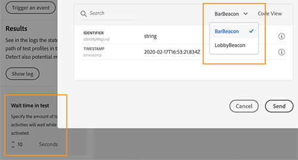

# Notas de versão {#release-notes}

Esta página lista todos os novos recursos e melhorias para o Journey Orchestration.
Você também pode consultar as Atualizações [da](../release-notes/documentation-updates.md)documentação.

## Versão do primeiro trimestre - março de 2020 {#q1-release---march-2020}

**Novidades?**

<table>
<thead>
<tr>
<th><strong>Melhorias no modo de teste</strong> </th>
</tr>
</thead>
<tbody>
<tr>
<td>

As seguintes melhorias foram feitas no modo de teste:

<ul>
<li>Quando uma jornada usa vários eventos, agora é possível disparar cada um deles individualmente de uma lista suspensa, na tela de configuração <strong>do</strong> Evento do modo de teste. <a href="../building-journeys/testing-the-journey.md#firing_events">Leia mais</a>
</li>
<li>
Quando uma ou mais atividades de <strong>espera</strong> são usadas em uma jornada, agora você pode definir o tempo que cada uma dessas atividades durará no modo de teste. O tempo padrão é de 10 segundos. Você pode alterar isso usando o tempo de <strong>espera no parâmetro de teste</strong> , no canto inferior esquerdo. <a href="../building-journeys/testing-the-journey.md">Leia mais</a>

</li>
<li>Nos registros <strong>de</strong>teste, em caso de erro ao chamar um sistema de terceiros (fonte de dados ou ação), o código de erro e a resposta do erro agora são exibidos. <a href="../building-journeys/testing-the-journey.md#viewing_logs">Leia mais</a>
</li>
</ul>
</td>
</tr>
</tbody>
</table>

<table>
<thead>
<tr>
<th><strong>Gerenciamento centralizado de fuso horário</strong> </th>
</tr>
</thead>
<tbody>
<tr> 
<td>

O gerenciamento de fuso horário agora está centralizado no painel de propriedades da jornada. Foram adicionados dois parâmetros às propriedades de viagem:

<ul>
<li>A lista suspensa <strong>Fuso horário</strong> permite selecionar um fuso horário específico. Por padrão, o fuso horário do navegador é usado. </li>
<li>A caixa de seleção Fuso horário do <strong>Perfil</strong> permite usar o fuso horário do Perfil da plataforma de experiência da pessoa que entra na jornada, se disponível. Caso contrário, o fuso horário definido na lista suspensa será usado. Este recurso não é compatível com viagens que usam eventos que não têm namespace.</li>
</ul>

Para obter mais informações, consulte as seções Propriedades <a href="../building-journeys/changing-properties.md#timezone">de</a> alteração e gerenciamento <a href="../building-journeys/timezone-management.md">de</a> fuso horário.

</td>
</tr>
</tbody>
</table>

<table>
<thead>
<tr>
<th><strong>Melhorias no designer de viagens</strong> </th>
</tr>
</thead>
<tbody>
<tr> 
<td>

A <strong>paleta</strong>de viagem, no lado esquerdo do designer de viagem, foi aprimorada:

<ul>
<li>Um novo ícone, ao lado da barra <strong>Pesquisar</strong> , permite ocultar ou exibir elementos indisponíveis na paleta, por exemplo, os eventos que usam uma namespace diferente daqueles usados em sua jornada. Por padrão, os itens indisponíveis ficam ocultos.</li>
<li>Ao usar o campo <strong>Pesquisar</strong> , o número de resultados para cada categoria de atividade da tela agora é exibido.</li>
<li>A navegação entre as diferentes categorias de atividade foi aprimorada.</li>
</ul>

No designer de viagem, você pode verificar que está acessando a versão mais recente da jornada. Essas informações são exibidas ao lado do número da versão.

Na <strong>tela</strong>da jornada, quando duas atividades são desconectadas, uma mensagem de aviso é exibida.

Para obter mais informações, consulte a <a href="../building-journeys/using-the-journey-designer.md">documentação detalhada</a>.

</td>
</tr>
</tbody>
</table>

<table>
<thead>
<tr>
<th><strong>Ajuda contextual</strong> </th>
</tr>
</thead>
<tbody>
<tr>
<td>

Uma ajuda contextual agora está disponível nas diferentes telas de lista do Journey Orchestration (viagens, eventos, ações e fontes de dados). Isso permite que você visualização uma descrição rápida da funcionalidade atual e acesse artigos e vídeos relacionados.

Para exibir a ajuda contextual, clique no  ícone no canto superior direito da tela. 

</td>
</tr>
</tbody>
</table>

**Outras melhorias**

* Além dos EUA, o Journey Orchestration está agora disponível na **EMEA**. O pedido e a documentação estão disponíveis em francês e em alemão.

* A Experience League agora está integrada ao produto. Isso simplifica o acesso ao conteúdo relacionado e ajuda a aproveitar ao máximo a Experience Cloud. O acesso direto à documentação do Journey Orchestration está disponível na parte inferior da guia Ajuda. Além disso, clique em Ajuda > Feedback para reportar problemas ou compartilhar suas ideias com a Adobe.

* O atalho de teclado **C** , que permite criar um novo item, está disponível em todas as telas de lista: viagens, fontes de dados, ações e eventos. [Leia mais](../about/user-interface.md#section_ksq_zr1_ffb)

* Agora você pode **excluir** as viagens interrompidas. Os relatórios associados a essas viagens excluídas não estarão disponíveis.

* Ao navegar pelos campos **da Plataforma de** dados (formato XDM), você verá o nome de exibição além do nome do campo. Essas informações são recuperadas da definição do schema no Modelo de dados de experiência. Quando disponível, o nome de exibição alternativo é exibido. Essa descrição fácil de usar, especialmente útil no caso de campos de eVar, permite que você identifique seus campos mais facilmente. [Leia mais](../about/user-interface.md#friendly-names-display)

## Versão GA - dezembro de 2019 {#ga-release---december-2019}

A Orquestração de Jornadas está agora pronta.

Crie casos de uso de orquestração em tempo real aproveitando dados contextuais armazenados em eventos ou fontes de dados.

O Journey Orchestration permite a orquestração em tempo real com dados contextuais de eventos, informações da Adobe Experience Platform ou dados de serviços de API de terceiros. A aplicação determina, em fluxos multifaseados, as próximas melhores ações específicas para o consumidor, com base no seu perfil e comportamento. Isso abrange tanto o tempo ideal quanto o tipo de ação, como enviar ao consumidor uma notificação por push via Adobe Campaign Standard transactional messaging capabilities (requer Adobe Campaign Standard) ou a notificação de um sistema de terceiros. Essas decisões são tomadas com base em regras e pontuações do Sensei.

Saiba mais sobre o Journey Orchestration.

Recursos adicionais:

* [Tutoriais](https://docs.adobe.com/content/help/en/platform-learn/tutorials/journey-orchestration/introduction.html)
* [Comunidade](https://www.adobe.com/go/journeyorchestrationcommunity)
