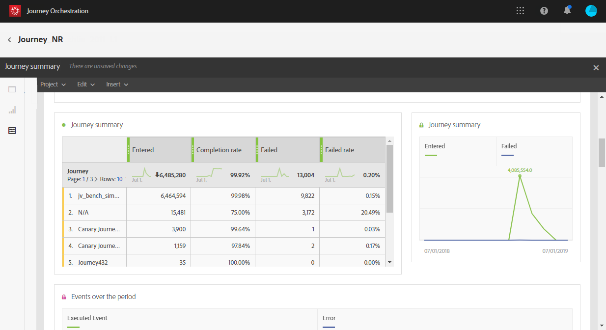

# Sobre relatórios de jornada {#concept_rfj_wpt_52b}

>[!NOTE]
>
>Os dados de delivery e o componente Segmentos só serão preenchidos se você tiver o Adobe Campaign Standard.

Esta seção apresentará como acessar e usar os relatórios para medir a eficácia das jornadas.

## Interface de relatórios {#reporting-interface}

A barra de ferramentas superior permite, por exemplo, modificar, salvar ou imprimir seu relatório.

Use a guia **[!UICONTROL Project]** para:

* **[!UICONTROL Open]**: abre um relatório ou modelo criado anteriormente.
* **[!UICONTROL Save As]**: duplica modelos para poder modificá-los.
* **[!UICONTROL Refresh project]**: atualiza seu relatório com base em novos dados e alterações em filtros.
* **[!UICONTROL Download CSV]**: exporta seus relatórios para um arquivo CSV.
* **[!UICONTROL Print]**: imprime seu relatório.

A guia **[!UICONTROL Edit]** permite:

* **[!UICONTROL Undo]**: cancela sua última ação no painel.
* **[!UICONTROL Redo]**: cancela sua última  **[!UICONTROL Undo]** ação no painel.
* **[!UICONTROL Clear all]**: exclui cada painel no painel.

A tabela **[!UICONTROL Insert]** permite personalizar seus relatórios ao adicionar gráficos e tabelas ao painel:

* **[!UICONTROL New Blank Panel]**: adiciona um novo painel em branco ao painel.
* **[!UICONTROL New Freeform]**: adiciona uma nova tabela de forma livre ao painel.
* **[!UICONTROL New Line]**: adiciona um novo gráfico de linha ao painel.
* **[!UICONTROL New Bar]**: adiciona um novo gráfico de barras ao painel.

As guias à esquerda permitem criar o relatório e filtrar os dados, conforme necessário.

Essas guias fornecem acesso aos seguintes itens:

* **[!UICONTROL Panels]**: adicione um painel em branco ou de forma livre ao relatório para começar a filtrar os dados. Para obter mais informações, consulte a seção [Adição de painéis](../reporting/creating-your-journey-reports.md#adding-panels)
* **[!UICONTROL Visualizations]**: arraste e solte uma seleção de itens de visualização para dar ao seu relatório uma dimensão gráfica. Para obter mais informações, consulte a seção [Adição de visualizações](../reporting/creating-your-journey-reports.md#adding-visualizations) .
* **[!UICONTROL Components]**: personalize seus relatórios com diferentes dimensões, métricas, segmentos e períodos. Para obter mais informações, consulte a seção [Adição de componentes](../reporting/creating-your-journey-reports.md#adding-components) .

## Modelo de resumo de jornada {#ootb-template}

Os relatórios são divididos em duas categorias: um modelo pronto para uso e relatórios personalizados.
O template pronto para uso, **[!UICONTROL Journey summary]**, fornece uma exibição clara dos dados de rastreamento mais importantes.

Cada tabela é representada por números de resumo e gráficos. Você pode alterar como os detalhes são mostrados em suas respectivas configurações de visualização.

Os seguintes KPIs estão disponíveis na parte superior do relatório:

* **[!UICONTROL Journey - Entered]**: número total de indivíduos que acessaram o evento de entrada da jornada.
* **[!UICONTROL Journey - Completion rate]**: número total de indivíduos que atingiram o fim da jornada (ou no caso de um indivíduo não corresponder a nenhuma condição) em comparação ao número total de indivíduos que entraram na jornada.
* **[!UICONTROL Journey - Current]**: número total de indivíduos atualmente na jornada.
* **[!UICONTROL Journey - Failed rate]**: número total de jornadas que não foram executadas com êxito em comparação ao número de jornadas de execução.
* **[!UICONTROL Delivery - Messages sent]**: número total de mensagens enviadas.
* **[!UICONTROL Delivery rate]**: número total de mensagens entregues com êxito em comparação às mensagens enviadas.
* **[!UICONTROL Delivery - Bounce rate]**: número total de mensagens que retornaram em comparação às mensagens enviadas.
* **[!UICONTROL Delivery - Unsubscribed rate]**: número total de unsubscriptions por recipient em comparação às mensagens entregues.
* **[!UICONTROL Delivery - Open rate]**: número total de mensagens abertas em comparação ao número de mensagens entregues.
* **[!UICONTROL Delivery - Click rate]**: número total de cliques em um delivery em comparação ao número de mensagens entregues.

A visualização do fluxo de Jornada permite visualizar o caminho dos perfis segmentados passo a passo pela jornada. Isso só está disponível ao direcionar uma jornada. Ele é gerado automaticamente e não pode ser modificado.

A tabela **[!UICONTROL Journey summary]** contém os dados disponíveis para sua jornada, como:

* **[!UICONTROL Entered]**: número total de indivíduos que acessaram o evento de entrada da jornada.
* **[!UICONTROL Completion rate]**: número total de indivíduos que acessaram o controle de fluxo final da jornada em comparação ao número total de indivíduos que entraram na jornada.
* **[!UICONTROL Current]**: número total de indivíduos atualmente na jornada.
* **[!UICONTROL Failed]**: número total de jornadas que não foram executadas com êxito.
* **[!UICONTROL Failed rate]**: número total de jornadas que não foram executadas com êxito em comparação ao número de jornadas de execução.

A tabela **[!UICONTROL Top events]** exibe os eventos mais bem-sucedidos e **[!UICONTROL Top action]**, as ações mais bem-sucedidas em suas jornadas.

A tabela **[!UICONTROL Delivery - Sending summary]** contém os dados disponíveis para as entregas da jornada, como:

* **[!UICONTROL Processed/sent]**: número total de mensagens enviadas.
* **[!UICONTROL Delivered rate]**: número total de mensagens entregues com êxito em comparação às mensagens enviadas.
* **[!UICONTROL Delivered]**: número de mensagens enviadas com êxito, em relação ao número total de mensagens enviadas.
* **[!UICONTROL Bounce + error rate]**: número total de mensagens que retornaram em comparação às mensagens enviadas.
* **[!UICONTROL Bounces + errors]**: total de erros acumulados durante o delivery e o processamento automático de retorno em relação ao número total de mensagens enviadas.

A tabela **[!UICONTROL Delivery - Tracking summary]** contém os dados disponíveis para rastrear o sucesso das entregas do jornada, como:

* **[!UICONTROL Open Rate]**: porcentagem de mensagens abertas.
* **[!UICONTROL Open]**: número de vezes que uma mensagem foi aberta em um delivery.
* **[!UICONTROL Click trough rate]**: número total de cliques em um delivery em comparação ao número de mensagens entregues.
* **[!UICONTROL Click]**: número de vezes que um conteúdo foi clicado em um delivery.
* **[!UICONTROL Unsubscribe rate]**: porcentagem de unsubscriptions por recipient em comparação às mensagens entregues.
* **[!UICONTROL Unsubscribed]**: número total de unsubscriptions por recipient em comparação às mensagens entregues.
