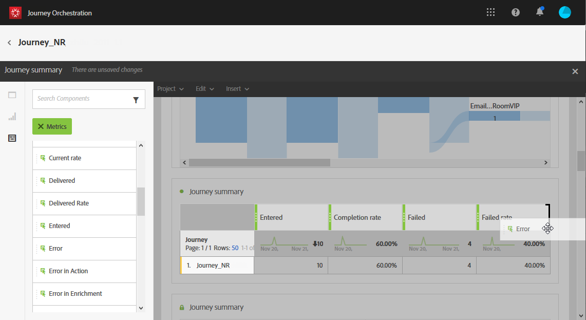
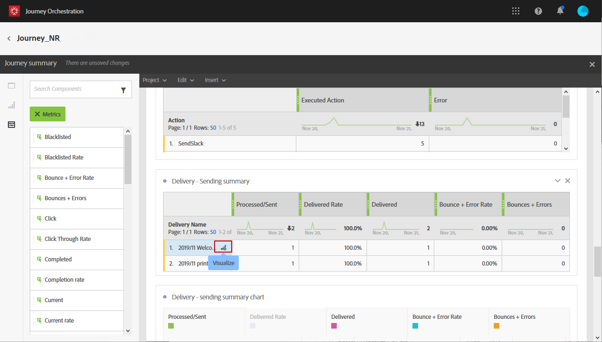

# Criar relatórios de jornada {#concept_rfj_wpt_52b}

## Acessar e criar seus relatórios {#accessing-reports}

>[!NOTE]
>
>Após excluir uma jornada, todos os relatórios associados não estarão mais disponíveis.

Esta seção mostrará como criar ou usar relatórios predefinidos. Combine painéis, componentes e visualizações para rastrear melhor o sucesso de suas viagens.

Para acessar os relatórios de suas viagens e o start que acompanha o sucesso de seus delivery:

1. No menu superior, clique na guia **[!UICONTROL Home]**.

1. Selecione a jornada na qual deseja relatar.

   Observe que você também pode acessar seus relatórios clicando em **Relatório** enquanto passa o mouse sobre uma jornada na lista de viagens.

   

1. Clique no **[!UICONTROL Report]** ícone na parte superior direita da tela.

   

1. O relatório **[!UICONTROL Journey summary]** pronto para uso aparece na tela. Para acessar relatórios personalizados, clique no **[!UICONTROL Close]** botão.

   

1. Clique no link **[!UICONTROL Create new project]** para criar seu relatório do zero.

   

1. Na **[!UICONTROL Panels]** guia, arraste e solte quantos painéis ou tabelas de forma livre forem necessários. Para obter mais informações, consulte esta [seção](#adding-panels).

   

1. Você pode filtrar seus dados por start arrastando e soltando dimensões e métricas da **[!UICONTROL Components]** guia para a tabela de forma livre. Para obter mais informações, consulte esta [seção](#adding-components).

   

1. Para ter uma visualização mais clara dos seus dados, você pode adicionar visualizações na **[!UICONTROL Visualizations]** guia. Para obter mais informações, consulte esta [seção](#adding-visualizations).

## Adicionar painéis{#adding-panels}

### Adicionar um painel em branco {#adding-a-blank-panel}

Para start de seu relatório, é possível adicionar um conjunto de painéis a um relatório predefinido ou personalizado. Cada painel contém conjuntos de dados diferentes e é composto de tabelas e visualizações de forma livre.

Esse painel permite que você crie seus relatórios conforme necessário. Você pode adicionar quantos painéis desejar em seus relatórios para filtrar seus dados com períodos de tempo diferentes.

1. Clique no ícone **[!UICONTROL Panels]**. Você também pode adicionar um painel clicando no painel **[!UICONTROL Insert tab]** e selecionando **[!UICONTROL New Blank Panel]**.

   

1. Arraste e solte o **[!UICONTROL Blank Panel]** em seu painel.

   

Agora é possível adicionar uma tabela de forma livre ao painel aos dados de direcionamento de start.

### Adicionar uma tabela de forma livre {#adding-a-freeform-table}

As tabelas de forma livre permitem criar uma tabela para analisar seus dados usando as diferentes métricas e dimensões disponíveis na **[!UICONTROL Component]** tabela.

Cada tabela e visualização é redimensionável e pode ser movida para personalizar melhor seu relatório.

1. Clique no ícone **[!UICONTROL Panels]**.

   

1. Arraste e solte o **[!UICONTROL Freeform]** item no seu painel.

   Você também pode adicionar uma tabela clicando na **[!UICONTROL Insert]** guia e selecionando **[!UICONTROL New Freeform]** ou clicando **[!UICONTROL Add a freeform table]** em um painel vazio.

   

1. Arraste e solte itens da **[!UICONTROL Components]** guia nas colunas e linhas para criar sua tabela.

   

1. Clique no **[!UICONTROL Settings]** ícone para alterar como os dados são exibidos nas colunas.

   

   O **[!UICONTROL Column settings]** grupo é composto por:

   * **[!UICONTROL Number]**: permite mostrar ou ocultar números de resumo na coluna.
   * **[!UICONTROL Percent]**: permite mostrar ou ocultar porcentagens na coluna.
   * **[!UICONTROL Interpret zero as no value]**: permite mostrar ou ocultar quando o valor é igual a zero.
   * **[!UICONTROL Background]**: permite mostrar ou ocultar a barra de progresso horizontal nas células.
   * **[!UICONTROL Include retries]**: permite incluir tentativas no resultado. Isso só está disponível para **[!UICONTROL Sent]** e **[!UICONTROL Bounces + Errors]**.

1. Selecione uma ou várias linhas e clique no **[!UICONTROL Visualize]** ícone. Uma visualização é adicionada para refletir as linhas selecionadas.

   

Agora você pode adicionar quantos componentes precisar e também adicionar visualizações para fornecer representações gráficas dos seus dados.

## Adicionar componentes{#adding-components}

Os componentes ajudam você a personalizar seus relatórios com diferentes dimensões, métricas e períodos.

1. Clique na **[!UICONTROL Components]** guia para acessar a lista dos componentes.

   

1. Cada categoria apresentada na guia **[!UICONTROL Components]** exibe os cinco itens mais usados, clique no nome de uma categoria para acessar sua lista completa de componentes.

   A tabela de componentes é dividida em três categorias:

   * **[!UICONTROL Dimensions]**: Obtenha detalhes no registro de delivery, como o navegador ou domínio do recipient, ou o sucesso de um delivery.
   * **[!UICONTROL Metrics]**: Obtenha detalhes sobre o status de uma mensagem. Por exemplo, se uma mensagem foi entregue e o usuário a abriu.
   * **[!UICONTROL Time]**: Defina um período para a tabela.

1. Arraste e solte componentes em um painel para filtrar seus dados por start.

Você pode arrastar e soltar quantos componentes forem necessários e compará-los uns aos outros.

## Adicionar visualizações{#adding-visualizations}

A **[!UICONTROL Visualizations]** guia permite arrastar e soltar itens de visualização, como área, rosca e gráfico. As visualizações fornecem representações gráficas dos seus dados.

1. Na **[!UICONTROL Visualizations]** guia, arraste e solte um item de visualização em um painel.

   

1. Após adicionar uma visualização ao painel, seus relatórios detectarão automaticamente os dados na tabela de forma livre. Selecione as configurações para sua visualização.
1. Se você tiver mais de uma tabela de forma livre, escolha a fonte de dados disponível para adicionar em seu gráfico na **[!UICONTROL Data Source Settings]** janela. Essa janela também está disponível ao clicar no ponto colorido ao lado do título da visualização.

   

1. Clique no botão de **[!UICONTROL Visualization]** configurações para alterar diretamente o tipo de gráfico ou o que é exibido nele, como:

   * **[!UICONTROL Percentages]**: Exibe os valores em porcentagem.
   * **[!UICONTROL Anchor Y Axis at Zero]**: Força o eixo y a zero mesmo se os valores estiverem acima de zero.
   * **[!UICONTROL Legend visible]**: Permite que você oculte a lenda.
   * **[!UICONTROL Normalization]**: Força a correspondência dos valores.
   * **[!UICONTROL Display Dual Axis]**: Adiciona outro eixo ao seu gráfico.
   * **[!UICONTROL Limit Max Items]**: Limita o número de gráficos exibidos.
   * **[!UICONTROL Threshold]**: Permite definir um limite para o gráfico. Aparece como uma linha pontilhada preta.

   

Essa visualização permite que você tenha uma visualização mais clara dos seus dados em seus relatórios.