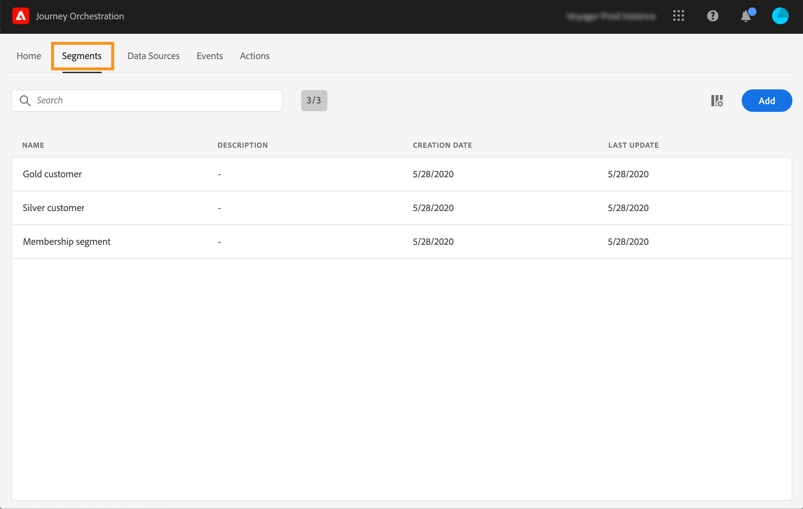

# Criação de um segmento {#creating-a-segment}

>[!CAUTION]
>
>**Está procurando pelo Adobe Journey Optimizer**? Clique [aqui](https://experienceleague.adobe.com/pt-br/docs/journey-optimizer/using/ajo-home){target="_blank"} para acessar a documentação do Journey Optimizer.
>
>
>_Essa documentação refere-se ao material herdado do Journey Orchestration, que foi substituído pelo Journey Optimizer. Entre em contato com a equipe de contas em caso de dúvidas sobre como acessar o Journey Orchestration ou o Journey Optimizer._

Você pode criar um segmento usando o [Serviço de Segmentação do Adobe Experience Platform](https://experienceleague.adobe.com/docs/experience-platform/segmentation/home.html?lang=pt-BR) ou pode acessá-lo e criá-lo diretamente no [!DNL Journey Orchestration].

1. No menu superior, clique na guia **[!UICONTROL Segments]**. A lista de segmentos do Adobe Experience Platform é exibida. Você pode pesquisar por um segmento específico na lista.

   

1. Clique em **[!UICONTROL Add]** para criar um novo segmento. A tela de definição de segmento permite configurar todos os campos obrigatórios para definir seu segmento. A configuração é a mesma do Serviço de segmentação. Consulte o [guia do usuário do Construtor de segmentos](https://experienceleague.adobe.com/docs/experience-platform/segmentation/ui/overview.html?lang=pt-BR).

   

O segmento agora pode ser usado nas jornadas para criar condições ou adicionar um evento **[!UICONTROL Segment qualification]**. Consulte [Uso de segmentos em condições](../segment/using-a-segment.md) e [Atividades de eventos](../building-journeys/segment-qualification-events.md).
