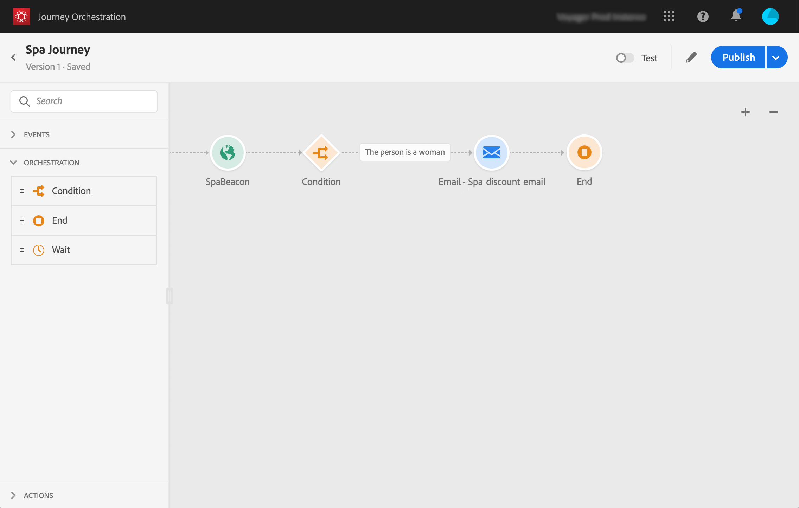

# Sobre o caso de uso simples{#concept_grh_vby_w2b}

>[!CAUTION]
>
>**Está procurando pelo Adobe Journey Optimizer**? Clique [aqui](https://experienceleague.adobe.com/pt-br/docs/journey-optimizer/using/ajo-home){target="_blank"} para acessar a documentação do Journey Optimizer.
>
>
>_Essa documentação refere-se ao material herdado do Journey Orchestration, que foi substituído pelo Journey Optimizer. Entre em contato com a equipe de contas em caso de dúvidas sobre como acessar o Journey Orchestration ou o Journey Optimizer._

## Finalidade {#purpose}

Vejamos o exemplo de uma marca de hotel chamada Marlton. Em seus hotéis, eles posicionaram dispositivos de sinal perto de todas as áreas estratégicas: lobby, pisos, restaurante, ginásio, piscina, etc.

Nesse caso de uso, veremos como enviar uma mensagem personalizada em tempo real para uma pessoa caminhando ao lado de um beacon posicionado perto do spa.

Queremos enviar uma mensagem somente se a pessoa for mulher. A mensagem deve ser recebida em segundos.

## Pré-requisitos {#prerequisites}

Para nosso caso de uso, projetamos um template de mensagens transacionais de email no Adobe Campaign Standard. Estamos usando um template de mensagem transacional de evento. Consulte esta [página](https://experienceleague.adobe.com/docs/campaign-standard/using/communication-channels/transactional-messaging/getting-started-with-transactional-msg.html?lang=pt-BR).

O Adobe Campaign Standard está configurado para enviar emails.

Os eventos são enviados pelo telefone celular dos clientes quando são detectados perto de um beacon. Você precisa criar um aplicativo móvel para enviar eventos do celular do cliente para o Mobile SDK.
