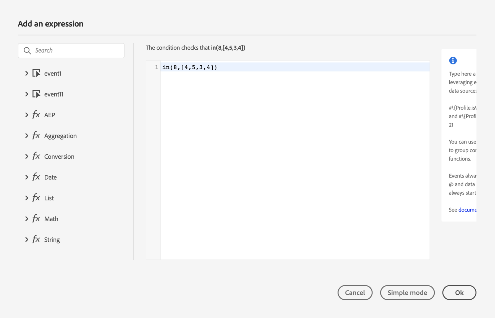

# Construir a jornada {#concept_owm_kdy_w2b}

O usuário **** comercial pode agora construir a jornada. Nossa jornada incluirá as seguintes atividades:

* duas **[!UICONTROL Event]** atividades: &quot;LobbyBeacon&quot; e &quot;RestaurantBeacon&quot;
* duas **[!UICONTROL Condition]** atividades
* três **[!UICONTROL Push]** atividades e uma **[!UICONTROL Email]** atividade (usando Adobe Campaign Standard)
* uma atividade **[!UICONTROL Wait]**
* quatro **[!UICONTROL End]** atividades

>[!NOTE]
>
>As **[!UICONTROL Push]** atividade **[!UICONTROL Email]** esó estarão disponíveis na paleta se você tiver Adobe Campaign Standard.

Para obter informações adicionais sobre como construir uma jornada, consulte [](../building-journeys/journey.md).

## Primeiros passos{#section_ntb_ws1_ffb}

1. No menu superior, clique na **[!UICONTROL Home]** guia e **[!UICONTROL Create]** para criar uma nova jornada.

   

1. Edite as propriedades da jornada no painel de configuração exibido no lado direito. Adicione um nome e defina-o para durar um mês, de 1º a 31 de dezembro.

   

1. Start ao criar sua jornada arrastando e soltando o evento &quot;LobbyBeacon&quot; da paleta para a tela. Você também pode clicar com o duplo no evento da paleta para adicioná-lo à tela de desenho.

   

1. Agora vamos adicionar uma condição para verificar se a pessoa não foi contatada nas últimas 24 horas e verificar se ele é um membro de fidelidade. Arraste e solte uma atividade de condição em sua jornada.

   

1. Escolha o **[!UICONTROL Data Source Condition]** tipo e clique no **[!UICONTROL Expression]** campo. Você também pode definir um rótulo de condição que aparecerá na seta, na tela. Em nosso exemplo, substituímos &quot;Condição 1&quot; por &quot;Membro de fidelidade&quot;.

   

1. Clique **[!UICONTROL Advanced mode]** e defina a seguinte condição com base nos campos &quot;carimbo de data e hora&quot; e &quot;directMarketing.send.value&quot; provenientes da fonte de dados do Adobe Experience Platform. A sintaxe da expressão é:

   ```
   count(#{ExperiencePlatformDataSource.MarltonExperience.experienceevent.all(
       currentDataPackField.directMarketing.sends.value > 0 and
       currentDataPackField.timestamp > nowWithDelta(-1, "days")).timestamp}) == 0
   and
       #{ExperiencePlatformDataSource.MarltonProfiles.Profile._customer.marlton.loyaltyMember}
   ```

   

1. Clique no **[!UICONTROL Add a path]** botão e crie um segundo caminho para clientes que não foram contatados nas últimas 24 horas e que não são membros da fidelidade. Nomeie o caminho &quot;Não é membro da fidelidade&quot;. A sintaxe da expressão é:

   ```
   count(#{ExperiencePlatformDataSource.MarltonExperience.experienceevent.all(
       currentDataPackField.directMarketing.sends.value > 0 and
       currentDataPackField.timestamp > nowWithDelta(-1, "days").timestamp}) == 0
   and not
       #{ExperiencePlatformDataSource.MarltonProfiles.Profile._customer.marlton.loyaltyMember}
   ```

   >[!NOTE]
   >
   >Na segunda parte da expressão, &quot;Perfil&quot; é opcional.

1. Precisamos selecionar uma namespace. Uma namespace é pré-selecionada com base nas propriedades do schema. Você pode manter aquele pré-selecionado. Para obter mais informações sobre namespaces, consulte [](../event/selecting-the-namespace.md).

Em nosso caso de uso, só queremos reagir a essas duas condições, então não marcamos a caixa **[!UICONTROL Show path for other cases than the one(s) above]**.

Dois caminhos são criados após sua condição:

* _Clientes que não foram contatados nas últimas 24 horas e são membros de fidelidade._
* _Clientes que não foram contatados nas últimas 24 horas e que não são membros de fidelidade._


## Primeiro caminho: o cliente é um membro de fidelidade {#section_otb_ws1_ffb}

1. No primeiro caminho, vamos adicionar uma condição para verificar se ele tem uma reserva. Arraste e solte uma atividade de condição em sua jornada.

   

1. Escolha o **[!UICONTROL Data Source Condition]** tipo e defina a condição com base nas informações de status da reserva recuperadas do sistema de reservas:

   ```
   #{MarltonReservation.MarltonFieldGroup.reservation} == true
   ```

   

1. Quando um campo é selecionado de uma fonte de dados externa, a parte direita da tela exibe a lista de parâmetros que foram definidos ao configurar a fonte de dados externa (consulte [](../usecase/configuring-the-data-sources.md)). Clique no nome do parâmetro e defina o valor da chave do sistema de reservas, a ID do Experience Cloud, em nosso exemplo:

   ```
   @{LobbyBeacon.endUserIDs._experience.mcid.id}
   ```

   

1. Como também queremos reagir a clientes que não têm uma reserva, precisamos marcar a caixa **[!UICONTROL Show path for other cases than the one(s) above]**.

   

   Dois caminhos são criados:

   * _Clientes que reservaram uma sala_
   * _Clientes que não reservaram um quarto._

   

1. No primeiro caminho (sala reservada), solte uma **[!UICONTROL Push]** atividade, selecione seu aplicativo móvel e seu modelo de &quot;Boas-vindas&quot;.

   

1. Defina os **[!UICONTROL Target]** campos exigidos pelo sistema para enviar o push.

   * **[!UICONTROL Push platform]**: selecione a plataforma: **[!UICONTROL Apple Push Notification Server]** (Apple) ou **[!UICONTROL Firebase Cloud Messaging]** (Android).
   * **[!UICONTROL Registration token]**: adicione a seguinte expressão (com base no evento configurado) usando o modo avançado:

      ```
      @{LobbyBeacon._experience.campaign.message.profileSnapshot.pushNotificationTokens.first().token}
      ``
      
1. Defina os campos de personalização de notificação por push. Em nosso exemplo: nome e sobrenome.

1. Adicione um evento &quot;RestaurantBeacon&quot;.

   

1. Adicione uma nova **[!UICONTROL Push]** atividade, selecione o modelo &quot;Desconto de refeição&quot; e defina os **[!UICONTROL Address]** campos e **[!UICONTROL Personalization]** . Adicione uma **[!UICONTROL End]** atividade.

   

1. Queremos enviar uma notificação por push de desconto para refeições somente se a pessoa entrar no restaurante nas próximas 6 horas após o push de boas-vindas. Para fazer isso, precisamos usar uma atividade de espera. Coloque o cursor na atividade de boas-vindas e clique no símbolo &quot;+&quot;. No novo caminho, adicione uma atividade de espera e defina uma duração de 6 horas. A primeira atividade elegível será escolhida. Se o evento do restaurante for recebido menos de 6 horas após o push de boas-vindas, a atividade de push será enviada. Se nenhum evento de restaurante for recebido dentro das próximas 6 horas, a espera será escolhida. Coloque uma **[!UICONTROL End]** atividade depois da atividade de espera.

   

1. No segundo caminho que segue a condição de reserva (nenhuma sala reservada), adicione uma **[!UICONTROL Push]** atividade e selecione o modelo &quot;Taxas de sala&quot;. Adicione uma **[!UICONTROL End]** atividade.

   

## Segundo caminho: o cliente não é um membro de fidelidade{#section_ptb_ws1_ffb}

1. No segundo caminho que segue a primeira condição (o cliente não é um membro de fidelidade), adicione uma **[!UICONTROL Email]** atividade e selecione seu modelo de &quot;associação de fidelidade&quot;.

   

1. No **[!UICONTROL Address]** campo, selecione o endereço de email da fonte de dados.

   

1. Defina os campos de personalização de nome e sobrenome da fonte de dados.

   

1. Adicione uma **[!UICONTROL End]** atividade.

Clique no botão de **[!UICONTROL Test]** alternância e teste sua jornada. Se houver algum erro, desative o modo de teste, modifique sua jornada e teste-a novamente. For more information on the test mode, refer to [](../building-journeys/testing-the-journey.md).


Quando o teste é conclusivo, você pode publicar sua jornada no menu suspenso superior direito.


