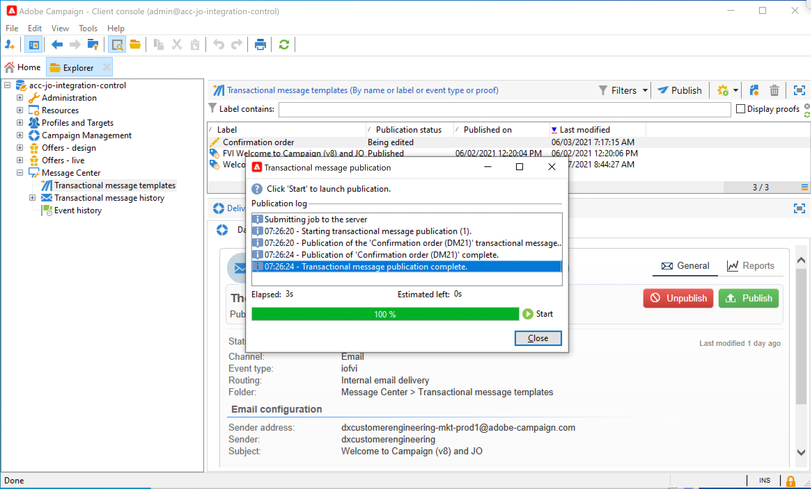
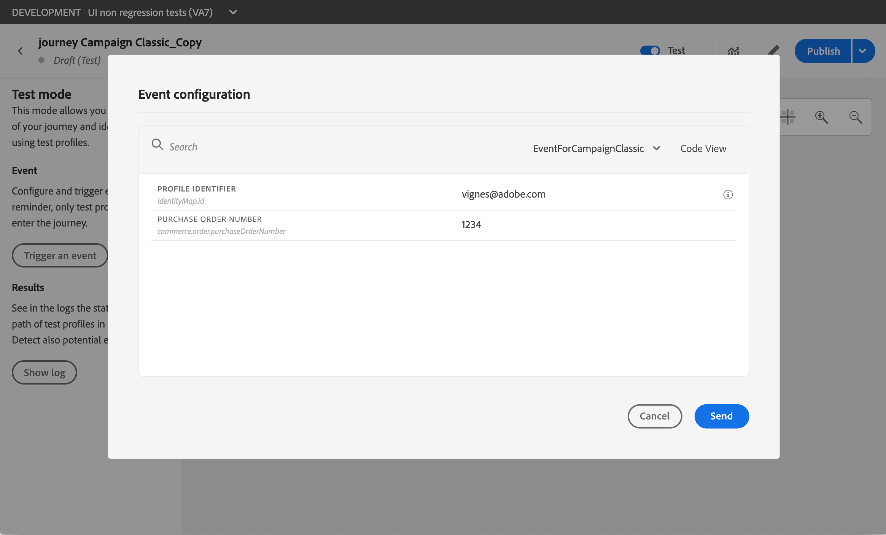

# Envio de uma mensagem usando o Campaign v7/v8 {#campaign-classic-use-case}

Este caso de uso apresenta todas as etapas necessárias para enviar um email usando a integração com o Adobe Campaign Classic v7 e o Adobe Campaign v8.

Primeiro, criaremos um template de email transacional no Campaign. Em seguida, no Journey Orchestration, criaremos o evento, a ação e projetaremos a jornada.

Para saber mais sobre a integração do Campaign, consulte estas páginas:

* [Criação de uma ação de campanha](../action/acc-action.md)
* [Usar a ação em uma jornada](../building-journeys/using-adobe-campaign-classic.md).

**Adobe Campaign**

Sua instância do Campaign precisa ser provisionada para essa integração. O recurso Mensagens transacionais precisa ser configurado.

1. Faça logon na instância de controle do Campaign.

1. Em **Administração** > **Plataforma** > **Enumerações**, selecione o **Tipo de evento** Enumeração (eventType). Crie um novo tipo de evento (&quot;jornada-evento&quot;, no nosso exemplo). Você precisará usar o nome interno do tipo de evento ao gravar o arquivo JSON posteriormente.

   

1. Desconecte e reconecte à instância para que a criação seja efetiva.

1. Em **Centro de mensagens** > **Templates de mensagem transacional**, crie um novo modelo de email com base no tipo de evento criado anteriormente.

   

1. Projete seu modelo. Neste exemplo, usamos personalização no nome do perfil e no número do pedido. O primeiro nome está na fonte de dados do Adobe Experience Platform e o número do pedido é um campo do evento do Journey Orchestration. Certifique-se de usar os nomes de campo corretos no Campaign.

   

1. Publique seu template transacional.

   

1. Agora, é necessário gravar a carga JSON correspondente ao modelo.

```
{
     "channel": "email",
     "eventType": "journey-event",
     "email": "Email address",
     "ctx": {
          "firstName": "First name", "purchaseOrderNumber": "Purchase order number"
     }
}
```

* Para o canal, é necessário digitar &quot;email&quot;.
* Para eventType, use o nome interno do tipo de evento criado anteriormente.
* O endereço de email será uma variável, portanto, você pode digitar qualquer rótulo.
* Em ctx, os campos de personalização também são variáveis.

**Journey Orchestration**

1. Primeiro, você precisa criar um evento . Certifique-se de incluir o campo &quot;purchaseOrderNumber&quot;.

   

1. Em seguida, é necessário criar, no Journey Orchestration, uma ação correspondente ao seu template de Campanha. No **Tipo de ação** , selecione **Adobe Campaign Classic**.

   

1. Clique no botão **Campo Carga** e cole o JSON criado anteriormente.

   

1. Para o endereço de email e os dois campos de personalização, altere **Constante** para **Variável**.

   

1. Agora crie uma nova jornada e comece com o evento criado anteriormente.

   

1. Adicione a ação e mapeie cada campo para o campo correto no Journey Orchestration.

   

1. Adicione um **End** e teste sua jornada.

   

1. Agora você pode publicar sua jornada.
